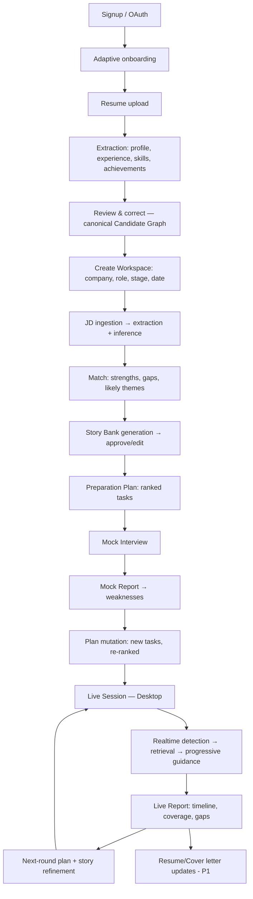
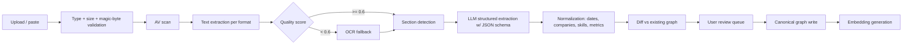
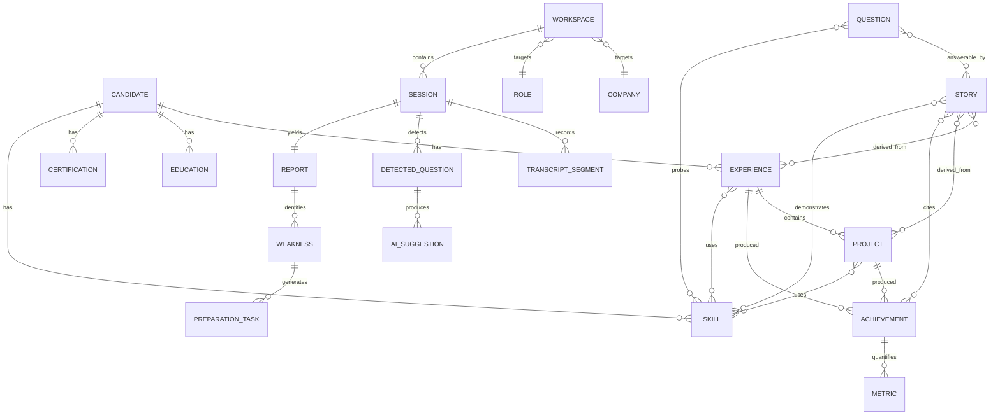
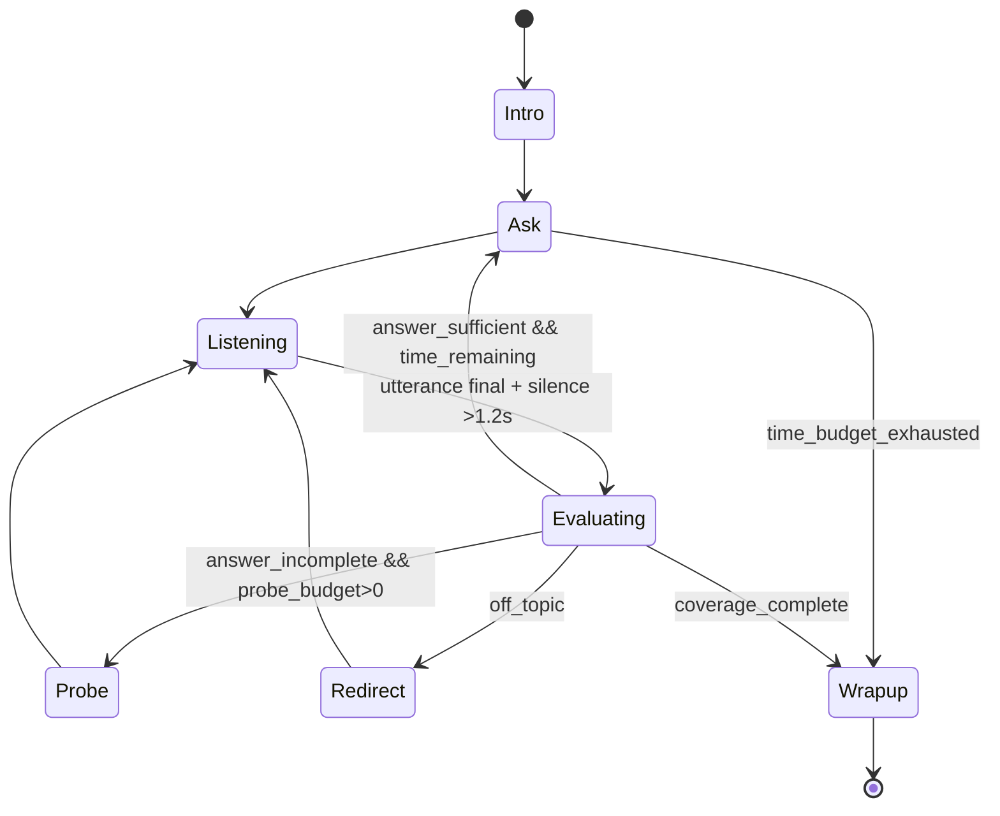
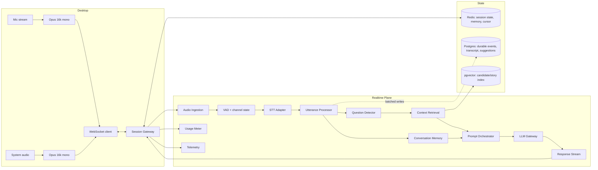
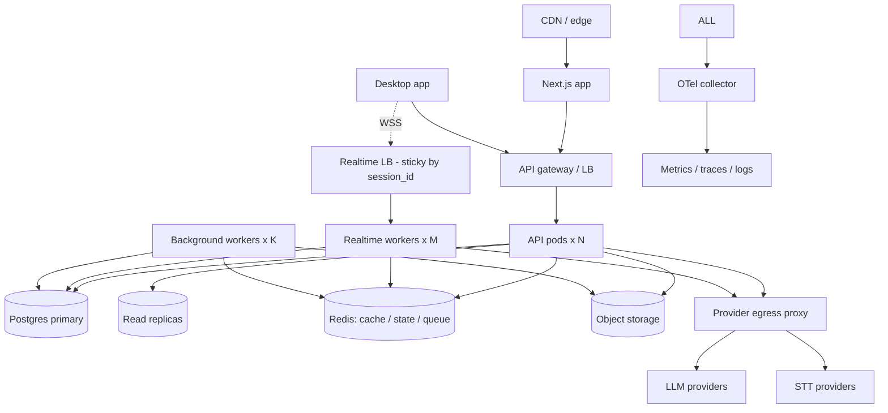

# Verity — Interview Workspace Platform
## Implementation-Grade Product Requirements & Technical Specification

| Field | Value |
|---|---|
| Document version | 1.0 |
| Status | Approved for build sequencing |
| Date | 2026-08-16 |
| Product codename | **Verity** |
| Subsystem codenames | **Graph** (Candidate Intelligence), **Workspace**, **Relay** (realtime transport/pipeline), **Compass** (Copilot answer engine), **Rehearse** (mock interview engine), **Ledger** (usage/entitlements) |
| Owners | Product, AI Platform, Backend, Realtime, Desktop, Design, Security |

### Reading conventions

- Requirement IDs: `FR-<AREA>-<NNN>` (functional), `NFR-<AREA>-<NNN>` (non-functional), `AC-<AREA>-<NNN>` (acceptance).
- Priority: **P0** = MVP blocking, **P1** = fast-follow, **P2** = later phase.
- Areas: `AUTH ONB DASH WS RES JD GRAPH STORY PREP QST MOCK RT COP CODE SCR AUD I18N SESS REP DOC CRM NOTIF SRCH DESK ADMIN BILL AI SEC PRIV OBS PERF A11Y TEST`.
- A requirement without an owner table entry is owned by the area lead named in the section header.

---

# 1. Executive Summary

Verity is a career and interview platform built around a persistent **Interview Workspace**: one canonical context object per job opportunity that every AI capability reads from and writes back to.

The strategic bet — and the structural difference from incumbents such as Final Round AI — is that **the realtime copilot is not the data model**. The data model is:

```
Candidate Intelligence (durable, cross-opportunity)
        │
        ├── Resume (source documents, versioned)
        ├── Experiences / Projects / Skills / Achievements / Education
        └── Story Bank (approved narratives)
        │
Interview Workspace (per-opportunity context)
        ├── Company · Role · JD · Stage · Match · Preparation
        │
Interview Intelligence Engine (consumers)
        ├── Mock Interview · Live Copilot · Coding · System Design
        │
Learning Loop
        └── Transcript → Report → Weakness → Story/Prep mutation → next round
```

Copilot, mock interview, coding help, resume builder and cover letters are all *consumers* of the same two stores. This produces compounding value per session instead of five disconnected AI features, and it is why a user configures a job once and never again.

**MVP thesis:** a candidate uploads a resume and a job description, receives an extracted and user-corrected candidate profile plus an auto-generated Story Bank, runs a mock interview that produces measurable weaknesses, and then runs a live interview where the copilot delivers a usable answer direction within ~2 seconds of question completion, grounded exclusively in approved candidate facts. The session ends and its report automatically rewrites the preparation plan for the next round.

**Highest-risk subsystem:** the realtime pipeline (§21). It is specified independently of the request/response product and is the sequencing gate for everything in the live path.

**Non-negotiable product guarantee:** Verity does not invent candidate history. Grounded Candidate Mode (§12.6) is a hard architectural constraint, not a prompt instruction.

---

# 2. Product Vision

**Three-year vision.** Verity becomes the durable system of record for a person's professional narrative. The resume becomes a rendering of the graph rather than the source of truth. Every interview a candidate takes makes the next one measurably better, because transcripts, weaknesses and validated stories accumulate in one place.

**Product north star metric:** *Verified Prepared Interviews* — sessions (mock or live) that occur inside a Workspace with an approved candidate profile, produce a report, and generate at least one accepted preparation action. This metric only moves when the full loop works.

**What we are deliberately not building:** a generic chat assistant, an interview-answer scraping database, an undetectable cheating tool, or an autonomous mass-application bot as an MVP dependency.

**Positioning sentence (internal):** Verity is an interview preparation and live assistance system whose intelligence comes from knowing the candidate, not from knowing the question.

---

# 3. Market Positioning

| Segment | Incumbent behavior | Verity position |
|---|---|---|
| Realtime interview copilots | Session-scoped context; user re-pastes resume/JD per session; answers frequently fabricate specifics | Workspace-scoped persistent context; grounded answer engine with explicit "no evidence" behavior |
| Mock interview tools | Scripted question lists, static scoring | Conversational interviewer with probing follow-ups; scores carry visible rationale; weaknesses mutate the prep plan |
| Resume/ATS tools | Standalone document optimizer | Resume is an ingestion source and a rendering of the Candidate Graph; never a parallel truth |
| Job trackers / CRMs | Spreadsheet replacements | Pipeline is a view over Workspaces that already carry full interview context |

**Differentiation defensibility ranking**
1. Candidate Graph + Story Bank (data moat, compounds per user).
2. Grounded Candidate Mode (trust; hard to retrofit onto prompt-only competitors).
3. Preparation Feedback Loop (retention; each session raises switching cost).
4. Progressive Guidance latency architecture (engineering moat).
5. Workspace IA (perceived product coherence).

**Explicit IP boundary.** No competitor source code, prompt text, UI layouts, iconography, copy, taxonomies, or branding is copied. All taxonomies (question categories, story categories, scoring rubrics), prompt registry content, design tokens and component names in this document are original to Verity.

**Ethical stance (product-visible).** Verity states plainly in-product that live assistance is a preparation and accessibility aid, exposes an *Interview Integrity* setting, and does not market undetectability or build detection-evasion features. Live Copilot is disabled by default for sessions the user marks as "proctored/assessment".

---

# 4. Personas

| ID | Persona | Context | Primary need | Success signal |
|---|---|---|---|---|
| P1 | **Mid-level IC switcher** (3–7 yrs, SWE/Data/PM) | 4–8 active opportunities, interviews weekly | Stop re-explaining background; structured behavioral answers | Story Bank approved; 3+ Workspaces |
| P2 | **Senior/Staff IC** (8–15 yrs) | Few high-stakes loops, system design heavy | Depth prompts, tradeoff scaffolds, credible metrics | System design mode usage; report depth |
| P3 | **Career switcher / returner** | Non-linear history, gaps | Reframing experience, gap narrative | Gap-handling stories approved |
| P4 | **New grad / student** | Thin experience, high volume | Coding practice, projects → stories | Coding sessions; project-derived stories |
| P5 | **Non-native English speaker** | Strong skill, language load under pressure | Bilingual coaching, concise speakable output | Multilingual mode; low regenerate rate |
| P6 | **Manager / EM** | Leadership loops, exec panels | Leadership stories, panel handling | Panel sessions; executive response mode |
| P7 | **Sales / CS / Consulting** | Case + discovery formats | Case frameworks, objection handling | Case mode sessions |
| P8 | **Internal: Support/Ops admin** | Runs the platform | Diagnose sessions, refunds, cost | Admin session diagnostics usage |

Persona drives defaults, not walls: interview-type modules, question mix, response mode default, and preparation plan weighting are seeded from persona + seniority + role family, then adapt from behavior.

---

# 5. Jobs To Be Done

| JTBD | Statement | Served by |
|---|---|---|
| J1 | When I get an interview, I want all my context in one place so I stop rebuilding it | Workspace, Candidate Graph |
| J2 | When I prepare, I want to know exactly what to work on next | Preparation Engine, readiness score |
| J3 | When I'm asked about my past, I want a real, specific story ready | Story Bank |
| J4 | When I freeze mid-interview, I want a direction within seconds | Realtime Copilot, Progressive Guidance |
| J5 | When I finish, I want to know precisely what went wrong | Session Reports |
| J6 | When I go to the next round, I want prep that reflects my last failure | Learning Loop |
| J7 | When I apply, I want documents that match this specific role | Resume Builder, Cover Letters |
| J8 | When I juggle many processes, I want to see my pipeline | Career CRM (P2) |
| J9 | When AI helps me, I need it to not lie about my career | Grounded Candidate Mode |
| J10 | When I pay, I want to know what I'm consuming | Usage/Entitlements surfaces |

---

# 6. Product Principles

| # | Principle | Enforcement mechanism (not aspiration) |
|---|---|---|
| PP1 | Context persists | All AI calls resolve context via `ContextResolver(workspace_id)`; no endpoint accepts free-form resume/JD payloads for generation |
| PP2 | Configure once | Workspace creation is the only place opportunity context is authored; every other surface links to it |
| PP3 | Latency is a feature | Realtime budgets in §32 are CI-enforced via load tests; regression fails release |
| PP4 | Hide AI complexity | No model names, token counts, or prompt controls in candidate-facing UI; only Response Mode and Depth |
| PP5 | Grounded generation | Claim-level evidence binding; ungrounded claims are structurally impossible to render as candidate fact (§12.6) |
| PP6 | User correction wins | `user_corrected` layer always overrides `ai_extracted`; re-extraction never silently overwrites |
| PP7 | Never invent experience | Missing evidence yields framework + clarifying question, explicitly labeled |
| PP8 | Speakable output | Answer schema is structured fields with per-field length caps; prose blobs are not a valid response object |
| PP9 | Graceful degradation | Every realtime stage has a defined fallback state (§34) |
| PP10 | Sessions survive networks | Event-sourced session with resumable cursor (§26.6) |
| PP11 | Explicit retention | Per-category retention policy, user-configurable within legal floors (§29) |
| PP12 | Cost is bounded | Entitlement check + budget guard on every metered operation (§33) |
| PP13 | Visible async states | Every async surface implements the 11 UX states (§10.1) |
| PP14 | Errors have exits | Error objects carry `recovery_action`; generic error text is banned by lint rule |
| PP15 | One backend | Desktop and web consume identical versioned APIs; no desktop-only endpoints except OS capability negotiation |
| PP16 | No duplicate settings | Settings resolve from a single `user_settings` + `workspace_settings` hierarchy |
| PP17 | International by default | UTF-8, IANA timezones, ICU formatting, locale-resolved currency, no English-only assumptions in schema |
| PP18 | Accessible | WCAG 2.2 AA gate in CI (axe) plus manual keyboard audit per release |
| PP19 | Mobile is prep + review | Mobile scope is fixed (§23.4); live capture is never squeezed into mobile |
| PP20 | B2B-ready, B2C-first | `organization_id` nullable column present from day one; no org logic in MVP paths |

---

# 7. Scope

## 7.1 In scope — MVP (P0)

Authentication & account lifecycle · Adaptive onboarding · Candidate Graph · Resume ingestion + versioning · Interview Workspace · JD ingestion + match · Story Bank · Preparation Engine · Question Intelligence · Mock Interview (General/Behavioral/Technical) · Realtime Copilot (General/Behavioral/Technical) · Transcripts · Mock + Live reports · Subscriptions & entitlements · Usage metering · Admin basics · Web app · Desktop companion · Observability · Security/privacy fundamentals.

## 7.2 In scope — P1

Coding Copilot · System Design mode · Panel improvements · Company Research · Advanced reports · Resume Builder · Cover Letters · Mobile optimization · Multilingual expansion · Screen Context.

## 7.3 In scope — P2

Job discovery · Career CRM · Application tracking · Assisted application workflows (separately governed) · Team/B2B.

## 7.4 Out of scope (explicit)

Detection-evasion features · Autonomous application submission without per-application confirmation · Scraping job boards in violation of ToS · Recording third parties without the consent flow · Human coaching marketplace · Native mobile live capture · Offline-first full product.

## 7.5 Assumptions

1. Single-tenant-per-user data model with a nullable `organization_id` reserved for B2B.
2. Cloud STT with streaming partials is available in all launch regions; on-device STT is a P2 fallback investigation.
3. Users obtain any legally required consent for recording; the product provides consent tooling and prompts but is not the consenting party.
4. Launch regions: US + EU data residency at the storage-bucket and DB-cluster level; single control plane.

---

# 8. User Journey



### 8.1 Journey stage contracts

| Stage | Entry condition | Exit condition | Max acceptable time |
|---|---|---|---|
| Signup → onboarding complete | Verified or OAuth account | Profile stub + goal captured | < 90 s of user input |
| Resume → reviewed graph | File accepted | ≥1 experience approved | < 3 min including parse |
| Workspace creation | Approved graph OR skip-path | Company + role + stage set | < 60 s |
| JD → match | JD text present | Match + gaps rendered | < 45 s (async, streamed) |
| Story generation | ≥1 approved experience | ≥3 stories approved | < 5 min user review |
| Prep plan | Workspace + JD | Ranked plan rendered | < 30 s |
| Mock → report | Session ended | Report available | < 90 s post-session |
| Live → report | Session ended | Report available | < 120 s post-session |

### 8.2 Skip paths (mandatory)

Every gate has a bypass; no dead ends.

| Missing input | Behavior |
|---|---|
| No resume | Manual profile wizard (3 experiences minimum prompt, 1 accepted); Story Bank seeded from manual entries; readiness capped at 60% with explicit reason |
| No JD | Role+company inference from a role template library; match section shows "Inferred — low confidence" and prompts for JD |
| No company known | Workspace allows `company = "Undisclosed"`; company prep section replaced with role-generic prep |
| No interview date | Prep plan uses effort-based ordering instead of a schedule |

---

# 9. Information Architecture

## 9.1 Global navigation (web)

```
Verity
├─ Dashboard
├─ Workspaces
│   └─ [Workspace]
│       ├─ Overview
│       ├─ Job
│       ├─ Resume
│       ├─ Company
│       ├─ Preparation
│       ├─ Question Bank
│       ├─ Story Bank
│       ├─ Mock Interviews
│       ├─ Live Copilot
│       ├─ Coding
│       ├─ Sessions
│       ├─ Reports
│       ├─ Documents
│       └─ Settings
├─ Profile          (Candidate Graph: experiences, projects, skills, achievements, education)
├─ Documents        (resumes, cover letters, exports — global library)
├─ Stories          (global Story Bank; Workspace views are filtered projections)
├─ Pipeline         (P2 — Career CRM)
├─ Search           (global, ⌘K)
├─ Settings         (account, privacy, notifications, language, devices, billing)
└─ Help
```

**Ownership rule (resolves duplication):** `Profile`, `Documents` and `Stories` are *global* stores. Workspace tabs of the same name are **filtered, ranked projections with workspace-scoped overrides** — never copies. A story edited in a Workspace edits the global story; a workspace may additionally hold a `story_workspace_override` (relevance rank, tailored opening line) which never mutates the source.

## 9.2 Desktop application IA

```
Verity Desktop
├─ Session Launcher   (pick Workspace → mode → devices → start)
├─ Live Session HUD   (transcript · current question · guidance · controls)
├─ Coding Panel       (P1)
├─ Devices & Permissions
├─ Session History    (read-only mirror; deep-links to web)
└─ Settings           (device, shortcuts, capture, updates, sign-out)
```

Desktop deliberately excludes: onboarding, workspace authoring, billing, reports authoring. It deep-links to web for all of these (`verity://` scheme → browser).

## 9.3 URL scheme

| Route | Purpose |
|---|---|
| `/dashboard` | Home |
| `/w` | Workspace list |
| `/w/:workspaceId/(overview\|job\|resume\|company\|prep\|questions\|stories\|mocks\|live\|coding\|sessions\|reports\|documents\|settings)` | Workspace tabs |
| `/profile/(overview\|experience\|projects\|skills\|education\|achievements)` | Candidate Graph |
| `/documents/(resumes\|letters\|exports)` | Global docs |
| `/stories` | Global Story Bank |
| `/sessions/:sessionId` | Session detail (mock or live) |
| `/reports/:reportId` | Report viewer |
| `/settings/(account\|privacy\|notifications\|devices\|language\|billing\|integrity)` | Settings |
| `/admin/*` | Admin (separate authorization domain, separate bundle) |

## 9.4 Entity ownership map (canonical, non-duplicated)

| Data | Canonical owner | Readers |
|---|---|---|
| Identity, permanent career facts | `candidate_profiles` + graph tables | Everything |
| Source document bytes + parse output | `resumes` / `resume_versions` | Graph extraction, resume builder |
| Opportunity context | `workspaces` + `workspace_context` | Prep, mock, live, docs |
| Approved narratives | `candidate_stories` | Copilot, mock, prep, resume |
| Conversation truth | `live_sessions` / `mock_sessions` + `transcript_segments` | Reports, analytics |
| Derived assessment | `session_feedback` / reports | Prep mutation, dashboard |
| Entitlement truth | `subscriptions` + `entitlements` | Every gated action |

Denormalization is permitted only where documented in §24.9 with an invalidation owner.

---

# 10. Feature Requirements

## 10.1 Universal UX state contract (applies to every view)

Every data-bearing view MUST declare handling for all eleven states. A view ships only when its Storybook story set covers all applicable states.

| State | Rule |
|---|---|
| `loading` | Skeleton matching final layout. Spinners only for <400 ms indeterminate actions. |
| `empty` | Cause + single primary action + what will happen after. No illustration-only empties. |
| `success` | Rendered content. |
| `partial` | Some sub-resources failed/pending; render available data + inline banner naming what's missing + retry for just that part. |
| `error` | Human cause, `recovery_action` button, error code (copyable), support deep link. |
| `permission_denied` | What permission, why needed, how to grant, OS-level deep link where available. |
| `offline` | Read cached data with "last updated" timestamp; queue mutations where safe; block unsafe ones with explanation. |
| `rate_limited` | Limit name, reset time (absolute + relative), upgrade path if entitlement-related. |
| `subscription_locked` | Entitlement name, current plan, what unlocks it, price, one-click upgrade. |
| `stale` | Data older than freshness SLA; show retrieved_at and refresh action (mandatory for company research). |
| `processing` | Named stage + measured progress only if truly measurable; otherwise stage list with current stage highlighted. No fake progress bars. |

`FR-UX-001 (P0)`: A lint rule + PR checklist blocks merging views lacking `loading`, `empty`, `error` states.

## 10.2 Authentication (`AUTH`)

### Requirements

| ID | P | Requirement |
|---|---|---|
| FR-AUTH-001 | P0 | Email+password signup with email verification required before any AI operation (browsing allowed unverified). |
| FR-AUTH-002 | P0 | Google OAuth (OIDC, PKCE). |
| FR-AUTH-003 | P0 | Apple OAuth (Sign in with Apple) on web and desktop; required if iOS client ships. |
| FR-AUTH-004 | P0 | Password reset via single-use, 30-min, hashed token; invalidates all sessions on completion. |
| FR-AUTH-005 | P0 | Session management: refresh-token rotation with reuse detection; access token TTL 15 min; refresh TTL 30 days sliding. |
| FR-AUTH-006 | P0 | Device registry: name, platform, app version, IP city, last seen, current flag. |
| FR-AUTH-007 | P0 | "Log out all devices" revokes every refresh token family and closes active WebSockets. |
| FR-AUTH-008 | P1 | MFA: TOTP + recovery codes (10, single-use, re-generatable). |
| FR-AUTH-009 | P0 | Account deletion with 7-day soft-delete grace, then hard-delete pipeline (§29.4). |
| FR-AUTH-010 | P0 | Onboarding state recovery: `onboarding_state` persisted server-side; any login resumes at the last incomplete step. |
| FR-AUTH-011 | P0 | Desktop auth via system-browser OAuth + loopback redirect + PKCE; refresh token in OS keychain. Never an embedded webview. |
| FR-AUTH-012 | P0 | Account linking: same verified email across providers links to one account after re-authentication challenge. |

### Screens & states

| Screen | States |
|---|---|
| Sign in | idle, validating, invalid credentials (generic message), locked (rate limit + reset time), unverified (resend), MFA challenge, provider error, offline |
| Sign up | idle, weak password (zxcvbn score < 3 blocked), email taken → *generic* "check your email" (no enumeration), success → verify pending |
| Verify email | pending, token invalid, token expired (resend), already verified, success |
| Reset request | idle, submitted (always generic success), rate limited |
| Reset complete | token valid, invalid, expired, success → forced re-login |
| Devices | list, current device highlighted, revoke single, revoke all (confirm), empty impossible |
| MFA setup | QR + secret, verify code, recovery codes (must confirm saved), disable (requires password + code) |
| Delete account | explain consequences + data list, type-to-confirm email, grace period notice, cancel-deletion banner during grace |

### Security controls

- Password: Argon2id (m=64MiB, t=3, p=1). Minimum 10 chars, breach-list check (k-anonymity API), no composition rules.
- Login rate limits: 5/min/IP+email, 20/hour/IP, exponential lockout to 15 min; CAPTCHA-free — we use device+IP reputation and progressive delays instead (we never ask users to solve CAPTCHAs on our own product either; we use invisible risk scoring).
- Uniform response timing on login and reset (constant-time compare + fixed floor latency) to prevent enumeration.
- Refresh reuse detection → revoke entire token family + notify user by email.
- Session cookies: `HttpOnly`, `Secure`, `SameSite=Lax`, `__Host-` prefix; CSRF double-submit token for cookie-authenticated mutations.

## 10.3 Onboarding (`ONB`)

**Design target:** ≤ 90 seconds of typing, adaptive branching, resume-first.

| Step | Content | Adaptive rule |
|---|---|---|
| 1 | Name, current title, experience level | Level drives later question difficulty defaults |
| 2 | Goal: `actively_interviewing` / `preparing_ahead` / `exploring` / `career_switch` | `actively_interviewing` → jump to Workspace creation after resume; `exploring` → defer Workspace |
| 3 | Target role + role family; target industries (optional) | Seeds role taxonomy + question mix |
| 4 | Upcoming interview date (optional) + timezone (auto-detected, editable) | Enables schedule-based prep plan |
| 5 | Preferred UI language + interview language | Sets `locale`, `interview_locale` |
| 6 | Resume upload (or "I'll do this later" / "Enter manually") | Upload triggers async extraction; user proceeds while it runs |
| 7 | Extraction review | Card-per-entity with `Accept` / `Edit` / `Reject`; bulk "Accept all" allowed but each accepted entity is marked `user_confirmed` |

| ID | P | Requirement |
|---|---|---|
| FR-ONB-001 | P0 | Extraction runs async; step 7 shows per-section processing state and streams sections as they complete. |
| FR-ONB-002 | P0 | User never retypes extracted data; correction is inline editing of pre-filled fields. |
| FR-ONB-003 | P0 | Rejected entities are retained as `status='rejected'` (not deleted) so re-extraction does not resurrect them. |
| FR-ONB-004 | P0 | Onboarding is resumable from any device; `onboarding_state` = `{step, completed_steps[], skipped[]}`. |
| FR-ONB-005 | P0 | Completion = step 1–5 answered AND (resume processed OR manual profile with ≥1 experience OR explicit skip). Skip caps readiness scoring and shows a persistent "complete your profile" task. |
| FR-ONB-006 | P0 | Behavioral story candidates are generated *after* onboarding completes as a background job, not blocking the flow. |

## 10.4 Dashboard (`DASH`)

Answers exactly four questions, in this visual order:

1. **What am I preparing for?** → Next interview card: company, role, stage, countdown in user TZ, readiness ring, primary CTA (`Start prep` / `Start mock` / `Launch live session`).
2. **What should I do next?** → Top 3 ranked preparation tasks across all Workspaces, each with estimated minutes and one-click start.
3. **How prepared am I?** → Readiness per active Workspace (compact bars), plus top 2 open weaknesses.
4. **What happened recently?** → Last 3 sessions with score delta and report links.

Plus a slim usage strip: minutes used / entitled this period, with upgrade link when >80%.

| ID | P | Requirement |
|---|---|---|
| FR-DASH-001 | P0 | Dashboard renders interactive < 2 s p95 on 10 Mbps; above-the-fold data from a single aggregated endpoint `GET /v1/dashboard`. |
| FR-DASH-002 | P0 | No chart with more than one series above the fold. No vanity analytics. |
| FR-DASH-003 | P0 | Empty state (no Workspace) shows a single Create Workspace action plus resume status. |
| FR-DASH-004 | P0 | Stale/partial: if any sub-widget fails, the rest render; the failed widget shows inline retry. |

## 10.5 Resume Intelligence (`RES`)

### Pipeline



| ID | P | Requirement |
|---|---|---|
| FR-RES-001 | P0 | Accept PDF, DOCX, TXT, RTF, pasted text. Max 10 MB, max 30 pages. |
| FR-RES-002 | P0 | Validate by magic bytes not extension; reject macro-enabled and encrypted files with a specific message. ClamAV scan before parse. |
| FR-RES-003 | P0 | Extraction quality score = f(chars/page, dictionary-word ratio, section-header hits). Below threshold → OCR; if OCR also fails → "we couldn't read this" state with paste-text fallback and manual entry. |
| FR-RES-004 | P0 | Extract: identity, headline, contact (stored encrypted, never sent to LLM providers — redacted before prompt), experience (company, title, start, end, location, employment type, bullets), education, certifications, projects, skills, achievements with metrics, languages. |
| FR-RES-005 | P0 | Three-layer storage per resume version: `raw_text`, `ai_extracted` (JSONB), `user_corrected` (JSONB). Effective value = `user_corrected ?? ai_extracted` per field path. |
| FR-RES-006 | P0 | Re-upload creates a new `resume_version`; a diff view shows added/changed/removed entities; user chooses per-entity merge. Never auto-overwrite `user_corrected` fields. |
| FR-RES-007 | P0 | Table-heavy and multi-column PDFs: layout-aware extraction (column detection via text-block x-ranges); if columns detected, extract per column then re-order by reading order. |
| FR-RES-008 | P0 | Date normalization to `{start: YYYY-MM, end: YYYY-MM|null, is_current: bool}` with a `date_confidence` field; "Present"/localized equivalents handled. |
| FR-RES-009 | P0 | Skill normalization against a canonical skill dictionary with alias mapping (`k8s`→`Kubernetes`); unmapped skills retained verbatim as `custom`. |
| FR-RES-010 | P0 | Metrics extraction is *literal only*: a metric is recorded only if numerically present in source text. `metric_source_span` stores the character offsets. |
| FR-RES-011 | P0 | Multiple resumes supported; one is `is_primary`. Workspaces reference a specific `resume_version_id`. |
| FR-RES-012 | P0 | Deleting a resume version removes its embeddings from the vector index within the same transaction boundary (outbox-driven). |

### States
`uploading` (measurable %), `scanning`, `extracting`, `parsing`, `needs_review`, `ready`, `failed_unreadable`, `failed_infected`, `failed_too_large`, `superseded`.

## 10.6 Job Description Intelligence (`JD`)

| ID | P | Requirement |
|---|---|---|
| FR-JD-001 | P0 | Input methods: paste, file upload, URL fetch (allow-listed domains only, robots-respecting, SSRF-guarded fetcher — §28.6). |
| FR-JD-002 | P0 | Extraction output is split into two objects: `facts` (verbatim spans from JD) and `inferences` (model-derived), each rendered distinctly in UI. |
| FR-JD-003 | P0 | `facts`: company, role title, seniority signal, location/remote policy, comp if stated, responsibilities[], must_have[], nice_to_have[], technologies[], domain[], leadership expectations[], stated interview process. |
| FR-JD-004 | P0 | `inferences`: seniority normalization, likely interview themes[], behavioral competencies[], evaluation signals[], keyword set for ATS, difficulty estimate — each with `confidence` 0–1 and `basis` string. |
| FR-JD-005 | P0 | Match computation: per-requirement evidence binding to candidate graph entities. Output = `{requirement, status: strong|partial|gap, evidence_ids[], rationale}`. Overall match % is a weighted roll-up with the weighting formula shown on hover. |
| FR-JD-006 | P0 | JD > 12k tokens: section-wise map-reduce extraction; the UI shows which sections contributed. |
| FR-JD-007 | P0 | JD absent: role-template fallback (role family + seniority), everything marked `inferred`, match section replaced by "Add a JD for accurate matching". |
| FR-JD-008 | P1 | URL ingestion respects site ToS; unsupported domains show "paste the description instead" rather than attempting a fetch. |

## 10.7 Question Intelligence (`QST`)

### Taxonomy (original)

`general · behavioral · resume_probe · leadership · technical_concept · technical_deep_dive · coding · system_design · case · product_sense · sales · consulting · management · situational · company_specific · role_specific · culture_values · compensation_logistics · reverse_question`

Cross-cutting attributes: `stage` (recruiter, hiring_manager, technical, onsite_loop, executive, final), `difficulty` (1–5), `format` (open, probing, hypothetical, whiteboard, take_home_review).

| ID | P | Requirement |
|---|---|---|
| FR-QST-001 | P0 | Generate a workspace question bank from role + JD + company + candidate graph + seniority + stage; minimum 40 questions, deduplicated by embedding cosine > 0.92. |
| FR-QST-002 | P0 | Each question stores: text, category, stage, difficulty, `relevance_score` (0–1) with basis, recommended framework, `evidence_ids[]` (candidate entities that answer it), talking-point seeds, practice history, last performance. |
| FR-QST-003 | P0 | Questions with no candidate evidence are flagged `evidence_gap` and automatically create a preparation task. |
| FR-QST-004 | P0 | Questions detected in live/mock sessions are appended to the bank with `source='observed'` and never deduplicated away silently (dedupe merges but preserves observation count). |
| FR-QST-005 | P1 | Reverse questions ("questions to ask") generated per interviewer role and stage. |

## 10.8 Preparation Engine (`PREP`)

**Inputs:** candidate graph, JD facts+inferences, company profile, role, seniority, interview type, interview date, prior session weaknesses, question bank coverage, story coverage.

**Output:** `preparation_plan` with sections and ranked tasks.

Sections: `role_knowledge · company · behavioral · technical · resume_deep_dive · project_deep_dive · system_design · coding · reverse_questions · risk_areas · schedule`.

Task ranking formula (deterministic, explainable):

```
priority_score =
    0.35 * gap_severity          // from JD match + weaknesses
  + 0.25 * expected_frequency    // probability the theme appears at this stage
  + 0.20 * time_pressure         // f(days_until_interview, task_effort)
  + 0.20 * improvement_headroom  // 1 - last_measured_score
Rank buckets: >=0.75 Critical | 0.55–0.74 High | 0.35–0.54 Medium | <0.35 Optional
```

| ID | P | Requirement |
|---|---|---|
| FR-PREP-001 | P0 | Plan regenerates (incrementally) whenever: JD changes, resume version changes, a session report lands, a story is approved/rejected, or interview date changes. Regeneration preserves user-completed tasks and user-added tasks. |
| FR-PREP-002 | P0 | Each task exposes `why` (the contributing factors and their weights) — no opaque ranking. |
| FR-PREP-003 | P0 | Tasks are actionable objects with a launch target (`start_mock(config)`, `practice_question(id)`, `review_story(id)`, `read_company_section`, `edit_resume_bullet`). No task is prose-only. |
| FR-PREP-004 | P0 | Readiness score = weighted coverage of Critical/High tasks + measured session performance + story coverage of top themes. Formula displayed on hover; never presented as a prediction of outcome. |
| FR-PREP-005 | P0 | Schedule generation distributes tasks across days remaining in the user's timezone, respecting a configurable daily budget (default 45 min). |

## 10.9 Search (`SRCH`)

| ID | P | Requirement |
|---|---|---|
| FR-SRCH-001 | P0 | ⌘K global search over workspaces, companies, jobs, questions, stories, sessions, transcripts, documents. |
| FR-SRCH-002 | P0 | Hybrid: Postgres FTS (`tsvector`, weighted) for lexical + pgvector for semantic; reciprocal-rank fusion (k=60). Exact IDs, dates, filenames use lexical only. |
| FR-SRCH-003 | P0 | Results are permission-scoped by `user_id` in the SQL predicate, never post-filtered. |
| FR-SRCH-004 | P1 | Transcript search returns timestamped deep links into the session timeline. |

## 10.10 Notifications (`NOTIF`)

Channels: email (transactional provider), in-app (persisted + realtime), push (desktop OS notifications; web push P1).

| Event | Default channels | Timing |
|---|---|---|
| Interview tomorrow | email + push | 24 h and 2 h before, user TZ |
| Preparation incomplete | in-app + email | 48 h before interview if Critical tasks open |
| Scheduled mock reminder | push + in-app | at time |
| Usage at 80% / 100% | in-app + email | on threshold crossing |
| Report ready | in-app + push | on completion |
| Session failed / recovered | in-app | immediate |
| Payment failed | email | immediate + day 3 + day 7 |
| Security: new device, password change, all-devices logout | email (non-optional) | immediate |

`FR-NOTIF-001 (P0)`: Per-category channel toggles; security and billing-critical emails are non-disableable. `FR-NOTIF-002 (P0)`: Delivery is idempotent by `(user_id, event_key)`; deduplication window 24 h.

---

# 11. Interview Workspace (`WS`)

## 11.1 Definition

A Workspace is the canonical, persistent context object for **one target opportunity**. It is the only place opportunity context is authored, and the mandatory scope parameter for every interview-intelligence operation.

```
Workspace = {
  identity:   company, role, role_family, seniority, location, stage, interview_date, timezone
  sources:    resume_version_id, job_id (JD), company_profile_id, user_notes[], documents[]
  derived:    match, gaps, likely_themes, readiness, risk_areas
  assets:     question_bank[], story_refs[] (+overrides), preparation_plan
  history:    mock_sessions[], live_sessions[], reports[], answer_memory
  config:     interview_type defaults, response_mode, language, integrity_mode
}
```

## 11.2 Requirements

| ID | P | Requirement |
|---|---|---|
| FR-WS-001 | P0 | Create Workspace requires only company + role. Everything else is progressively enrichable. |
| FR-WS-002 | P0 | Workspace binds to a *specific* `resume_version_id`, not "the latest resume". Changing it is an explicit action with an impact preview (which match results, tasks and stories change). |
| FR-WS-003 | P0 | A Workspace exposes a single `ContextBundle` API used by prep, mock, live, coding and document generation. No consumer builds context independently. |
| FR-WS-004 | P0 | Workspace stage transitions (`recruiter_screen → hiring_manager → technical → onsite → final → offer/rejected`) create a new *round* record; prep plans and reports are round-scoped while context stays workspace-scoped. |
| FR-WS-005 | P0 | Archiving a Workspace hides it from active views but retains data; deleting cascades per §29.4 and removes all vectors. |
| FR-WS-006 | P0 | Duplicating a Workspace (same company, new role/stage) copies config and question bank, references the same graph, and does not copy sessions. |
| FR-WS-007 | P1 | Workspace-level notes (`user_notes`) are first-class grounded evidence (source = `user_note`). |

## 11.3 Overview tab contents

| Block | Content | Empty behavior |
|---|---|---|
| Header | Company, role, stage, date + countdown, integrity mode badge | — |
| Readiness | Ring + formula breakdown + 3 top drivers | "Add a JD to compute readiness" |
| Strengths | Top 5 matched requirements with evidence chips | "Approve experiences to compute" |
| Missing knowledge | Gaps ranked, each linking to a prep task | "No gaps identified — add a JD to verify" |
| Predicted areas | Likely themes with probability + basis | Role-template fallback, labeled inferred |
| Recent performance | Last 3 sessions sparkline + top weakness | "Run your first mock" CTA |
| Plan preview | Next 3 Critical/High tasks | Generate plan CTA |
| Quick launch | Start Mock · Launch Live (desktop) · Practice Questions · Open Coding | Live disabled with reason if desktop not installed/entitlement missing |

## 11.4 Context propagation contract (Seamlessness)

| Trigger | Automatic effect | Latency target | Mechanism |
|---|---|---|---|
| Resume version changed on Workspace | Match recompute, prep re-rank, story relevance re-score, question evidence re-bind | < 60 s, streamed | Domain event `workspace.resume_changed` → jobs |
| Workspace created | ContextBundle materialized and warm in cache; available to all consumers | < 5 s | Synchronous stub + async enrichment |
| Mock session completed | Report → weaknesses → prep tasks created/re-ranked; question performance updated | < 90 s | `session.completed` event |
| Story created/edited/approved | Immediately retrievable by Copilot | < 3 s | Synchronous embedding write on approve (small model, sub-second) + index upsert |
| Live session ended | Report generated automatically, no user action | < 120 s | `session.ended` event |
| Report weaknesses produced | Suggested prep tasks created with `source='report'` | Same job | Transactional with report write |
| Subscription changed | Entitlements recomputed centrally; running sessions re-evaluated at next checkpoint | < 5 s | Stripe webhook → `entitlements.recomputed` |
| Any content deleted | Vector + cache + search index purge | < 60 s | Transactional outbox |
| Desktop session ends | Appears in web history | Immediate | Same DB, no sync layer |

`FR-WS-010 (P0)`: The user must never see a "sync" or "refresh context" control. If a propagation is in flight, affected surfaces show `processing` with the stage name.

---

# 12. Candidate Intelligence (`GRAPH`)

## 12.1 Entity model



## 12.2 Provenance model (applies to every graph node)

```json
{
  "id": "exp_01H...",
  "status": "draft | pending_review | approved | rejected | superseded",
  "provenance": {
    "source": "resume | user_manual | jd | session_transcript | user_note | inference",
    "source_ref": "resume_version_id:page:char_span",
    "extracted_by": "prompt_id@version / model_id",
    "confidence": 0.0,
    "confirmed_by_user_at": "2026-08-16T10:00:00Z"
  },
  "layers": { "ai_extracted": {}, "user_corrected": {} }
}
```

`FR-GRAPH-001 (P0)`: Only nodes with `status='approved'` are eligible as **candidate fact** evidence in generated answers. `pending_review` nodes may be *suggested* to the user but are never asserted as fact by Copilot.

## 12.3 Retrieval layer

- Each approved node has an embedding of a canonicalized text projection (`skill list + role + verbs + metrics`), stored in `pgvector` (HNSW, `vector_cosine_ops`, m=16, ef_construction=200).
- Retrieval is **hybrid + typed**: a query is decomposed into `{intent, entity_types[], filters}` by a small model, then a SQL query filters by type/workspace/status and ranks by fused lexical+vector score.
- Graph expansion: top-k seed nodes expand one hop (experience → projects → achievements → metrics) so an answer has depth without a second retrieval round-trip.

`NFR-GRAPH-001 (P0)`: Retrieval p95 < 300 ms including expansion, at 10k nodes/user.

## 12.4 Example retrieval trace (spec-normative)

> Question: "Tell me about a production incident you handled."

```
classify → {category: behavioral, sub: incident/ownership, framework: STAR}
retrieve(types=[story, achievement, project], filters={workspace, approved}, k=8)
  → story_042 "Payments outage, Q3 2024" (0.81)
  → achievement_118 "Reduced MTTR 42m→9m" (0.74) [child of project_31]
expand(story_042) → experience_07 (Stripe-like payments team) → project_31 → metrics[2]
assemble → evidence_set = [story_042, achievement_118, metric_331, metric_332]
generate(answer_schema, evidence_set, grounding=strict)
```

## 12.5 Story Bank (`STORY`)

### Categories (original taxonomy)
`leadership · conflict · failure · deadline_pressure · ambiguity · ownership · customer_impact · technical_challenge · disagreement · innovation · prioritization · mistake_and_learning · collaboration · high_pressure · measurable_success · scope_negotiation · mentoring · crisis_recovery`

### Schema

```json
{
  "id": "story_...",
  "title": "Payments outage during Black Friday",
  "category": ["crisis_recovery","ownership"],
  "situation": "…", "task": "…", "actions": ["…"], "result": "…",
  "metrics": [{"label":"MTTR","before":"42m","after":"9m","source_ref":"achievement_118"}],
  "skills_demonstrated": ["incident_response","postmortem","observability"],
  "roles_relevant_to": ["backend","sre","platform"],
  "questions_relevant_to": ["q_...","q_..."],
  "confidence": 0.86,
  "source_experience_ids": ["exp_07"],
  "source_evidence_ids": ["achievement_118","project_31"],
  "status": "suggested | approved | rejected | needs_detail",
  "speak_time_seconds": 95,
  "variants": {"concise":"…","detailed":"…","executive":"…"}
}
```

| ID | P | Requirement |
|---|---|---|
| FR-STORY-001 | P0 | Story generation runs on approved experiences/projects/achievements only; a story cannot contain a fact absent from `source_evidence_ids`. |
| FR-STORY-002 | P0 | Generated stories start as `suggested`; only user approval makes them retrievable as candidate fact. |
| FR-STORY-003 | P0 | `needs_detail` status when the generator lacks Result or Metrics; UI asks 1–3 targeted questions ("What changed after your fix? Any number you remember?") and merges answers as `user_manual` provenance. |
| FR-STORY-004 | P0 | Actions: edit, approve, reject, regenerate, tag, search, practice (launches a targeted 1-question mock). |
| FR-STORY-005 | P0 | Story coverage matrix: categories × approved stories, shown per Workspace; uncovered high-probability categories create Critical prep tasks. |
| FR-STORY-006 | P0 | `speak_time_seconds` estimated at 150 wpm; concise variant must be ≤ 90 s. |
| FR-STORY-007 | P0 | Copilot MUST retrieve stories rather than compose anecdotes; if no approved story matches, it returns a framework + evidence prompt (never an invented narrative). |
| FR-STORY-008 | P1 | Story reuse tracking per session prevents recommending the same story twice in one interview. |

## 12.6 Grounded Candidate Mode (`FR-GRAPH-010`, P0) — architectural constraint

The answer object separates claim types at the **schema** level:

```json
{
  "answer_direction": "…",
  "key_points": [
    {"text":"Cut deploy time 60%","claim_type":"candidate_fact","evidence_ids":["ach_118"]},
    {"text":"Mention blast-radius controls","claim_type":"guidance"},
    {"text":"Typical pattern: canary + auto-rollback","claim_type":"general_knowledge"}
  ],
  "evidence": [{"id":"ach_118","label":"MTTR 42m→9m","source":"resume v3 · Experience: Payments"}],
  "gaps": [{"need":"specific incident date","ask_user":"Which outage do you want to use?"}]
}
```

Enforcement, in order:
1. **Prompt contract** — the generator receives only the retrieved evidence set; the resume/JD are not in the prompt as free text.
2. **Schema constraint** — `claim_type: candidate_fact` requires a non-empty `evidence_ids`; enforced by the response validator, not the model.
3. **Post-generation validator** — every `candidate_fact` string is checked for entity/number consistency against its evidence rows (named entities and numerals must appear in evidence text or its normalized fields). Violations are downgraded to `guidance` and logged as `grounding_violation`.
4. **UI** — `candidate_fact` chips are visually distinct and hoverable to their source; `general_knowledge` is labeled "not from your background".
5. **Eval gate** — candidate-fact hallucination rate measured per release (§20.7); release blocks above threshold.

`AC-GRAPH-010`: Given a question about an employer the candidate never had, when guidance is generated, then zero `candidate_fact` items are emitted, a `gaps` entry is present, and the UI shows the "no verified experience" state.

## 12.7 Personal Answer Style

Learned preferences stored in `candidate_profiles.style_profile`:

```json
{"verbosity":"concise|balanced|detailed","register":"conversational|technical|executive",
 "structure_preference":"star|prep|freeform","pace_wpm":142,
 "phrases_to_avoid":["synergy"],"preferred_openers":["The short version is…"],
 "learned_from":{"regenerate_shorter_rate":0.41,"expand_rate":0.06,"edits":37}}
```

Style affects *form only*. `FR-GRAPH-011 (P0)`: style learning must never write into the fact layers; style updates are computed from interaction telemetry, not from transcript content claims.

---

# 13. Mock Interview (`MOCK`) — "Rehearse"

## 13.1 Modes & configuration

Modes: `general · behavioral · technical · coding · system_design · case · hiring_manager · recruiter_screen · executive · custom`.

Config: role, company, JD binding (inherited from Workspace), difficulty (1–5), duration (10/20/30/45/60 min), stage, interviewer persona, question categories mix, language, camera on/off, live-feedback on/off (default **off**), integrity mode.

Interviewer personas (original): `Neutral Evaluator · Friendly Peer · Time-Pressured Manager · Skeptical Expert · Executive Sponsor · Structured Panelist`. Persona controls probing rate, warmth, interruption likelihood, and follow-up depth — implemented as parameters in the interviewer state machine, not as free-text personality prompts.

## 13.2 Interviewer state machine



| ID | P | Requirement |
|---|---|---|
| FR-MOCK-001 | P0 | One question at a time; the model never emits multiple questions per turn (schema-enforced: `{utterance, intent, expects_answer}`). |
| FR-MOCK-002 | P0 | Probe decision uses a rubric evaluation of the answer (specificity, result present, ownership clarity, technical depth) — a small-model classification, not a vibe. Probe budget default 2 per question. |
| FR-MOCK-003 | P0 | Adaptive difficulty: rolling rubric score >0.75 for 2 answers → +1 difficulty; <0.4 → −1, floor 1. |
| FR-MOCK-004 | P0 | Repetition guard: asked-question embeddings tracked; cosine >0.9 blocks re-asking. |
| FR-MOCK-005 | P0 | Time management: interviewer plans a question budget from duration; visible timer; graceful wrap-up in the final 90 s. |
| FR-MOCK-006 | P0 | Input modes: microphone (default), text fallback (always available), camera optional (analyzed only for presence/framing hints, never emotion inference). |
| FR-MOCK-007 | P0 | Live feedback hidden by default; if enabled, it appears only between questions, never during an answer. |
| FR-MOCK-008 | P0 | TTS interviewer voice with barge-in support: candidate speech >300 ms cancels playback. |
| FR-MOCK-009 | P0 | Session survives refresh/disconnect for 10 minutes (state in Redis + DB checkpoints per turn). |
| FR-MOCK-010 | P1 | Panel mock: 2–3 personas alternate with distinct question domains. |

## 13.3 Mock report

Sections: overall (0–100 with band), dimension scores, per-question feedback, strengths, weaknesses, missed opportunities, improved talking points, recommended practice.

Dimensions (each 0–100 with an explicit rubric and rationale text): `relevance · structure · specificity · technical_accuracy · communication_clarity · conciseness · ownership_signal · question_handling`.

Delivery metrics (measured, not inferred): words per minute, filler rate (per 100 words), average answer length in seconds, longest pause, talk-time ratio, STAR completeness per behavioral answer (S/T/A/R present flags).

| ID | P | Requirement |
|---|---|---|
| FR-MOCK-020 | P0 | Every score displays: rubric definition, the evidence spans that drove it, and a "how this is computed" disclosure. Scores are labeled *AI assessment*, never "your actual performance". |
| FR-MOCK-021 | P0 | Confidence/emotion claims are prohibited except objectively measurable proxies (pace, pauses, fillers), and those are labeled as delivery metrics. |
| FR-MOCK-022 | P0 | Each weakness emits a structured `weakness{dimension, theme, severity, evidence_segment_ids}` consumed by the prep engine. |
| FR-MOCK-023 | P0 | "Improved talking points" rewrite the candidate's *own* answer using only their evidence; no new facts. |
| FR-MOCK-024 | P0 | Report generation is async with a progress state; partial report (transcript + metrics) available immediately. |

---

# 14. Realtime Copilot (`RT` / `COP`)

## 14.1 Scope

Live assistance during a real interview, delivered by the desktop app (web fallback for text/manual-question mode). Highest-priority subsystem. Architecture in §21; product behavior here.

## 14.2 Question lifecycle (`FR-RT-001`, P0)

```
DETECTED → ACCUMULATING → FINALIZED → CLASSIFIED → RETRIEVING → GENERATING → DISPLAYED → (SUPERSEDED | ANSWERED | DISMISSED)
```

| State | Enter condition | UI |
|---|---|---|
| DETECTED | Interviewer channel + interrogative/imperative signal, confidence ≥ 0.55 | Faint "listening" indicator on the question card |
| ACCUMULATING | Continued interviewer speech within 900 ms | Live question text grows |
| FINALIZED | Boundary detector confidence ≥ 0.75 (see §14.3) | Question text locks, headline shown |
| CLASSIFIED | Category+framework assigned (< 120 ms, small model) | Category chip appears |
| RETRIEVING | Evidence query issued | Evidence chips skeleton |
| GENERATING | LLM stream open | Progressive fields fill |
| DISPLAYED | First field complete | Full card |
| SUPERSEDED | New FINALIZED question while previous < 3 s old and semantically distinct | Previous card collapses to history strip |

## 14.3 Boundary & intent detection

Signals fused into a single confidence score:

| Signal | Weight | Source |
|---|---|---|
| Trailing silence ≥ 600 ms on interviewer channel | 0.30 | VAD |
| Terminal prosody / final punctuation from STT | 0.15 | STT final + punctuation |
| Interrogative syntax or imperative request pattern | 0.25 | Small classifier |
| Turn-taking: candidate channel opens | 0.15 | VAD both channels |
| Semantic completeness (is this a self-contained request?) | 0.15 | Small classifier |

Utterance classes: `question · follow_up · multi_part_question · rhetorical · small_talk · statement · technical_prompt · coding_prompt · logistics · interruption`.

| ID | P | Requirement |
|---|---|---|
| FR-RT-002 | P0 | Generation triggers only for `question`, `follow_up`, `multi_part_question`, `technical_prompt`, `coding_prompt` with confidence ≥ 0.75. |
| FR-RT-003 | P0 | Multi-part questions are decomposed into ordered sub-questions; guidance is structured per part. |
| FR-RT-004 | P0 | Follow-ups inherit the prior question's evidence set and explicitly reference the candidate's just-given answer (conversation memory §14.6). |
| FR-RT-005 | P0 | Interruption: if the interviewer resumes speaking during GENERATING, the stream is cancelled within 200 ms and the question returns to ACCUMULATING. |
| FR-RT-006 | P0 | Below-threshold detections are shown as a dim "possible question — tap to answer" affordance rather than triggering generation (cost + noise control). |
| FR-RT-007 | P0 | Manual question entry (typed or hotkey "treat last utterance as question") always available and bypasses detection. |

## 14.4 Progressive guidance (`FR-COP-001`, P0)

The generator emits fields in a fixed order so the UI is useful before completion:

| Elapsed (target, from FINALIZED) | Emitted |
|---|---|
| ≤ 0.8 s | `answer_direction` (1–2 sentences) |
| ≤ 1.3 s | `key_points[0..2]` |
| ≤ 2.0 s | remaining key points + `evidence` chips + `structure` |
| ≤ 4.0 s | `expanded_answer` (only if response mode requests it or user expands) |

Implementation: the prompt mandates emission order; the client renders each JSON field as it completes via a streaming JSON parser tolerant of partial values. `answer_direction` is additionally produced by a **fast lane** call (small, low-latency model) issued in parallel with the main call, so the first token does not wait on the heavier model. If the main model's direction differs materially, the card updates once, with a subtle transition — never a flicker loop.

## 14.5 Answer schema & response modes

Response modes: `concise · balanced · detailed · talking_points · star · executive · technical`.

| Mode | direction | key_points | evidence | structure | expanded |
|---|---|---|---|---|---|
| concise | 1 sentence | 3 × ≤ 12 words | 2 | no | no |
| balanced (default) | 2 sentences | 4 × ≤ 18 words | 3 | yes | on demand |
| detailed | 2 sentences | 5 × ≤ 25 words | 4 | yes | yes |
| talking_points | no | 5 × ≤ 10 words | 3 | no | no |
| star | 1 sentence | S/T/A/R labeled | 3 | STAR | on demand |
| executive | 1 sentence (outcome-first) | 3 × outcome/impact | 2 | PREP | no |
| technical | 1 sentence | tradeoffs, complexity, failure modes | 3 | technical frame | yes |

`FR-COP-002 (P0)`: Hard caps enforced server-side by validator; over-long fields are truncated at a sentence boundary and flagged, never streamed as a wall of text.

`FR-COP-003 (P0)`: Adaptive depth — mode auto-selects per question class unless the user pins a mode: behavioral→star, rapid-fire/logistics→concise, system design→technical, exec-panel→executive.

## 14.6 Conversation memory

Maintained per session in Redis with periodic DB checkpoints:

```json
{
  "verbatim_window": "last 90s of both channels",
  "rolling_summary": "≤400 tokens, updated every 5 turns by a small model",
  "questions_asked": [{"id","text","category","speaker_id","t"}],
  "topics_covered": ["k8s","incident response"],
  "stories_used": ["story_042"],
  "claims_made": [{"text","evidence_id","t"}],
  "open_threads": [{"topic","raised_by","status"}],
  "speakers": {"spk_1":{"label":"Hiring Manager","topics":[...]}}
}
```

`FR-COP-010 (P0)`: Guidance must not contradict `claims_made` or re-recommend a story in `stories_used`. Both are hard constraints in the prompt *and* checked by the validator (story reuse → swap to next-best evidence).

## 14.7 Panel support

| ID | P | Requirement |
|---|---|---|
| FR-RT-020 | P0 | Speaker segmentation where the STT provider supports diarization; otherwise a single "interviewer" channel plus channel-based separation (system audio vs mic). |
| FR-RT-021 | P0 | Users can label speakers mid-session (1-click on a transcript line); labels apply retroactively in the transcript and report. |
| FR-RT-022 | P1 | Per-speaker topic history; follow-up resolution survives speaker changes by scoring recency × same-speaker × topic similarity. |

## 14.8 Session UI (glanceability)

Layout (desktop HUD, resizable, always-on-top optional):

```
┌─────────────────────────────────────────────────────────┐
│ ● REC  Workspace · Role        00:12:41    [Modes ▾] [⏸] │
├──────────────────────┬──────────────────────────────────┤
│  CURRENT QUESTION    │  GUIDANCE                        │
│  "Tell me about a…"  │  ▸ Direction (largest type)      │
│  [behavioral][STAR]  │  • point • point • point         │
│                      │  Evidence: [MTTR 42→9m] [Proj X] │
├──────────────────────┴──────────────────────────────────┤
│ TRANSCRIPT (collapsible, auto-scroll w/ pause-on-hover) │
└─────────────────────────────────────────────────────────┘
```

| ID | P | Requirement |
|---|---|---|
| FR-RT-030 | P0 | The `answer_direction` is the largest, highest-contrast element; readable in ≤ 1.5 s glance (≥ 18 px, ≤ 2 lines at default width). |
| FR-RT-031 | P0 | Controls: start, pause AI, resume, mute capture, end, mark question, regenerate, shorter, expand, switch mode, pin, manual question, copy (copy disabled when integrity mode = proctored). |
| FR-RT-032 | P0 | No animation on guidance updates beyond a 120 ms opacity fade; respects `prefers-reduced-motion`. |
| FR-RT-033 | P0 | Transcript panel is collapsible and never steals focus; auto-scroll pauses when the user scrolls. |

## 14.9 Keyboard shortcuts (customizable; no OS conflicts)

| Action | Default (macOS / Windows) |
|---|---|
| Toggle copilot guidance | ⌥⌘G / Ctrl+Alt+G |
| Pause/resume capture | ⌥⌘Space / Ctrl+Alt+Space |
| Regenerate | ⌥⌘R / Ctrl+Alt+R |
| Shorter | ⌥⌘[ / Ctrl+Alt+[ |
| Expand | ⌥⌘] / Ctrl+Alt+] |
| Next section | ⌥⌘↓ |
| Pin suggestion | ⌥⌘P |
| Manual question | ⌥⌘K |
| Mark moment | ⌥⌘M |
| Hide HUD instantly | ⌥⌘H |

`FR-RT-040 (P0)`: Shortcut registration validates against a reserved-combination list per OS and refuses conflicting bindings with an explanatory message.

---

# 15. Coding Copilot (`CODE`) — P1

## 15.1 Requirements

| ID | P | Requirement |
|---|---|---|
| FR-CODE-001 | P1 | Dedicated coding workspace: problem panel, editor (Monaco), language selector, help panel, test panel. Not a chat window. |
| FR-CODE-002 | P1 | Problem input: paste text, screen capture region (explicit user action), or select from practice set. |
| FR-CODE-003 | P1 | Progressive help modes: `Hint → Approach → Pseudocode → Implementation → Debug → Explain`. Default entry is Hint; Implementation requires an explicit second confirmation. |
| FR-CODE-004 | P1 | Languages: Python, JavaScript, TypeScript, Java, C++, C#, Go, Rust, SQL, Swift, Kotlin. Editor grammar + formatter per language. |
| FR-CODE-005 | P1 | Analysis outputs: restated problem, constraints, examples, 2–3 approaches with time/space complexity and tradeoffs, edge cases, test cases (including adversarial). |
| FR-CODE-006 | P1 | Debug mode accepts code + failing input and returns the reasoning path, not just corrected code. |
| FR-CODE-007 | P1 | Execution: sandboxed runner (isolated container, no network, 5 s CPU, 256 MB, read-only FS) for Python/JS/TS/Go initially; other languages are analysis-only at launch. |
| FR-CODE-008 | P1 | Coding sessions persist to `coding_sessions` with snapshots per help-mode escalation, feeding the report and prep loop. |
| FR-CODE-009 | P1 | Coding copilot obeys integrity mode: disabled for `proctored` sessions. |

## 15.2 Screen Context (`SCR`) — P1, desktop only

| ID | P | Requirement |
|---|---|---|
| FR-SCR-001 | P1 | Capture is user-initiated only: manual capture hotkey or explicit "capture region". No continuous capture in v1. |
| FR-SCR-002 | P1 | Persistent, non-hideable capture indicator in the HUD and OS menu bar while capture capability is armed. |
| FR-SCR-003 | P1 | Region selection with a live preview; the exact bytes sent are previewed before send. |
| FR-SCR-004 | P1 | Default retention: **transient** — image processed in memory, OCR/vision result stored, bytes discarded within 60 s; opt-in "keep screenshots in this session" retains for session lifetime + 24 h max. |
| FR-SCR-005 | P1 | Redaction pass: OCR-detected email addresses/phone numbers outside the selected region are excluded; the user can mask regions before send. |
| FR-SCR-006 | P1 | OS permission flows for macOS Screen Recording and Windows capture, with a dedicated permission-denied state that deep-links to system settings. |
| FR-SCR-007 | P1 | Screen capture is unavailable in `proctored` integrity mode. |

---

# 16. Resume & Career Tools (`DOC`) — P1

## 16.1 Resume Builder

| ID | P | Requirement |
|---|---|---|
| FR-DOC-001 | P1 | Structured editor over the Candidate Graph — editing a bullet edits the graph (with confirmation) or creates a resume-local override, user's choice, shown explicitly. |
| FR-DOC-002 | P1 | ATS-safe templates (original designs): single-column, no text in images, semantic ordering, standard section headings, selectable text, embedded fonts. Minimum 3 templates. |
| FR-DOC-003 | P1 | JD match + keyword coverage panel: which JD keywords are present/absent, with suggested placements that map to real evidence. |
| FR-DOC-004 | P1 | Bullet rewriting with impact analysis (action verb, scope, outcome, metric presence). If a metric is absent, the tool **asks** rather than inventing: "What was the measurable result?" |
| FR-DOC-005 | P1 | Version history with named versions and per-Workspace assignment. |
| FR-DOC-006 | P1 | Exports: PDF (server-rendered, deterministic, font-embedded) and DOCX (structured, styles-based, verified against reference renderers). Export job is async with a download link, not a browser-side hack. |
| FR-DOC-007 | P1 | Grammar/clarity checks run locally-in-worker with a language model and produce diffs, not silent rewrites. |

## 16.2 Cover Letters

| ID | P | Requirement |
|---|---|---|
| FR-DOC-010 | P1 | Inputs: candidate profile, selected resume version, Workspace (company + JD + match + notes). |
| FR-DOC-011 | P1 | Controls: tone (`direct/warm/formal/enthusiastic`), length (150/250/400 words), emphasis (choose up to 3 evidence items). |
| FR-DOC-012 | P1 | Generation must cite ≥2 specific evidence items and ≥1 company-specific fact with a source; otherwise it returns `needs_input` rather than generic filler. |
| FR-DOC-013 | P1 | Versioning + export, same pipeline as resumes. |

## 16.3 Company Preparation

Sections: overview, products, business model, industry position, role relationship, recent developments, competitors, culture signals, interview process intel (user-contributed + public), questions to ask.

| ID | P | Requirement |
|---|---|---|
| FR-DOC-020 | P1 | Every external fact carries `{claim, source_url, source_title, retrieved_at, confidence}`. Facts without a source are not rendered. |
| FR-DOC-021 | P1 | Freshness: research older than 30 days renders in the `stale` state with a refresh action; older than 90 days is hidden behind an explicit "show outdated research". |
| FR-DOC-022 | P1 | Research is cached per company (not per user) with per-section TTL; cost is amortized across users. User-specific sections (role relationship) are computed per Workspace. |
| FR-DOC-023 | P1 | Rate-limited to N refreshes per company per day globally; user-triggered refresh consumes a `company_research` entitlement unit. |

## 16.4 Job Search & Career CRM — P2

| ID | P | Requirement |
|---|---|---|
| FR-CRM-001 | P2 | Job discovery via licensed/permitted sources only; per-source adapter with ToS compliance record. |
| FR-CRM-002 | P2 | Saved jobs, match scoring against the Candidate Graph, filters, "Create Workspace from job" in one click (JD pre-populated). |
| FR-CRM-003 | P2 | Application pipeline statuses: `saved · preparing · ready · applied · assessment · recruiter_screen · interview · final_round · offer · rejected · withdrawn`. |
| FR-CRM-004 | P2 | CRM entities: companies, opportunities, contacts, applications, interviews, follow-ups, notes, documents, deadlines, offers. |
| FR-CRM-005 | P2 | Assisted application: never auto-submits without a per-application confirmation screen showing exactly what will be sent; hard-blocked where the destination's ToS prohibits automation; full audit log. Not a dependency of any P0/P1 feature. |

---

# 17. Desktop Application (`DESK`)

## 17.1 Technology decision

**Choice: Tauri 2 (Rust core + system WebView), shipping macOS 12+ (universal) and Windows 10+ (x64/arm64).**

| Criterion | Tauri 2 | Electron |
|---|---|---|
| Bundle size | ~10–15 MB | ~120–180 MB |
| Memory at idle | ~90–150 MB | ~250–400 MB |
| Audio capture | Native Rust (cpal / CoreAudio / WASAPI) — full device control | Node native modules or web APIs |
| System audio loopback | Requires platform work either way (ScreenCaptureKit on macOS 13+, WASAPI loopback on Windows) | Same |
| Secure token storage | `keyring` crate → Keychain/Credential Manager | keytar (unmaintained risk) |
| Auto-update | Built-in updater with signature verification | electron-updater |
| Risk | Smaller ecosystem; WebView version variance | Mature but heavy |

Mitigation for WebView variance: the renderer targets a conservative baseline (no bleeding-edge CSS/JS), and CI runs the HUD against WKWebView and WebView2 matrices. **Fallback trigger:** if system-audio loopback or WebView stability blocks GA for >3 weeks, switch the renderer host to Electron; the Rust audio core is exposed via a thin IPC boundary specifically so this swap costs <2 weeks. This boundary is a P0 architectural requirement (`NFR-DESK-001`).

## 17.2 Responsibility split

| Capability | Desktop | Web |
|---|---|---|
| Auth | ✅ (system browser OAuth + keychain) | ✅ |
| Mic capture, device selection, system audio loopback | ✅ | Mic only (getUserMedia); no reliable system audio |
| Live session HUD, always-on-top, hotkeys | ✅ | Text/manual mode only |
| Screen context capture | ✅ (P1) | ❌ |
| Onboarding, workspaces, resume, prep, reports, billing, settings | Deep-link to web | ✅ |
| Mock interview | ✅ (better audio) | ✅ |
| Session history | Read-only list | ✅ full |

## 17.3 Requirements

| ID | P | Requirement |
|---|---|---|
| FR-DESK-001 | P0 | Audio: enumerate input devices, select default, live level meter, hot-swap on device change without ending the session. |
| FR-DESK-002 | P0 | Dual-channel capture: microphone (candidate) + system/meeting audio (interviewer) as separate streams — this is the primary speaker-separation mechanism and is more reliable than diarization. |
| FR-DESK-003 | P0 | macOS: ScreenCaptureKit audio capture (13+) with documented fallback instructions for 12.x (virtual audio device guidance); Windows: WASAPI loopback. |
| FR-DESK-004 | P0 | Permission handling: mic, screen recording (P1), accessibility (hotkeys) with per-permission explain + retry + system-settings deep link. |
| FR-DESK-005 | P0 | Tokens in OS keychain; nothing sensitive in app storage or logs. Refresh handled by the Rust core; the WebView never sees the refresh token. |
| FR-DESK-006 | P0 | Auto-update: signed, staged rollout, mandatory-minimum-version enforcement (server returns `min_supported_version`; older clients block with an update prompt). |
| FR-DESK-007 | P0 | Crash reporting with symbolication; opt-out available; no session content in crash payloads. |
| FR-DESK-008 | P0 | Offline start: app launches, shows cached workspaces read-only, blocks session start with a clear reason + retry. |
| FR-DESK-009 | P0 | Single-instance lock; deep-link handler for `verity://session/:id`. |
| FR-DESK-010 | P0 | Audio buffering: 30 s ring buffer retained in memory during transport interruption; flushed on reconnect. Audio is never written to disk unless the user enabled recording retention. |
| FR-DESK-011 | P1 | Window behavior: floating HUD, always-on-top toggle, opacity control, per-display position memory, instant-hide hotkey. |

---

# 18. Admin Panel (`ADMIN`)

Separate route namespace, separate build target, separate auth policy (staff SSO + mandatory MFA), separate audit trail.

## 18.1 Modules

| Module | Contents |
|---|---|
| **Business** | MRR, ARR, active subs by plan, trial starts/conversions, churn (logo + revenue), LTV estimate, cohort retention |
| **Usage & Cost** | Sessions/day, realtime minutes, STT seconds, tokens by model/provider, cost by feature, **gross margin by plan and by user decile**, top-100 cost users |
| **Users** | Search by email/id, account state, plan, entitlement overrides, usage, credits grant, suspend/restore, deletion workflow status, support context (recent sessions, errors) |
| **Sessions** | Session diagnostics: timeline of events, latency breakdown per stage, provider used, failures, transcript access **gated by user consent flag + reason + audit entry** |
| **AI Ops** | Model routing table, provider health/latency/error rate, fallback activations, prompt registry with versions and rollout state, eval scores, feature flags, cost budgets |
| **Billing** | Plans, entitlements, coupons, refunds, payment events, failed payments, dunning state |
| **Content** | Question categories, role taxonomies, prep templates, system prompts (via registry), email/notification templates |
| **Support** | Cases, user reports, linked diagnostics |
| **Audit** | Every privileged action, immutable, exportable |

## 18.2 Requirements

| ID | P | Requirement |
|---|---|---|
| FR-ADMIN-001 | P0 | RBAC roles: `support` (read + limited), `billing_ops`, `ai_ops`, `admin`, `security`. Least privilege by default. |
| FR-ADMIN-002 | P0 | Session/transcript content access requires: an open support case ID, a typed reason, and creates a user-visible access record in the user's privacy log. |
| FR-ADMIN-003 | P0 | Impersonation is **read-only**, time-boxed (30 min), banner-visible in the impersonated UI, requires two-person approval for accounts flagged sensitive, and is fully audited. No write actions while impersonating. |
| FR-ADMIN-004 | P0 | All destructive admin actions (delete, refund, entitlement override) are two-step with typed confirmation and are reversible or compensable. |
| FR-ADMIN-005 | P0 | Admin panel is not reachable from the product domain session; separate cookie scope and origin. |

---

# 19. Billing (`BILL`)

## 19.1 Entitlement-based model

No feature checks a plan name. Every gate reads an entitlement.

```json
// entitlement definition (config/data-driven, not code)
{
  "key": "live_minutes",
  "type": "metered",            // boolean | metered | quota | tier
  "unit": "minute",
  "reset": "billing_period",    // never | daily | billing_period
  "overage": "block"            // block | soft_warn | charge
}
```

Entitlement catalog (initial):

| Key | Type | Free | Starter | Pro | Max |
|---|---|---|---|---|---|
| `mock_minutes` | metered/period | 20 | 120 | 600 | 2000 |
| `live_minutes` | metered/period | 0 | 60 | 300 | 1200 |
| `realtime_copilot` | boolean | ✗ | ✓ | ✓ | ✓ |
| `coding_copilot` | boolean | ✗ | ✗ | ✓ | ✓ |
| `screen_context` | boolean | ✗ | ✗ | ✓ | ✓ |
| `workspaces_active` | quota | 1 | 3 | 15 | unlimited* |
| `resume_versions` | quota | 2 | 10 | 50 | 200 |
| `company_research_refresh` | metered/period | 0 | 5 | 30 | 100 |
| `advanced_reports` | boolean | ✗ | ✗ | ✓ | ✓ |
| `model_tier` | tier | `standard` | `standard` | `premium` | `premium` |
| `session_history_days` | quota | 7 | 90 | 730 | unlimited* |
| `exports_per_period` | metered | 1 | 20 | 200 | 1000 |
| `panel_mode` | boolean | ✗ | ✗ | ✓ | ✓ |

\* "unlimited" plans are backed by a **fair-use ceiling** entitlement (`fair_use_multiplier` × plan baseline) enforced technically with a soft warning then throttle. `FR-BILL-010 (P0)`: no plan maps to unmetered backend consumption.

## 19.2 Requirements

| ID | P | Requirement |
|---|---|---|
| FR-BILL-001 | P0 | Plans, prices and entitlement mappings live in a `plans`/`entitlements` table + config, never in application code. Price changes require zero deploys. |
| FR-BILL-002 | P0 | Provider: Stripe (Checkout + Billing + Customer Portal) behind a `PaymentProvider` interface. Webhooks are the source of truth; idempotent by `event.id`. |
| FR-BILL-003 | P0 | Entitlement resolution is a single service: `entitlements.check(user, key, amount)` → `{allowed, remaining, reason, upgrade_target}`. Called pre-flight by every metered operation and re-checked at session checkpoints. |
| FR-BILL-004 | P0 | Mid-session expiry/exhaustion: warn at 10 min and 2 min remaining; at 0, stop *new generations* but keep transcript + STT running to session end (graceful), then report is produced. Never hard-cut a live interview. |
| FR-BILL-005 | P0 | Trials: 7-day, card-optional, `trial` entitlement set; conversion prompts at day 5. |
| FR-BILL-006 | P0 | Payment failure → 7-day grace with full access, then downgrade to Free (data retained, not deleted). Dunning emails on days 0/3/6. |
| FR-BILL-007 | P0 | Cancellation keeps access until period end; reactivation restores entitlements without data loss. |
| FR-BILL-008 | P0 | Refund workflow: admin-initiated, reason-coded, recorded, entitlement recalculated. |
| FR-BILL-009 | P0 | Coupons and promotional credits are entitlement grants with expiry, not price hacks. |
| FR-BILL-011 | P0 | Invoice history and payment method management via provider portal (no PCI data ever touches Verity servers). |
| FR-BILL-012 | P0 | Currency and tax: provider-handled (Stripe Tax); prices localized per region config. |

---

# 20. AI Architecture (`AI`)

## 20.1 Task classes and routing

Models are referenced by **capability alias**, never by hard-coded vendor ID in application code. The routing table is data (admin-editable, flag-gated).

| Task class | Latency budget | Alias | Rationale |
|---|---|---|---|
| `utterance_classify`, `boundary_score`, `question_classify` | < 120 ms | `fast_small` | High QPS, short input, cheap |
| `intent_to_retrieval_query` | < 100 ms | `fast_small` | Deterministic-ish transformation |
| `answer_direction` (fast lane) | TTFT < 400 ms | `fast_realtime` | Must beat the main model to first paint |
| `copilot_answer` (main) | TTFT < 900 ms | `realtime_primary` | Quality + speed balance |
| `mock_interviewer_turn` | TTFT < 700 ms | `realtime_primary` | Conversational |
| `rubric_evaluate_answer` | < 800 ms | `fast_small` | Structured scoring |
| `resume_extract`, `jd_extract`, `story_generate` | async | `reasoning_batch` | Accuracy over latency, JSON schema output |
| `system_design_guidance`, `complex_coding` | TTFT < 1.5 s | `reasoning_primary` | Depth |
| `session_report`, `weakness_analysis` | async | `reasoning_batch` | Long context, quality |
| `rolling_summary` | < 500 ms | `fast_small` | Frequent |
| `embeddings` | < 150 ms | `embed_primary` | Retrieval |

Routing inputs: task class, entitlement `model_tier`, provider health, current cost budget state, feature flags, user locale (some models are weaker in some languages → per-locale override table).

## 20.2 Provider abstraction

```python
class LLMProvider(Protocol):
    async def complete(self, req: CompletionRequest) -> Completion: ...
    async def stream(self, req: CompletionRequest) -> AsyncIterator[Delta]: ...
    def capabilities(self) -> Capabilities  # json_schema, tools, streaming, ctx_len, langs

class STTProvider(Protocol):
    async def open(self, cfg: SttConfig) -> SttStream:  ...
    # SttStream: send(bytes) / events: partial, final, speaker_change, error, closed
    def capabilities(self) -> SttCapabilities  # diarization, langs, punctuation, partial_latency
```

Also abstracted: `EmbeddingProvider`, `TTSProvider`, `ObjectStorage`, `PaymentProvider`, `EmailProvider`, `SearchIndex`. `NFR-AI-001 (P0)`: swapping an STT or LLM vendor must require no changes outside `providers/` + routing config; enforced by an architecture test that forbids vendor SDK imports outside that package.

## 20.3 Fallback chains

| Scenario | Behavior |
|---|---|
| Primary LLM 5xx / timeout > budget | Retry once on the same provider with a 250 ms jitter, then switch to secondary alias; the user sees no change except a "reduced quality" pill in the session diagnostics (not the main UI) |
| Primary LLM rate-limited | Immediate switch to secondary; circuit breaker opens after 5 failures/30 s, half-open probe every 15 s |
| STT provider degraded (partial latency p95 > 900 ms for 60 s) | Switch new sessions to the secondary STT; existing sessions continue unless final-transcript errors occur |
| STT hard failure mid-session | Reconnect ×3 (0.5/1/2 s), then failover provider; if both fail → **Manual Mode**: transcript disabled, manual question entry active, banner explains, minutes stop metering |
| Embeddings unavailable | Fall back to lexical-only retrieval, flag `degraded_retrieval` in the suggestion metadata |
| All LLM providers down | Copilot shows the retrieved evidence cards + question classification + framework skeleton (fully deterministic, no model needed). This is a real, useful degraded mode, not an error screen. |

## 20.4 Context assembly & token budgeting

Priority ladder with hard token allocations (example for a 12k-token realtime budget):

| Priority | Content | Budget | Form |
|---|---|---|---|
| P0 | Current question (+ sub-parts) | 200 | verbatim |
| P1 | Last 3 turns of conversation | 900 | verbatim |
| P2 | JD essentials (must-haves, themes, role) | 700 | structured summary, cached |
| P3 | Approved candidate facts relevant to query | 2,500 | retrieved structured records |
| P4 | Story Bank matches (top 2 full, next 3 titles) | 1,800 | structured |
| P5 | Resume-derived context not already in P3 | 800 | retrieved snippets only |
| P6 | Company/role prep notes | 600 | summary |
| P7 | Older conversation (rolling summary) | 400 | summary |
| — | System contract + schema + style profile | 1,200 | cached prefix |
| — | Reserved for output | 1,900 | — |

Rules (`FR-AI-010`, P0):
- The full resume text and full JD text are **never** sent to a realtime generation call. Only structured, retrieved, or pre-summarized derivatives.
- The full transcript is never resent; only the verbatim window + rolling summary.
- Static prefix (system contract + schema + workspace summary) is ordered first and marked for **prompt caching**; measured cache hit rate is a tracked metric (target > 70 % within a session).
- If assembled context exceeds budget, drop in reverse priority order and record `context_truncated_at` in suggestion metadata.

## 20.5 Prompt registry

Prompts are database/config records, not source literals.

```json
{"id":"copilot.answer.behavioral","version":7,"status":"production",
 "task_class":"copilot_answer","model_aliases":["realtime_primary"],
 "template":"…{{question}}…{{evidence}}…","variables":["question","evidence","style","memory"],
 "output_schema_ref":"schemas/answer.v3.json","eval_score":0.87,
 "rollout":{"type":"percentage","value":100},"created_at":"…","author":"…"}
```

| ID | P | Requirement |
|---|---|---|
| FR-AI-020 | P0 | Environments: `development → staging → production` with promotion and one-click rollback to any prior version. |
| FR-AI-021 | P0 | A/B testing by percentage or cohort; results joined to eval + product metrics. |
| FR-AI-022 | P0 | Every AI response record stores `prompt_id@version`, `model_id`, `provider`, so any output is reproducible and any regression is attributable. |
| FR-AI-023 | P0 | Promotion to production requires a passing eval run (§20.7) — enforced in the promotion API, not by convention. |

## 20.6 Structured output enforcement

All non-conversational generations use JSON-schema-constrained decoding where the provider supports it; otherwise schema + repair loop (max 1 repair, then fallback to a simpler schema). Validation failures are logged with the raw output (redacted) for eval.

## 20.7 AI evaluation system

Datasets (versioned, stored in repo + object storage; synthetic + consented real data, PII-scrubbed):

| Dataset | Size (launch) | Purpose |
|---|---|---|
| `behavioral_questions` | 300 | classification + grounded answer quality |
| `technical_questions` | 300 | correctness, depth |
| `follow_ups` | 200 | continuity |
| `ambiguous_speech` | 250 audio | boundary detection under disfluency |
| `multi_part` | 150 | decomposition |
| `panel_conversations` | 100 audio | speaker attribution |
| `coding_prompts` | 150 | approach quality |
| `system_design` | 100 | structure coverage |
| `grounding_adversarial` | 250 | fabrication resistance (questions about experience the profile lacks) |
| `noise_accents` | 200 audio | STT robustness |

Metrics and release gates:

| Metric | Definition | Gate |
|---|---|---|
| Question detection precision | correct FINALIZED / total FINALIZED | ≥ 0.92 |
| Question detection recall | detected / actual questions | ≥ 0.88 |
| False generation rate | generations on non-questions | ≤ 0.05 |
| **Candidate-fact hallucination rate** | candidate_fact items unsupported by evidence | **≤ 0.005 (hard block)** |
| Groundedness | fraction of candidate_fact with valid evidence binding | ≥ 0.99 |
| Relevance (LLM-judge + human sample) | 1–5 rubric | ≥ 4.1 mean |
| Verbosity compliance | fields within caps | ≥ 0.98 |
| Follow-up continuity | correct antecedent resolution | ≥ 0.85 |
| Technical correctness (human-rated sample n=100) | rubric | ≥ 4.0 |
| Latency (offline harness) | TTFT p95 per task class | within §32 budgets |

`FR-AI-030 (P0)`: Offline regression suite runs on every prompt/model/routing change; promotion blocked on gate failure. Human review sample of 50 items per release for judge calibration.

---

# 21. Realtime Architecture (`RT`)

## 21.1 Topology



## 21.2 Deployment separation

Realtime workers are a **separate deployment** from the API monolith: separate autoscaling (target 30 concurrent sessions/instance), separate node pool, separate rollout policy (drain-and-wait: no instance terminates with active sessions; max drain 90 min), separate SLO. Background jobs run in a third deployment. This is the "modular monolith + independently scalable realtime workers" decision — no microservice sprawl at MVP.

**Session affinity:** the gateway is stateful per session. Sticky routing by `session_id` via consistent hashing at the load balancer; all recoverable state also lives in Redis so a lost instance means reconnect-and-resume, not data loss.

## 21.3 Stage specifications

| Stage | Implementation | Budget (p95) |
|---|---|---|
| Audio ingestion | 20 ms Opus frames, jitter buffer 60 ms, sequence numbers | 20 ms |
| VAD | WebRTC VAD (aggressiveness 2) per channel + 300 ms hangover | 10 ms |
| STT | Provider streaming; partials every ~200 ms; finals on endpoint | partial 500 ms, final 900 ms |
| Utterance processor | Merge partials, punctuate, attribute channel/speaker, emit utterance objects | 30 ms |
| Question detector | Weighted signal fusion + small-model classify (cached by text hash) | 120 ms |
| Context retrieval | Typed hybrid query + 1-hop expansion, Redis-cached workspace context | 300 ms |
| Prompt orchestrator | Assemble by budget ladder, cached prefix | 40 ms |
| LLM fast lane | `answer_direction` | TTFT 400 ms |
| LLM main | full answer object | TTFT 900 ms |
| Response stream | Partial-JSON parse → per-field events | 10 ms |

**End-to-end target: first useful guidance ≤ 2.0 s p95 from question boundary.**

## 21.4 Concurrency & backpressure

- One asyncio task group per session; audio decode offloaded to a thread pool sized to CPU count.
- If STT lags > 2 s, drop the oldest partials (never finals) and emit `warning{code:'stt_lag'}`.
- If LLM concurrency saturates the provider budget, queue with a 400 ms cap, then degrade to the fast lane only and mark `degraded_generation`.
- Per-user concurrent live sessions capped at 1 (2 for Max), enforced at gateway.

## 21.5 Cost guard in the realtime path

Every generation checks, in ~1 ms from Redis: entitlement remaining, per-session generation count vs cap, per-minute generation rate, and global provider budget state. Exceeded → `warning{code}` + suppressed generation with an explicit UI reason. This prevents a single pathological session from consuming unbounded spend.

---

# 22. Backend Architecture (`BE`)

## 22.1 Stack decision

| Layer | Choice | Justification | Alternative considered |
|---|---|---|---|
| API | **Python 3.12 + FastAPI** | Typed (Pydantic v2) contracts, first-class async for streaming/provider SDKs, shares language with AI tooling and eval harness | Node/NestJS — better single-language story with the frontend, but weaker AI/eval ecosystem; TS types alone do not give runtime validation without extra work |
| Realtime workers | **Python + uvloop**, same codebase, separate entrypoint | Reuses provider adapters and context code; asyncio is adequate for I/O-bound streaming at target scale | Go/Rust — lower latency but duplicates provider + context logic; revisit only if p95 orchestration overhead exceeds 80 ms |
| DB | **PostgreSQL 16** (+ `pgvector`, `pg_trgm`, `citext`) | One store for relational + vector at MVP scale; transactional consistency between graph writes and embeddings | Dedicated vector DB — extra ops surface and a distributed-transaction problem at 10k-vectors/user scale; revisit past ~50 M vectors |
| Cache/state | **Redis 7** | Session state, rate limits, entitlement counters, pub/sub for fan-out | — |
| Queue | **Redis Streams + ARQ** (Python-native, consumer groups, DLQ) | No extra broker; durable enough with AOF + replicas | RabbitMQ/SQS — more durable but more ops; move to SQS if durability incidents occur |
| Object storage | **S3-compatible** behind `ObjectStorage` interface | Portability | — |
| Migrations | Alembic, forward-only, expand/contract | Zero-downtime deploys | — |
| Realtime transport | WebSocket (`websockets`/Starlette) | Bidirectional, low overhead | WebRTC data channel — better NAT/loss behavior; deferred to P1 evaluation |

## 22.2 Modular monolith structure

```
verity/
├─ apps/
│  ├─ api/          # FastAPI HTTP entrypoint
│  ├─ realtime/     # WebSocket gateway + pipeline entrypoint
│  ├─ worker/       # ARQ background workers
│  └─ admin_api/
├─ modules/                      # each: router / service / repository / schemas / events
│  ├─ identity/  billing/  candidate_graph/  documents/  workspace/
│  ├─ preparation/  questions/  stories/  sessions/  reports/
│  ├─ coding/  research/  search/  notifications/  usage/
├─ ai/
│  ├─ providers/    # ONLY place vendor SDKs may be imported
│  ├─ routing/  prompts/  context/  retrieval/  evaluation/  schemas/
├─ realtime/
│  ├─ vad/  stt/  utterance/  detector/  memory/  orchestrator/  stream/
├─ platform/
│  └─ db/  cache/  queue/  storage/  telemetry/  errors/  auth/  entitlements/  events/
└─ tests/
```

Rules enforced by import-linter in CI: modules never import each other's repositories (only `service` interfaces or events); `apps/` never contains business logic; vendor SDKs only under `ai/providers`; no module imports `admin_api`.

## 22.3 Cross-cutting patterns

- **Domain events + transactional outbox.** Business writes and event emission share a transaction; a relay publishes to Redis Streams. Guarantees the seamlessness contract (§11.4) survives crashes.
- **Idempotency.** All mutating POSTs accept `Idempotency-Key`; keys stored 24 h with the response hash.
- **Authorization.** A single `authorize(actor, action, resource)` policy layer; every repository query is user-scoped at the SQL level. Row access without a `user_id` predicate fails an automated query-shape test.
- **Error model.** One `AppError{code, message, detail, recovery_action, request_id, retryable}` type; HTTP and WebSocket serialize the same object.
- **Feature flags.** Evaluated server-side, exposed to clients in a bootstrap payload; targeting by global/percentage/plan/user/platform/app_version.

---

# 23. Frontend Architecture (`FE`)

## 23.1 Stack

Next.js 16 (App Router) · TypeScript strict · React 19 Server Components for read-heavy pages · Tailwind CSS v4 with design tokens · shadcn-derived primitives, restyled into an original Verity component library · TanStack Query for client cache · Zustand for session-local realtime state · `react-hook-form` + Zod (schemas generated from OpenAPI) · Monaco for the coding editor · Recharts for the few charts that exist.

Rationale: RSC removes most client fetching for dashboard/workspace/report pages (helps the < 2 s interactive target); the realtime HUD is a fully client-side island with its own state machine and no SSR dependency.

## 23.2 Structure

```
web/
├─ app/(marketing) (auth) (app)/…       # route groups
├─ features/<domain>/{components,hooks,api,state,types}
├─ components/ui/                        # design system primitives
├─ lib/{api-client,ws-client,flags,analytics,i18n,a11y}
└─ styles/tokens.css
```

`FR-FE-001 (P0)`: no component file exceeds 250 lines; no business logic in components (rule: components may not import from `lib/api-client` directly — only via `features/*/api` hooks). Enforced by ESLint boundaries + a size rule.

## 23.3 Realtime client

A single `SessionClient` class owns: WebSocket lifecycle, exponential-backoff reconnect with `last_event_id` resume, heartbeat (10 s ping / 25 s timeout), event ordering by `seq`, out-of-order buffering (window 50), partial-JSON accumulation for answer fields, and audio worklet management. React components subscribe to a store; they never touch the socket.

## 23.4 Responsive matrix

| Surface | Desktop ≥1280 | Tablet 768–1279 | Mobile <768 |
|---|---|---|---|
| Dashboard | Full | Full | Full (stacked) |
| Workspace overview/job/company/prep/questions/stories | Full | Full | Read + light edit |
| Story practice | Full | Full | ✅ |
| Mock interview | Full | Text + audio | Text mode only |
| Live copilot | Desktop app | ❌ (explain + link) | ❌ (explain + link) |
| Coding | Full | Read-only | ❌ |
| Reports | Full | Full | Full (vertical timeline) |
| Resume builder | Full | Editing | Review + comment only |
| Billing/settings | Full | Full | Full |

Blocked surfaces render an explicit explanation and the nearest useful action — never a broken layout.

## 23.5 Design system — "Verity Design Language" (original)

**Character:** premium, calm, high information density without clutter; a neutral canvas so interview content is the only saturated element on screen.

**Color tokens** (semantic; each maps to light/dark values):

| Token | Light | Dark | Use |
|---|---|---|---|
| `--bg-canvas` | `#FBFBFA` | `#0E1012` | App background |
| `--bg-surface` | `#FFFFFF` | `#16191D` | Cards |
| `--bg-raised` | `#F4F5F6` | `#1E2227` | Nested/raised |
| `--border-subtle` | `#E6E8EA` | `#282D33` | Dividers |
| `--text-primary` | `#14181C` | `#EDF0F2` | Body |
| `--text-secondary` | `#5A6572` | `#9AA5B1` | Meta |
| `--accent` | `#1F6F5C` (deep teal) | `#3FA88D` | Primary action, brand |
| `--accent-quiet` | `#E7F1EE` | `#14312A` | Accent surfaces |
| `--signal-critical` | `#B4382C` | `#E06B5C` | Errors, critical tasks |
| `--signal-warning` | `#9A6B1F` | `#DBA43C` | Warnings, stale |
| `--signal-positive` | `#2E6B3E` | `#5EA971` | Success, strengths |
| `--signal-info` | `#2B5C8A` | `#6BA3D6` | Neutral info |
| `--live` | `#B4382C` | `#E06B5C` | Recording indicator only |

All pairs verified ≥ 4.5:1 for text, ≥ 3:1 for UI boundaries, in both themes. Status is never color-only: every status carries an icon + text label.

**Typography:** Inter (UI) / IBM Plex Mono (code, transcripts timestamps). Scale: 12, 13, 14, 16, 18, 22, 28, 36 px. Line-height 1.5 body / 1.25 headings. Transcript uses 15 px / 1.7 for sustained reading. Guidance `answer_direction` uses 18–20 px, weight 500.

**Spacing:** 4-px base; scale 4/8/12/16/24/32/48/64. **Radius:** 6 (controls), 10 (cards), 14 (modals), 999 (pills). **Elevation:** four levels, low-diffusion shadows; dark mode uses surface lightness instead of shadow.

**Motion:** 120 ms (micro), 200 ms (panel), 260 ms (page). Easing `cubic-bezier(.2,0,0,1)`. All motion respects `prefers-reduced-motion` and realtime surfaces cap at opacity transitions.

**Components:** Button (5 variants × 3 sizes), Input/Select/Combobox/DatePicker/FileDrop, Card, Panel, Tabs, SideNav, Table (virtualized, sortable, sticky header), Dialog, Sheet, Popover, Tooltip, Toast, Banner, Skeleton, EmptyState, ProgressStages, Badge/Chip, EvidenceChip, ReadinessRing, ScoreBar-with-rationale, Timeline, TranscriptLine, QuestionCard, GuidanceCard, DeviceMeter, ShortcutHint, DiffViewer, CoverageMatrix.

**Session-specific components** are separately specified because they carry latency constraints: `GuidanceCard` must render field-by-field without layout shift (reserved min-heights), `TranscriptStream` must virtualize beyond 200 lines, `QuestionCard` must transition state without remounting.

**Dark mode** is a first-class theme (not an inversion), default-follows-system, with an explicit override persisted per user.

---

# 24. Database Schema

## 24.1 Conventions

- PKs: `id UUID PRIMARY KEY DEFAULT gen_random_uuid()` (UUIDv7 generated app-side for time-ordered inserts on high-volume tables).
- Every user-owned table carries `user_id UUID NOT NULL REFERENCES users(id) ON DELETE CASCADE` and `organization_id UUID NULL` (reserved for B2B; unused in MVP).
- Timestamps: `created_at TIMESTAMPTZ NOT NULL DEFAULT now()`, `updated_at` (trigger-maintained). Soft delete: `deleted_at TIMESTAMPTZ NULL` on user-content tables; hard delete only via the deletion pipeline.
- All list queries filter `deleted_at IS NULL` via a repository-level default; partial indexes include `WHERE deleted_at IS NULL`.
- JSONB is used only for: provider payload snapshots, extraction layers, config blobs, and event payloads. Anything queried or joined is a column.
- Enums are Postgres enums where the value set is stable; `TEXT` + check constraint where it may grow (question categories).
- Cursor pagination on all list endpoints: `(created_at DESC, id DESC)` with a matching composite index.

## 24.2 Identity, billing, usage

```sql
CREATE TABLE users (
  id UUID PRIMARY KEY, organization_id UUID NULL,
  email CITEXT NOT NULL UNIQUE,
  email_verified_at TIMESTAMPTZ NULL,
  password_hash TEXT NULL,                        -- null for OAuth-only
  full_name TEXT NULL, locale TEXT NOT NULL DEFAULT 'en-US',
  timezone TEXT NOT NULL DEFAULT 'UTC',           -- IANA
  interview_locale TEXT NOT NULL DEFAULT 'en-US',
  status TEXT NOT NULL DEFAULT 'active',          -- active|suspended|pending_deletion|deleted
  onboarding_state JSONB NOT NULL DEFAULT '{"step":1,"completed":[],"skipped":[]}',
  mfa_enabled BOOLEAN NOT NULL DEFAULT false, mfa_secret_enc BYTEA NULL,
  deletion_requested_at TIMESTAMPTZ NULL,
  created_at TIMESTAMPTZ NOT NULL DEFAULT now(), updated_at TIMESTAMPTZ NOT NULL DEFAULT now(),
  deleted_at TIMESTAMPTZ NULL
);
CREATE INDEX ON users (status) WHERE deleted_at IS NULL;
CREATE INDEX ON users (deletion_requested_at) WHERE deletion_requested_at IS NOT NULL;

CREATE TABLE accounts (                            -- OAuth identities
  id UUID PRIMARY KEY, user_id UUID NOT NULL REFERENCES users(id) ON DELETE CASCADE,
  provider TEXT NOT NULL,                          -- google|apple|password
  provider_account_id TEXT NOT NULL,
  email_at_provider CITEXT NULL, created_at TIMESTAMPTZ NOT NULL DEFAULT now(),
  UNIQUE (provider, provider_account_id)
);

CREATE TABLE sessions (                            -- auth sessions (refresh families)
  id UUID PRIMARY KEY, user_id UUID NOT NULL REFERENCES users(id) ON DELETE CASCADE,
  device_id UUID NULL REFERENCES devices(id) ON DELETE SET NULL,
  family_id UUID NOT NULL, refresh_token_hash BYTEA NOT NULL,
  issued_at TIMESTAMPTZ NOT NULL DEFAULT now(), expires_at TIMESTAMPTZ NOT NULL,
  revoked_at TIMESTAMPTZ NULL, revoked_reason TEXT NULL,
  ip_hash BYTEA NULL, user_agent TEXT NULL
);
CREATE UNIQUE INDEX ON sessions (refresh_token_hash);
CREATE INDEX ON sessions (user_id, expires_at) WHERE revoked_at IS NULL;

CREATE TABLE devices (
  id UUID PRIMARY KEY, user_id UUID NOT NULL REFERENCES users(id) ON DELETE CASCADE,
  name TEXT NOT NULL, platform TEXT NOT NULL,      -- web|macos|windows|ios|android
  app_version TEXT NULL, trusted BOOLEAN NOT NULL DEFAULT false,
  push_token TEXT NULL, last_seen_at TIMESTAMPTZ NOT NULL DEFAULT now(),
  created_at TIMESTAMPTZ NOT NULL DEFAULT now()
);
CREATE INDEX ON devices (user_id, last_seen_at DESC);

CREATE TABLE plans (
  id TEXT PRIMARY KEY,                              -- 'free','starter','pro','max'
  name TEXT NOT NULL, provider_price_ids JSONB NOT NULL,  -- {monthly:..., yearly:...}
  is_public BOOLEAN NOT NULL DEFAULT true, sort_order INT NOT NULL,
  config JSONB NOT NULL                             -- display metadata
);

CREATE TABLE entitlements (                         -- catalog (definitions)
  key TEXT PRIMARY KEY, type TEXT NOT NULL,         -- boolean|metered|quota|tier
  unit TEXT NULL, reset_period TEXT NOT NULL DEFAULT 'billing_period',
  overage_behavior TEXT NOT NULL DEFAULT 'block'
);

CREATE TABLE plan_entitlements (
  plan_id TEXT NOT NULL REFERENCES plans(id), entitlement_key TEXT NOT NULL REFERENCES entitlements(key),
  value JSONB NOT NULL, PRIMARY KEY (plan_id, entitlement_key)
);

CREATE TABLE subscriptions (
  id UUID PRIMARY KEY, user_id UUID NOT NULL REFERENCES users(id) ON DELETE CASCADE,
  plan_id TEXT NOT NULL REFERENCES plans(id),
  provider TEXT NOT NULL DEFAULT 'stripe', provider_subscription_id TEXT NULL UNIQUE,
  status TEXT NOT NULL,                             -- trialing|active|past_due|canceled|incomplete|paused
  current_period_start TIMESTAMPTZ NOT NULL, current_period_end TIMESTAMPTZ NOT NULL,
  cancel_at_period_end BOOLEAN NOT NULL DEFAULT false,
  trial_ends_at TIMESTAMPTZ NULL, grace_ends_at TIMESTAMPTZ NULL,
  created_at TIMESTAMPTZ NOT NULL DEFAULT now(), updated_at TIMESTAMPTZ NOT NULL DEFAULT now()
);
CREATE UNIQUE INDEX ON subscriptions (user_id) WHERE status IN ('trialing','active','past_due');

CREATE TABLE entitlement_grants (                   -- overrides, credits, coupons
  id UUID PRIMARY KEY, user_id UUID NOT NULL REFERENCES users(id) ON DELETE CASCADE,
  entitlement_key TEXT NOT NULL REFERENCES entitlements(key),
  value JSONB NOT NULL, reason TEXT NOT NULL, granted_by UUID NULL,
  expires_at TIMESTAMPTZ NULL, created_at TIMESTAMPTZ NOT NULL DEFAULT now()
);
CREATE INDEX ON entitlement_grants (user_id, entitlement_key) WHERE expires_at IS NULL OR expires_at > now();

CREATE TABLE usage_events (                         -- append-only, partitioned monthly
  id UUID NOT NULL, user_id UUID NOT NULL, occurred_at TIMESTAMPTZ NOT NULL DEFAULT now(),
  workspace_id UUID NULL, session_id UUID NULL,
  feature TEXT NOT NULL,                            -- live_copilot|mock|resume_parse|report|research|coding|export
  metric TEXT NOT NULL,                             -- stt_seconds|input_tokens|output_tokens|embed_tokens|screens|minutes|storage_bytes|exports
  quantity NUMERIC(18,4) NOT NULL,
  provider TEXT NULL, model TEXT NULL,
  unit_cost_usd NUMERIC(12,8) NULL, cost_usd NUMERIC(12,6) NULL,
  idempotency_key TEXT NULL,
  PRIMARY KEY (id, occurred_at)
) PARTITION BY RANGE (occurred_at);
CREATE UNIQUE INDEX ON usage_events (idempotency_key, occurred_at) WHERE idempotency_key IS NOT NULL;
CREATE INDEX ON usage_events (user_id, occurred_at DESC);
CREATE INDEX ON usage_events (feature, occurred_at DESC);

CREATE TABLE usage_counters (                       -- fast current-period rollup (Redis-backed, DB-durable)
  user_id UUID NOT NULL REFERENCES users(id) ON DELETE CASCADE,
  entitlement_key TEXT NOT NULL, period_start TIMESTAMPTZ NOT NULL,
  consumed NUMERIC(18,4) NOT NULL DEFAULT 0,
  PRIMARY KEY (user_id, entitlement_key, period_start)
);
```

## 24.3 Candidate Graph

```sql
CREATE TABLE candidate_profiles (
  id UUID PRIMARY KEY, user_id UUID NOT NULL UNIQUE REFERENCES users(id) ON DELETE CASCADE,
  headline TEXT NULL, summary TEXT NULL,
  experience_level TEXT NULL,                       -- student|entry|mid|senior|staff|manager|director|exec
  target_role TEXT NULL, role_family TEXT NULL, target_industries TEXT[] NOT NULL DEFAULT '{}',
  goal TEXT NULL, contact_enc BYTEA NULL,           -- encrypted; never sent to model providers
  style_profile JSONB NOT NULL DEFAULT '{}',
  created_at TIMESTAMPTZ NOT NULL DEFAULT now(), updated_at TIMESTAMPTZ NOT NULL DEFAULT now()
);

CREATE TABLE resumes (
  id UUID PRIMARY KEY, user_id UUID NOT NULL REFERENCES users(id) ON DELETE CASCADE,
  label TEXT NOT NULL, is_primary BOOLEAN NOT NULL DEFAULT false,
  created_at TIMESTAMPTZ NOT NULL DEFAULT now(), deleted_at TIMESTAMPTZ NULL
);
CREATE UNIQUE INDEX ON resumes (user_id) WHERE is_primary AND deleted_at IS NULL;

CREATE TABLE resume_versions (
  id UUID PRIMARY KEY, resume_id UUID NOT NULL REFERENCES resumes(id) ON DELETE CASCADE,
  user_id UUID NOT NULL REFERENCES users(id) ON DELETE CASCADE,
  version INT NOT NULL, source_type TEXT NOT NULL,  -- upload|paste|builder
  storage_key TEXT NULL, mime_type TEXT NULL, byte_size INT NULL, checksum_sha256 BYTEA NULL,
  raw_text TEXT NULL, extraction_quality NUMERIC(4,3) NULL,
  ai_extracted JSONB NULL, user_corrected JSONB NOT NULL DEFAULT '{}',
  status TEXT NOT NULL,                             -- uploading|scanning|extracting|needs_review|ready|failed
  failure_code TEXT NULL,
  parsed_at TIMESTAMPTZ NULL, created_at TIMESTAMPTZ NOT NULL DEFAULT now(), deleted_at TIMESTAMPTZ NULL,
  UNIQUE (resume_id, version)
);
CREATE INDEX ON resume_versions (user_id, created_at DESC) WHERE deleted_at IS NULL;

-- Shared provenance columns on every graph table:
--   status TEXT NOT NULL DEFAULT 'pending_review'  (draft|pending_review|approved|rejected|superseded)
--   source TEXT NOT NULL, source_ref TEXT NULL, confidence NUMERIC(4,3) NULL,
--   extracted_by TEXT NULL, confirmed_at TIMESTAMPTZ NULL,
--   ai_extracted JSONB NULL, user_corrected JSONB NOT NULL DEFAULT '{}'

CREATE TABLE experiences (
  id UUID PRIMARY KEY, user_id UUID NOT NULL REFERENCES users(id) ON DELETE CASCADE,
  company_name TEXT NOT NULL, company_id UUID NULL REFERENCES companies(id),
  title TEXT NOT NULL, employment_type TEXT NULL, location TEXT NULL, is_remote BOOLEAN NULL,
  start_month DATE NULL, end_month DATE NULL, is_current BOOLEAN NOT NULL DEFAULT false,
  date_confidence NUMERIC(4,3) NULL,
  description TEXT NULL, bullets TEXT[] NOT NULL DEFAULT '{}',
  seniority TEXT NULL, sort_order INT NOT NULL DEFAULT 0,
  status TEXT NOT NULL DEFAULT 'pending_review', source TEXT NOT NULL, source_ref TEXT NULL,
  confidence NUMERIC(4,3) NULL, extracted_by TEXT NULL, confirmed_at TIMESTAMPTZ NULL,
  ai_extracted JSONB NULL, user_corrected JSONB NOT NULL DEFAULT '{}',
  created_at TIMESTAMPTZ NOT NULL DEFAULT now(), updated_at TIMESTAMPTZ NOT NULL DEFAULT now(),
  deleted_at TIMESTAMPTZ NULL
);
CREATE INDEX ON experiences (user_id, start_month DESC) WHERE deleted_at IS NULL;
CREATE INDEX ON experiences (user_id, status) WHERE deleted_at IS NULL;

CREATE TABLE projects (
  id UUID PRIMARY KEY, user_id UUID NOT NULL REFERENCES users(id) ON DELETE CASCADE,
  experience_id UUID NULL REFERENCES experiences(id) ON DELETE SET NULL,
  name TEXT NOT NULL, role TEXT NULL, description TEXT NULL,
  start_month DATE NULL, end_month DATE NULL, url TEXT NULL,
  technologies TEXT[] NOT NULL DEFAULT '{}', impact TEXT NULL,
  status TEXT NOT NULL DEFAULT 'pending_review', source TEXT NOT NULL, source_ref TEXT NULL,
  confidence NUMERIC(4,3) NULL, ai_extracted JSONB NULL, user_corrected JSONB NOT NULL DEFAULT '{}',
  created_at TIMESTAMPTZ NOT NULL DEFAULT now(), deleted_at TIMESTAMPTZ NULL
);
CREATE INDEX ON projects (user_id) WHERE deleted_at IS NULL;
CREATE INDEX ON projects (experience_id);

CREATE TABLE skills (
  id UUID PRIMARY KEY, user_id UUID NOT NULL REFERENCES users(id) ON DELETE CASCADE,
  canonical_name TEXT NOT NULL, raw_name TEXT NOT NULL, category TEXT NULL,
  proficiency TEXT NULL, years_experience NUMERIC(4,1) NULL, last_used_year INT NULL,
  status TEXT NOT NULL DEFAULT 'pending_review', source TEXT NOT NULL, confidence NUMERIC(4,3) NULL,
  created_at TIMESTAMPTZ NOT NULL DEFAULT now(), deleted_at TIMESTAMPTZ NULL,
  UNIQUE (user_id, canonical_name)
);

CREATE TABLE skill_links (                          -- skill ↔ experience/project
  skill_id UUID NOT NULL REFERENCES skills(id) ON DELETE CASCADE,
  entity_type TEXT NOT NULL, entity_id UUID NOT NULL,
  PRIMARY KEY (skill_id, entity_type, entity_id)
);

CREATE TABLE achievements (
  id UUID PRIMARY KEY, user_id UUID NOT NULL REFERENCES users(id) ON DELETE CASCADE,
  experience_id UUID NULL REFERENCES experiences(id) ON DELETE CASCADE,
  project_id UUID NULL REFERENCES projects(id) ON DELETE CASCADE,
  statement TEXT NOT NULL, action TEXT NULL, outcome TEXT NULL,
  metrics JSONB NOT NULL DEFAULT '[]',              -- [{label,before,after,delta,unit,source_span}]
  has_quantified_metric BOOLEAN NOT NULL DEFAULT false,
  metric_source_span JSONB NULL,
  status TEXT NOT NULL DEFAULT 'pending_review', source TEXT NOT NULL, confidence NUMERIC(4,3) NULL,
  created_at TIMESTAMPTZ NOT NULL DEFAULT now(), deleted_at TIMESTAMPTZ NULL,
  CHECK (experience_id IS NOT NULL OR project_id IS NOT NULL)
);
CREATE INDEX ON achievements (user_id, has_quantified_metric) WHERE deleted_at IS NULL;

CREATE TABLE education (
  id UUID PRIMARY KEY, user_id UUID NOT NULL REFERENCES users(id) ON DELETE CASCADE,
  institution TEXT NOT NULL, degree TEXT NULL, field TEXT NULL,
  start_year INT NULL, end_year INT NULL, grade TEXT NULL, honors TEXT[] DEFAULT '{}',
  status TEXT NOT NULL DEFAULT 'pending_review', source TEXT NOT NULL,
  created_at TIMESTAMPTZ NOT NULL DEFAULT now(), deleted_at TIMESTAMPTZ NULL
);

CREATE TABLE certifications (
  id UUID PRIMARY KEY, user_id UUID NOT NULL REFERENCES users(id) ON DELETE CASCADE,
  name TEXT NOT NULL, issuer TEXT NULL, issued_on DATE NULL, expires_on DATE NULL,
  credential_id TEXT NULL, status TEXT NOT NULL DEFAULT 'pending_review', source TEXT NOT NULL,
  created_at TIMESTAMPTZ NOT NULL DEFAULT now(), deleted_at TIMESTAMPTZ NULL
);

CREATE TABLE candidate_stories (
  id UUID PRIMARY KEY, user_id UUID NOT NULL REFERENCES users(id) ON DELETE CASCADE,
  title TEXT NOT NULL, categories TEXT[] NOT NULL DEFAULT '{}',
  situation TEXT NULL, task TEXT NULL, actions TEXT[] NOT NULL DEFAULT '{}', result TEXT NULL,
  metrics JSONB NOT NULL DEFAULT '[]',
  skills_demonstrated TEXT[] NOT NULL DEFAULT '{}', roles_relevant_to TEXT[] NOT NULL DEFAULT '{}',
  source_experience_ids UUID[] NOT NULL DEFAULT '{}', source_evidence_ids UUID[] NOT NULL DEFAULT '{}',
  confidence NUMERIC(4,3) NULL, speak_time_seconds INT NULL,
  variants JSONB NOT NULL DEFAULT '{}',
  status TEXT NOT NULL DEFAULT 'suggested',         -- suggested|approved|rejected|needs_detail
  usage_count INT NOT NULL DEFAULT 0, last_used_at TIMESTAMPTZ NULL,
  created_at TIMESTAMPTZ NOT NULL DEFAULT now(), updated_at TIMESTAMPTZ NOT NULL DEFAULT now(),
  deleted_at TIMESTAMPTZ NULL
);
CREATE INDEX ON candidate_stories (user_id, status) WHERE deleted_at IS NULL;
CREATE INDEX ON candidate_stories USING GIN (categories);

CREATE TABLE graph_embeddings (                     -- unified vector index for all graph entities
  id UUID PRIMARY KEY, user_id UUID NOT NULL REFERENCES users(id) ON DELETE CASCADE,
  entity_type TEXT NOT NULL, entity_id UUID NOT NULL,
  content_hash BYTEA NOT NULL, model TEXT NOT NULL,
  embedding VECTOR(1536) NOT NULL, text_projection TEXT NOT NULL,
  tsv TSVECTOR GENERATED ALWAYS AS (to_tsvector('simple', text_projection)) STORED,
  created_at TIMESTAMPTZ NOT NULL DEFAULT now(),
  UNIQUE (entity_type, entity_id, model)
);
CREATE INDEX ON graph_embeddings USING hnsw (embedding vector_cosine_ops) WITH (m=16, ef_construction=200);
CREATE INDEX ON graph_embeddings USING GIN (tsv);
CREATE INDEX ON graph_embeddings (user_id, entity_type);
```

## 24.4 Opportunity: companies, jobs, workspaces

```sql
CREATE TABLE companies (                            -- shared across users
  id UUID PRIMARY KEY, canonical_name TEXT NOT NULL, domain TEXT NULL,
  industry TEXT NULL, size_band TEXT NULL, hq_location TEXT NULL,
  profile JSONB NOT NULL DEFAULT '{}',              -- sectioned research, each with source+retrieved_at
  research_refreshed_at TIMESTAMPTZ NULL,
  created_at TIMESTAMPTZ NOT NULL DEFAULT now(),
  UNIQUE (canonical_name, domain)
);
CREATE INDEX ON companies USING GIN (to_tsvector('simple', canonical_name));

CREATE TABLE jobs (
  id UUID PRIMARY KEY, user_id UUID NOT NULL REFERENCES users(id) ON DELETE CASCADE,
  company_id UUID NULL REFERENCES companies(id),
  title TEXT NOT NULL, seniority TEXT NULL, location TEXT NULL, remote_policy TEXT NULL,
  source_type TEXT NOT NULL,                        -- paste|upload|url|discovery
  source_url TEXT NULL, raw_text TEXT NULL, storage_key TEXT NULL,
  facts JSONB NOT NULL DEFAULT '{}',                -- verbatim extraction
  inferences JSONB NOT NULL DEFAULT '{}',           -- model-derived, each with confidence+basis
  status TEXT NOT NULL DEFAULT 'processing',
  created_at TIMESTAMPTZ NOT NULL DEFAULT now(), deleted_at TIMESTAMPTZ NULL
);
CREATE INDEX ON jobs (user_id, created_at DESC) WHERE deleted_at IS NULL;

CREATE TABLE workspaces (
  id UUID PRIMARY KEY, user_id UUID NOT NULL REFERENCES users(id) ON DELETE CASCADE,
  organization_id UUID NULL,
  company_id UUID NULL REFERENCES companies(id), company_name TEXT NOT NULL,
  role_title TEXT NOT NULL, role_family TEXT NULL, seniority TEXT NULL,
  job_id UUID NULL REFERENCES jobs(id) ON DELETE SET NULL,
  resume_version_id UUID NULL REFERENCES resume_versions(id) ON DELETE SET NULL,
  stage TEXT NOT NULL DEFAULT 'preparing',
  interview_at TIMESTAMPTZ NULL, timezone TEXT NULL,
  pipeline_status TEXT NOT NULL DEFAULT 'preparing',
  integrity_mode TEXT NOT NULL DEFAULT 'assisted', -- assisted|proctored
  settings JSONB NOT NULL DEFAULT '{}',            -- response_mode, language, mock defaults
  readiness_score NUMERIC(5,2) NULL, readiness_computed_at TIMESTAMPTZ NULL,
  archived_at TIMESTAMPTZ NULL,
  created_at TIMESTAMPTZ NOT NULL DEFAULT now(), updated_at TIMESTAMPTZ NOT NULL DEFAULT now(),
  deleted_at TIMESTAMPTZ NULL
);
CREATE INDEX ON workspaces (user_id, interview_at) WHERE deleted_at IS NULL AND archived_at IS NULL;
CREATE INDEX ON workspaces (user_id, updated_at DESC) WHERE deleted_at IS NULL;

CREATE TABLE workspace_context (                    -- materialized ContextBundle
  workspace_id UUID PRIMARY KEY REFERENCES workspaces(id) ON DELETE CASCADE,
  user_id UUID NOT NULL REFERENCES users(id) ON DELETE CASCADE,
  bundle JSONB NOT NULL,                            -- summaries: jd_essentials, candidate_summary, themes
  match JSONB NOT NULL DEFAULT '{}',                -- per-requirement evidence binding
  version INT NOT NULL DEFAULT 1,
  computed_at TIMESTAMPTZ NOT NULL DEFAULT now(),
  stale BOOLEAN NOT NULL DEFAULT false
);

CREATE TABLE workspace_documents (
  id UUID PRIMARY KEY, workspace_id UUID NOT NULL REFERENCES workspaces(id) ON DELETE CASCADE,
  user_id UUID NOT NULL REFERENCES users(id) ON DELETE CASCADE,
  kind TEXT NOT NULL,                               -- resume|cover_letter|note|attachment|export
  title TEXT NOT NULL, storage_key TEXT NULL, body TEXT NULL, metadata JSONB NOT NULL DEFAULT '{}',
  created_at TIMESTAMPTZ NOT NULL DEFAULT now(), deleted_at TIMESTAMPTZ NULL
);

CREATE TABLE story_workspace_overrides (
  workspace_id UUID NOT NULL REFERENCES workspaces(id) ON DELETE CASCADE,
  story_id UUID NOT NULL REFERENCES candidate_stories(id) ON DELETE CASCADE,
  relevance NUMERIC(4,3) NULL, tailored_opening TEXT NULL, pinned BOOLEAN NOT NULL DEFAULT false,
  PRIMARY KEY (workspace_id, story_id)
);
```

## 24.5 Preparation & questions

```sql
CREATE TABLE preparation_plans (
  id UUID PRIMARY KEY, workspace_id UUID NOT NULL REFERENCES workspaces(id) ON DELETE CASCADE,
  user_id UUID NOT NULL REFERENCES users(id) ON DELETE CASCADE,
  round_index INT NOT NULL DEFAULT 1, stage TEXT NOT NULL,
  generated_by TEXT NOT NULL, version INT NOT NULL DEFAULT 1,
  summary JSONB NOT NULL DEFAULT '{}', created_at TIMESTAMPTZ NOT NULL DEFAULT now(),
  UNIQUE (workspace_id, round_index, version)
);

CREATE TABLE preparation_tasks (
  id UUID PRIMARY KEY, plan_id UUID NOT NULL REFERENCES preparation_plans(id) ON DELETE CASCADE,
  workspace_id UUID NOT NULL REFERENCES workspaces(id) ON DELETE CASCADE,
  user_id UUID NOT NULL REFERENCES users(id) ON DELETE CASCADE,
  section TEXT NOT NULL, title TEXT NOT NULL, detail TEXT NULL,
  priority TEXT NOT NULL,                            -- critical|high|medium|optional
  priority_score NUMERIC(5,4) NOT NULL, score_breakdown JSONB NOT NULL,
  action JSONB NOT NULL,                             -- {type, params}
  estimated_minutes INT NOT NULL DEFAULT 15,
  scheduled_for DATE NULL,
  source TEXT NOT NULL DEFAULT 'plan',               -- plan|report|user
  status TEXT NOT NULL DEFAULT 'open',               -- open|in_progress|done|dismissed
  completed_at TIMESTAMPTZ NULL,
  created_at TIMESTAMPTZ NOT NULL DEFAULT now()
);
CREATE INDEX ON preparation_tasks (workspace_id, status, priority_score DESC);
CREATE INDEX ON preparation_tasks (user_id, status, scheduled_for);

CREATE TABLE questions (
  id UUID PRIMARY KEY, user_id UUID NOT NULL REFERENCES users(id) ON DELETE CASCADE,
  workspace_id UUID NULL REFERENCES workspaces(id) ON DELETE CASCADE,
  text TEXT NOT NULL, normalized_text TEXT NOT NULL,
  category TEXT NOT NULL, stage TEXT NULL, difficulty INT NOT NULL DEFAULT 3,
  relevance_score NUMERIC(4,3) NULL, relevance_basis TEXT NULL,
  framework TEXT NULL, talking_points JSONB NOT NULL DEFAULT '[]',
  evidence_ids UUID[] NOT NULL DEFAULT '{}', evidence_gap BOOLEAN NOT NULL DEFAULT false,
  source TEXT NOT NULL DEFAULT 'generated',          -- generated|observed|user|library
  observation_count INT NOT NULL DEFAULT 0,
  created_at TIMESTAMPTZ NOT NULL DEFAULT now(), deleted_at TIMESTAMPTZ NULL
);
CREATE INDEX ON questions (workspace_id, relevance_score DESC) WHERE deleted_at IS NULL;
CREATE INDEX ON questions (user_id, category);

CREATE TABLE question_attempts (
  id UUID PRIMARY KEY, question_id UUID NOT NULL REFERENCES questions(id) ON DELETE CASCADE,
  user_id UUID NOT NULL REFERENCES users(id) ON DELETE CASCADE,
  session_id UUID NULL, mode TEXT NOT NULL,          -- practice|mock|live
  answer_text TEXT NULL, duration_seconds INT NULL,
  scores JSONB NOT NULL DEFAULT '{}', feedback JSONB NOT NULL DEFAULT '{}',
  story_id UUID NULL REFERENCES candidate_stories(id) ON DELETE SET NULL,
  created_at TIMESTAMPTZ NOT NULL DEFAULT now()
);
CREATE INDEX ON question_attempts (user_id, created_at DESC);
```

## 24.6 Sessions

```sql
CREATE TABLE mock_sessions (
  id UUID PRIMARY KEY, user_id UUID NOT NULL REFERENCES users(id) ON DELETE CASCADE,
  workspace_id UUID NOT NULL REFERENCES workspaces(id) ON DELETE CASCADE,
  mode TEXT NOT NULL, persona TEXT NOT NULL, difficulty INT NOT NULL,
  planned_duration_seconds INT NOT NULL, language TEXT NOT NULL DEFAULT 'en-US',
  config JSONB NOT NULL DEFAULT '{}',
  status TEXT NOT NULL DEFAULT 'created',            -- created|active|paused|completed|abandoned|failed
  started_at TIMESTAMPTZ NULL, ended_at TIMESTAMPTZ NULL, duration_seconds INT NULL,
  end_reason TEXT NULL, created_at TIMESTAMPTZ NOT NULL DEFAULT now(), deleted_at TIMESTAMPTZ NULL
);

CREATE TABLE live_sessions (
  id UUID PRIMARY KEY, user_id UUID NOT NULL REFERENCES users(id) ON DELETE CASCADE,
  workspace_id UUID NOT NULL REFERENCES workspaces(id) ON DELETE CASCADE,
  device_id UUID NULL REFERENCES devices(id),
  interview_type TEXT NOT NULL, integrity_mode TEXT NOT NULL DEFAULT 'assisted',
  language TEXT NOT NULL DEFAULT 'en-US', response_mode TEXT NOT NULL DEFAULT 'balanced',
  stt_provider TEXT NULL, llm_route JSONB NOT NULL DEFAULT '{}',
  status TEXT NOT NULL DEFAULT 'created',            -- created|connecting|active|reconnecting|degraded|paused|ended|failed
  degraded_reason TEXT NULL,
  audio_retention TEXT NOT NULL DEFAULT 'none',      -- none|session|30d
  started_at TIMESTAMPTZ NULL, ended_at TIMESTAMPTZ NULL, duration_seconds INT NULL,
  last_event_seq BIGINT NOT NULL DEFAULT 0,
  created_at TIMESTAMPTZ NOT NULL DEFAULT now(), deleted_at TIMESTAMPTZ NULL
);
CREATE INDEX ON live_sessions (user_id, created_at DESC) WHERE deleted_at IS NULL;
CREATE INDEX ON live_sessions (workspace_id, started_at DESC);

CREATE TABLE session_speakers (
  id UUID PRIMARY KEY, session_id UUID NOT NULL, session_kind TEXT NOT NULL, -- live|mock
  user_id UUID NOT NULL REFERENCES users(id) ON DELETE CASCADE,
  channel TEXT NOT NULL,                             -- mic|system
  provider_speaker_tag TEXT NULL, role TEXT NOT NULL,-- candidate|interviewer|unknown
  label TEXT NULL, first_seen_at TIMESTAMPTZ NULL,
  UNIQUE (session_id, session_kind, channel, provider_speaker_tag)
);

CREATE TABLE transcript_segments (                   -- partitioned monthly by created_at
  id UUID NOT NULL, session_id UUID NOT NULL, session_kind TEXT NOT NULL,
  user_id UUID NOT NULL, speaker_id UUID NULL,
  seq BIGINT NOT NULL, start_ms INT NOT NULL, end_ms INT NOT NULL,
  text TEXT NOT NULL, is_final BOOLEAN NOT NULL DEFAULT true,
  confidence NUMERIC(4,3) NULL, language TEXT NULL,
  created_at TIMESTAMPTZ NOT NULL DEFAULT now(),
  PRIMARY KEY (id, created_at)
) PARTITION BY RANGE (created_at);
CREATE UNIQUE INDEX ON transcript_segments (session_id, seq, created_at);
CREATE INDEX ON transcript_segments (session_id, start_ms);

CREATE TABLE detected_questions (
  id UUID PRIMARY KEY, session_id UUID NOT NULL, session_kind TEXT NOT NULL,
  user_id UUID NOT NULL REFERENCES users(id) ON DELETE CASCADE,
  workspace_id UUID NOT NULL,
  text TEXT NOT NULL, speaker_id UUID NULL,
  category TEXT NULL, sub_parts JSONB NOT NULL DEFAULT '[]',
  detection_confidence NUMERIC(4,3) NOT NULL, classification_confidence NUMERIC(4,3) NULL,
  lifecycle_state TEXT NOT NULL,                     -- detected|accumulating|finalized|classified|retrieving|generating|displayed|superseded|answered|dismissed
  detected_at_ms INT NOT NULL, finalized_at_ms INT NULL,
  question_id UUID NULL REFERENCES questions(id) ON DELETE SET NULL,
  trigger TEXT NOT NULL DEFAULT 'auto',              -- auto|manual
  created_at TIMESTAMPTZ NOT NULL DEFAULT now()
);
CREATE INDEX ON detected_questions (session_id, detected_at_ms);

CREATE TABLE ai_suggestions (
  id UUID PRIMARY KEY, detected_question_id UUID NOT NULL REFERENCES detected_questions(id) ON DELETE CASCADE,
  session_id UUID NOT NULL, user_id UUID NOT NULL REFERENCES users(id) ON DELETE CASCADE,
  response_mode TEXT NOT NULL, revision INT NOT NULL DEFAULT 1,
  revision_reason TEXT NULL,                         -- initial|regenerate|shorter|expand|mode_switch
  content JSONB NOT NULL,                            -- answer schema object
  evidence_ids UUID[] NOT NULL DEFAULT '{}',
  grounding JSONB NOT NULL DEFAULT '{}',             -- {violations:[], validator_version}
  prompt_id TEXT NOT NULL, prompt_version INT NOT NULL, model TEXT NOT NULL, provider TEXT NOT NULL,
  latency_ms JSONB NOT NULL,                         -- {boundary,retrieval,ttft,complete,e2e}
  degraded BOOLEAN NOT NULL DEFAULT false, degraded_reason TEXT NULL,
  input_tokens INT NULL, output_tokens INT NULL, cost_usd NUMERIC(12,6) NULL,
  shown_at TIMESTAMPTZ NULL, pinned BOOLEAN NOT NULL DEFAULT false,
  created_at TIMESTAMPTZ NOT NULL DEFAULT now()
);
CREATE INDEX ON ai_suggestions (session_id, created_at);
CREATE INDEX ON ai_suggestions (detected_question_id, revision);

CREATE TABLE session_events (                        -- event-sourced recovery log, partitioned
  session_id UUID NOT NULL, seq BIGINT NOT NULL, event_id UUID NOT NULL,
  type TEXT NOT NULL, payload JSONB NOT NULL, created_at TIMESTAMPTZ NOT NULL DEFAULT now(),
  PRIMARY KEY (session_id, seq, created_at)
) PARTITION BY RANGE (created_at);

CREATE TABLE session_feedback (                      -- reports
  id UUID PRIMARY KEY, session_id UUID NOT NULL, session_kind TEXT NOT NULL,
  user_id UUID NOT NULL REFERENCES users(id) ON DELETE CASCADE,
  workspace_id UUID NOT NULL REFERENCES workspaces(id) ON DELETE CASCADE,
  overall_score NUMERIC(5,2) NULL, dimension_scores JSONB NOT NULL DEFAULT '{}',
  delivery_metrics JSONB NOT NULL DEFAULT '{}',
  strengths JSONB NOT NULL DEFAULT '[]', weaknesses JSONB NOT NULL DEFAULT '[]',
  missed_opportunities JSONB NOT NULL DEFAULT '[]', per_question JSONB NOT NULL DEFAULT '[]',
  coverage JSONB NOT NULL DEFAULT '{}', recommendations JSONB NOT NULL DEFAULT '[]',
  rubric_version TEXT NOT NULL, model TEXT NOT NULL, prompt_id TEXT NOT NULL,
  status TEXT NOT NULL DEFAULT 'processing',         -- processing|partial|ready|failed
  created_at TIMESTAMPTZ NOT NULL DEFAULT now()
);
CREATE UNIQUE INDEX ON session_feedback (session_id, session_kind);

CREATE TABLE coding_problems (
  id UUID PRIMARY KEY, user_id UUID NULL REFERENCES users(id) ON DELETE CASCADE,
  title TEXT NOT NULL, statement TEXT NOT NULL, source TEXT NOT NULL, -- user|library|capture
  constraints JSONB NOT NULL DEFAULT '{}', examples JSONB NOT NULL DEFAULT '[]',
  difficulty INT NULL, topics TEXT[] NOT NULL DEFAULT '{}',
  created_at TIMESTAMPTZ NOT NULL DEFAULT now()
);

CREATE TABLE coding_sessions (
  id UUID PRIMARY KEY, user_id UUID NOT NULL REFERENCES users(id) ON DELETE CASCADE,
  workspace_id UUID NOT NULL REFERENCES workspaces(id) ON DELETE CASCADE,
  problem_id UUID NULL REFERENCES coding_problems(id),
  language TEXT NOT NULL, help_level_reached TEXT NOT NULL DEFAULT 'hint',
  snapshots JSONB NOT NULL DEFAULT '[]', final_code TEXT NULL,
  test_results JSONB NOT NULL DEFAULT '[]', analysis JSONB NOT NULL DEFAULT '{}',
  started_at TIMESTAMPTZ NOT NULL DEFAULT now(), ended_at TIMESTAMPTZ NULL,
  deleted_at TIMESTAMPTZ NULL
);
```

## 24.7 Platform tables

```sql
CREATE TABLE notifications (
  id UUID PRIMARY KEY, user_id UUID NOT NULL REFERENCES users(id) ON DELETE CASCADE,
  category TEXT NOT NULL, title TEXT NOT NULL, body TEXT NULL, link TEXT NULL,
  channels TEXT[] NOT NULL, event_key TEXT NOT NULL,
  read_at TIMESTAMPTZ NULL, delivered JSONB NOT NULL DEFAULT '{}',
  created_at TIMESTAMPTZ NOT NULL DEFAULT now(),
  UNIQUE (user_id, event_key)
);
CREATE INDEX ON notifications (user_id, created_at DESC) WHERE read_at IS NULL;

CREATE TABLE audit_logs (                            -- append-only, partitioned
  id UUID NOT NULL, actor_type TEXT NOT NULL,        -- user|admin|system
  actor_id UUID NULL, subject_user_id UUID NULL,
  action TEXT NOT NULL, resource_type TEXT NOT NULL, resource_id TEXT NULL,
  reason TEXT NULL, case_id TEXT NULL,
  ip_hash BYTEA NULL, metadata JSONB NOT NULL DEFAULT '{}',
  created_at TIMESTAMPTZ NOT NULL DEFAULT now(),
  PRIMARY KEY (id, created_at)
) PARTITION BY RANGE (created_at);
CREATE INDEX ON audit_logs (subject_user_id, created_at DESC);
CREATE INDEX ON audit_logs (actor_id, created_at DESC);

CREATE TABLE support_cases (
  id UUID PRIMARY KEY, user_id UUID NOT NULL REFERENCES users(id) ON DELETE CASCADE,
  subject TEXT NOT NULL, status TEXT NOT NULL DEFAULT 'open',
  priority TEXT NOT NULL DEFAULT 'normal', assigned_to UUID NULL,
  context JSONB NOT NULL DEFAULT '{}', created_at TIMESTAMPTZ NOT NULL DEFAULT now()
);

CREATE TABLE feature_flags (
  key TEXT PRIMARY KEY, description TEXT NOT NULL, enabled BOOLEAN NOT NULL DEFAULT false,
  rollout JSONB NOT NULL DEFAULT '{}',               -- {percentage, plans[], user_ids[], platforms[], min_app_version}
  updated_by UUID NULL, updated_at TIMESTAMPTZ NOT NULL DEFAULT now()
);

CREATE TABLE prompts (
  id TEXT NOT NULL, version INT NOT NULL, task_class TEXT NOT NULL,
  status TEXT NOT NULL,                              -- development|staging|production|archived
  model_aliases TEXT[] NOT NULL, template TEXT NOT NULL, variables TEXT[] NOT NULL,
  output_schema_ref TEXT NULL, eval_score NUMERIC(4,3) NULL, eval_run_id UUID NULL,
  rollout JSONB NOT NULL DEFAULT '{}',
  created_by UUID NULL, created_at TIMESTAMPTZ NOT NULL DEFAULT now(),
  PRIMARY KEY (id, version)
);

CREATE TABLE outbox (
  id BIGSERIAL PRIMARY KEY, aggregate_type TEXT NOT NULL, aggregate_id UUID NOT NULL,
  event_type TEXT NOT NULL, payload JSONB NOT NULL,
  published_at TIMESTAMPTZ NULL, attempts INT NOT NULL DEFAULT 0,
  created_at TIMESTAMPTZ NOT NULL DEFAULT now()
);
CREATE INDEX ON outbox (published_at, id) WHERE published_at IS NULL;

CREATE TABLE deletion_jobs (
  id UUID PRIMARY KEY, user_id UUID NOT NULL, scope TEXT NOT NULL, -- account|session|resume|workspace
  target_id UUID NULL, requested_at TIMESTAMPTZ NOT NULL DEFAULT now(),
  execute_after TIMESTAMPTZ NOT NULL, status TEXT NOT NULL DEFAULT 'pending',
  steps JSONB NOT NULL DEFAULT '{}',                  -- per-store completion with timestamps
  completed_at TIMESTAMPTZ NULL
);
```

## 24.8 Retention behavior by table

| Table | Default retention | Notes |
|---|---|---|
| `transcript_segments` | Plan-based `session_history_days`; user-overridable down to 0 | Partition drop |
| Raw audio (object storage) | Not stored by default | Only if `audio_retention != none`, max 30 d |
| Screen captures | Transient (≤60 s) unless opted in (≤24 h) | |
| `session_events` | 30 d | Recovery only |
| `ai_suggestions` | Same as transcripts | Needed for reports |
| `usage_events` | 25 months | Billing/finance |
| `audit_logs` | 24 months (7 y for security-class actions) | Immutable |
| `graph_embeddings` | Lifetime of entity | Deleted transactionally |
| Backups | 30 d PITR + 90 d weekly snapshots | Deletion propagation §29.4 |

## 24.9 Documented denormalizations

| Field | Duplicates | Owner of invalidation |
|---|---|---|
| `workspaces.company_name` | `companies.canonical_name` | Workspace service; intentional (workspace may name an undisclosed/renamed company) |
| `workspace_context.bundle` | Derived from graph + job | Rebuilt by `workspace_context_rebuild` job on any source event |
| `workspaces.readiness_score` | Derived from tasks + sessions | `readiness_recompute` job |
| `questions.evidence_ids` | Derived from retrieval | Re-bound on resume/graph change |
| `usage_counters` | Aggregate of `usage_events` | Usage meter; reconciled nightly |

---

# 25. API Contracts

## 25.1 Conventions

- Base: `https://api.verity.app/v1`. Version in path; breaking changes = new version, 6-month overlap.
- Auth: `Authorization: Bearer <access_token>` (desktop/mobile) or `__Host-verity_session` cookie + CSRF header (web).
- Pagination: `?limit=25&cursor=<opaque>` → `{data:[…], next_cursor, has_more}`. `limit` max 100.
- Idempotency: `Idempotency-Key` header required on POSTs that create billable or side-effectful resources.
- Errors:

```json
{"error":{"code":"entitlement_exhausted","message":"You've used all live interview minutes for this period.",
 "detail":{"entitlement":"live_minutes","remaining":0,"resets_at":"2026-09-01T00:00:00Z"},
 "recovery_action":{"type":"upgrade","target":"pro"},
 "request_id":"req_01H…","retryable":false}}
```
  Codes are a closed enum documented in OpenAPI. HTTP: 400 validation, 401 unauthenticated, 403 unauthorized/entitlement, 404, 409 conflict, 422 semantic, 429 rate limit (`Retry-After`), 5xx.
- Long operations return `202 {job_id, status_url}`; clients poll or subscribe via SSE `/v1/jobs/:id/events`.

## 25.2 Representative endpoints

| Group | Endpoints |
|---|---|
| `/auth` | `POST /signup`, `POST /login`, `POST /logout`, `POST /refresh`, `POST /verify-email`, `POST /password/reset-request`, `POST /password/reset`, `POST /oauth/:provider/start`, `POST /oauth/:provider/callback`, `POST /mfa/enroll`, `POST /mfa/verify`, `GET /devices`, `DELETE /devices/:id`, `POST /devices/revoke-all` |
| `/users` | `GET /me`, `PATCH /me`, `GET /me/settings`, `PATCH /me/settings`, `POST /me/delete`, `DELETE /me/delete` (cancel), `GET /me/export`, `GET /me/privacy-log` |
| `/profile` | `GET /`, `PATCH /`, `GET /experiences`, `POST /experiences`, `PATCH /experiences/:id`, `POST /experiences/:id/approve`, `POST /experiences/:id/reject`, same for `projects\|skills\|achievements\|education\|certifications`, `POST /bulk-approve` |
| `/resumes` | `POST /` (init upload → presigned), `POST /:id/versions`, `GET /:id/versions/:vid`, `GET /:id/versions/:vid/diff`, `POST /:id/versions/:vid/apply`, `DELETE /:id`, `POST /paste` |
| `/workspaces` | `GET /`, `POST /`, `GET /:id`, `PATCH /:id`, `POST /:id/archive`, `DELETE /:id`, `GET /:id/overview`, `POST /:id/resume` (bind version, returns impact preview), `GET /:id/context`, `POST /:id/duplicate`, `GET /:id/match` |
| `/jobs` | `POST /` (paste/upload/url), `GET /:id`, `PATCH /:id`, `DELETE /:id` |
| `/companies` | `GET /:id`, `GET /:id/research`, `POST /:id/research/refresh` |
| `/stories` | `GET /`, `POST /`, `PATCH /:id`, `POST /:id/approve`, `POST /:id/reject`, `POST /:id/regenerate`, `POST /generate`, `GET /coverage?workspace_id=` |
| `/questions` | `GET /?workspace_id=`, `POST /generate`, `POST /:id/practice`, `GET /:id/attempts` |
| `/preparation` | `GET /plans?workspace_id=`, `POST /plans/generate`, `GET /tasks`, `PATCH /tasks/:id`, `POST /tasks`, `POST /tasks/:id/complete` |
| `/mock-sessions` | `POST /`, `GET /:id`, `POST /:id/start`, `POST /:id/answer`, `POST /:id/end`, `GET /:id/transcript`, `WS /rt/mock/:id` |
| `/live-sessions` | `POST /`, `GET /:id`, `POST /:id/end`, `GET /`, `GET /:id/timeline`, `WS /rt/live/:id` |
| `/transcripts` | `GET /:session_id`, `GET /:session_id/search?q=`, `DELETE /:session_id` |
| `/copilot` | `POST /manual-question`, `POST /suggestions/:id/regenerate`, `POST /suggestions/:id/adjust` (shorter/expand/mode), `POST /suggestions/:id/pin` |
| `/coding` | `POST /sessions`, `POST /sessions/:id/help`, `POST /sessions/:id/run`, `POST /sessions/:id/tests`, `GET /problems` |
| `/reports` | `GET /:id`, `GET /?session_id=`, `POST /:id/export`, `POST /:id/share` (P1), `DELETE /shares/:token` |
| `/files` | `POST /uploads` (presigned init), `POST /uploads/:id/complete`, `GET /:id/download` (signed, 5-min) |
| `/search` | `GET /?q=&types=&workspace_id=` |
| `/subscriptions` | `GET /`, `POST /checkout`, `POST /portal`, `GET /plans`, `POST /webhooks/stripe` |
| `/usage` | `GET /summary`, `GET /events?feature=` |
| `/notifications` | `GET /`, `POST /:id/read`, `POST /read-all`, `GET /preferences`, `PATCH /preferences` |
| `/settings` | `GET /`, `PATCH /`, `GET /privacy`, `PATCH /privacy` |
| `/admin` | `/admin/users`, `/admin/sessions/:id/diagnostics`, `/admin/ai/routing`, `/admin/prompts`, `/admin/flags`, `/admin/billing/*`, `/admin/metrics/*`, `/admin/audit` |

## 25.3 Sample contracts

**Create Workspace**

```http
POST /v1/workspaces
Idempotency-Key: 8f3c…
{ "company_name": "Northwind Systems", "role_title": "Senior Backend Engineer",
  "seniority": "senior", "stage": "technical",
  "interview_at": "2026-08-24T15:00:00Z", "timezone": "America/New_York",
  "job": { "source_type": "paste", "raw_text": "…" },
  "resume_version_id": "rv_01H…" }

201
{ "id": "ws_01H…", "status": "enriching",
  "company": {"id":"co_…","name":"Northwind Systems","research_status":"queued"},
  "job": {"id":"job_…","status":"processing"},
  "context": {"version":0,"ready":false},
  "jobs": [{"id":"jb_1","type":"jd_extract","status_url":"/v1/jobs/jb_1"},
           {"id":"jb_2","type":"match_compute","depends_on":"jb_1"}] }
```

**Workspace overview**

```http
GET /v1/workspaces/ws_01H…/overview
200
{ "workspace": {...},
  "readiness": {"score":62.5,"computed_at":"…","drivers":[
     {"factor":"behavioral_story_coverage","contribution":-14.0,"detail":"3 of 8 likely categories covered"},
     {"factor":"mock_performance","contribution":+8.5,"detail":"avg 71 over 2 sessions"}]},
  "strengths":[{"requirement":"Distributed systems at scale","status":"strong",
                "evidence":[{"id":"exp_07","label":"Payments platform, 4 yrs"}]}],
  "gaps":[{"requirement":"Kafka","status":"gap","task_id":"pt_…"}],
  "predicted_areas":[{"theme":"incident response","probability":0.78,"basis":"JD ops emphasis + stage"}],
  "recent_sessions":[{"id":"ls_…","kind":"live","score":68,"ended_at":"…"}],
  "next_tasks":[{"id":"pt_…","title":"Prepare a Kafka consumer-lag story","priority":"critical","minutes":20}],
  "quick_actions":{"live_session":{"enabled":false,"reason":"desktop_required"}} }
```

**Copilot manual question (HTTP fallback path)**

```http
POST /v1/copilot/manual-question
{ "session_id":"ls_…", "text":"Walk me through a system you designed end to end.",
  "response_mode":"technical" }
202 { "detected_question_id":"dq_…","stream":"ws" }
```

**Entitlement pre-flight (internal contract, exposed for UI gating)**

```http
GET /v1/usage/summary
200
{ "period": {"start":"…","end":"…"},
  "entitlements": [
    {"key":"live_minutes","limit":300,"consumed":184.5,"remaining":115.5,"unit":"minute"},
    {"key":"coding_copilot","type":"boolean","allowed":true}],
  "warnings":[{"key":"live_minutes","level":"soft","at_percent":61}] }
```

---

# 26. WebSocket Protocol

## 26.1 Connection

`wss://rt.verity.app/v1/rt/live/{session_id}?token=<short_lived_ws_ticket>`

Tickets are single-use, 60-second, session-bound, issued by `POST /v1/live-sessions/:id/ticket`. Access tokens are never placed in query strings for long-lived credentials. Origin checked; subprotocol `verity.rt.v1`.

## 26.2 Envelope

```json
{ "v": 1, "event_id": "evt_01H…", "session_id": "ls_…", "seq": 4821,
  "ts": "2026-08-16T14:03:12.482Z", "type": "answer.delta", "payload": { … } }
```

`seq` is a server-assigned monotonic counter for server→client events. Client→server events carry `client_seq` for ack-based flow control.

## 26.3 Client → server

| Type | Payload | Notes |
|---|---|---|
| `session.start` | `{workspace_id, interview_type, response_mode, language, devices:{mic_id,system_id}, integrity_mode, client:{platform,app_version}}` | First message |
| `audio.chunk` | binary frame: `[1B channel][8B ts_ms][opus payload]` | Binary frames, not JSON |
| `audio.pause` / `audio.resume` | `{channel?}` | Stops metering while paused |
| `question.manual` | `{text, response_mode?}` | Bypasses detection |
| `question.dismiss` | `{detected_question_id}` | |
| `response.regenerate` | `{suggestion_id, hint?}` | |
| `response.shorter` / `response.expand` | `{suggestion_id}` | |
| `response.mode` | `{suggestion_id, mode}` | |
| `response.pin` | `{suggestion_id, pinned}` | |
| `context.update` | `{notes?, speaker_labels?:{spk_1:"HM"}, focus_hint?}` | Mid-session context |
| `session.mark` | `{label?}` | Bookmark a moment |
| `session.end` | `{reason}` | |
| `ack` | `{last_seq}` | Every 2 s |
| `ping` | `{}` | 10 s |

## 26.4 Server → client

| Type | Payload |
|---|---|
| `session.ready` | `{stt_provider, model_tier, entitlement:{live_minutes_remaining}, features:{diarization:bool}}` |
| `stt.partial` | `{channel, speaker_id?, text, start_ms, stability}` |
| `stt.final` | `{segment_id, channel, speaker_id?, text, start_ms, end_ms, confidence}` |
| `speaker.detected` | `{speaker_id, channel, provider_tag, suggested_role}` |
| `question.detected` | `{detected_question_id, partial_text, confidence}` |
| `question.finalized` | `{detected_question_id, text, sub_parts[], confidence}` |
| `question.classified` | `{detected_question_id, category, framework, difficulty}` |
| `question.superseded` | `{detected_question_id, by}` |
| `context.ready` | `{detected_question_id, evidence:[{id,label,type,source}]}` |
| `answer.delta` | `{suggestion_id, field, index?, text_delta}` |
| `answer.field_complete` | `{suggestion_id, field, value}` |
| `answer.complete` | `{suggestion_id, content, evidence_ids, degraded, latency_ms}` |
| `answer.cancelled` | `{suggestion_id, reason}` |
| `usage.update` | `{live_minutes_remaining, generations_used}` |
| `warning` | `{code, message, detail}` — e.g. `stt_lag`, `degraded_generation`, `entitlement_low`, `poor_audio` |
| `error` | `{code, message, recovery_action, fatal}` |
| `session.reconnecting` | `{attempt, next_retry_ms}` |
| `session.resumed` | `{from_seq, replayed}` |
| `session.ended` | `{reason, duration_seconds, report:{job_id,status_url}}` |
| `pong` | `{}` |

## 26.5 Ordering

- Server events are strictly ordered by `seq` per session. Clients buffer out-of-order events up to 50 and 2 s, then request `resume` from the last contiguous seq.
- `answer.delta` events for the same `suggestion_id` are ordered; the client discards deltas for a `suggestion_id` that has received `answer.cancelled` or a newer revision.
- Binary audio frames carry monotonic `ts_ms`; the server tolerates ±200 ms reordering and drops frames older than 2 s.

## 26.6 Reconnection & recovery

```
disconnect detected (missed pong ×2 or socket close)
  → UI: session.reconnecting banner; audio keeps recording into a 30 s ring buffer
  → retry with backoff 0.5s, 1s, 2s, 4s, 8s (max 60 s total, jittered)
  → reconnect with ?resume_from=<last_seq>&session_id=…
  → server replays session_events from last_seq (capped 500 events / 60 s)
  → client flushes buffered audio with original timestamps
  → session.resumed
```

- Beyond 60 s of failure: session enters `degraded` — transcript continues locally (device-side buffer), guidance disabled, banner offers "keep recording / end session".
- Beyond 10 min: session auto-ends, and the report is generated from what was captured, marked `partial`.
- `NFR-RT-010 (P0)`: no transcript segment already acknowledged by the server is ever lost across a reconnect; verified by the reconnect E2E test with induced packet loss.

---

# 27. Background Jobs

## 27.1 Queues & priorities

| Queue | Workload | Concurrency | Timeout | Retries |
|---|---|---|---|---|
| `realtime_aux` | rolling summaries, memory checkpoints | 32 | 5 s | 1 |
| `ingest` | resume parse, JD extract, embeddings | 16 | 120 s | 3 exp backoff |
| `intelligence` | story generation, question generation, match, prep plan, readiness | 12 | 180 s | 3 |
| `reports` | mock/live report generation | 8 | 300 s | 2 |
| `research` | company research fetch + synthesis | 4 | 240 s | 2 |
| `exports` | PDF/DOCX rendering | 4 | 120 s | 2 |
| `comms` | email, push, in-app fan-out | 16 | 30 s | 5 |
| `maintenance` | cleanup, retention, partition management, reconciliation, analytics rollups | 2 | 900 s | 1 |
| `deletion` | deletion pipeline | 2 | 900 s | 5 |

## 27.2 Job catalog

| Job | Trigger | Idempotency key |
|---|---|---|
| `resume.parse` | upload complete | `resume_version_id` |
| `resume.extract_graph` | parse done | `resume_version_id:extract` |
| `graph.embed` | entity approved/updated | `entity_type:entity_id:content_hash` |
| `jd.extract` | job created | `job_id` |
| `workspace.match_compute` | jd.extract done, resume bound, graph changed | `workspace_id:context_version` |
| `workspace.context_rebuild` | any source event | `workspace_id:context_version` |
| `stories.generate` | graph approved (debounced 60 s) | `user_id:graph_version` |
| `questions.generate` | context ready | `workspace_id:context_version` |
| `prep.plan_generate` | context ready / report ready / date change | `workspace_id:round:trigger_hash` |
| `readiness.recompute` | task/session/story change (debounced 30 s) | `workspace_id:rev` |
| `session.summarize` | every 5 turns | `session_id:turn` |
| `report.generate` | session ended | `session_id` |
| `report.export` | user request | `report_id:format` |
| `company.research` | workspace created / refresh | `company_id:section:day` |
| `notify.dispatch` | notification created | `user_id:event_key` |
| `usage.reconcile` | nightly | `date` |
| `billing.reconcile` | nightly | `date` |
| `retention.enforce` | hourly | `hour` |
| `deletion.execute` | grace elapsed | `deletion_job_id` |
| `partitions.manage` | daily | `date` |
| `analytics.rollup` | hourly | `hour` |

## 27.3 Reliability requirements

| ID | P | Requirement |
|---|---|---|
| FR-JOB-001 | P0 | Every job is idempotent by an explicit key; re-execution produces no duplicate side effects. |
| FR-JOB-002 | P0 | Failed jobs after max retries move to a per-queue DLQ with the full payload and error; DLQ depth is alerted at >0 for `deletion`/`comms`, >10 elsewhere. |
| FR-JOB-003 | P0 | Job status is user-visible where it affects a surface (`processing` state with named stage), via `GET /v1/jobs/:id` and SSE. |
| FR-JOB-004 | P0 | A job whose workspace/user was deleted mid-flight exits cleanly by checking the target's existence at start and after each expensive step (handles "deleted Workspace with running background task"). |
| FR-JOB-005 | P0 | Long jobs report progress by *stage*, never a synthetic percentage. |

---

# 28. Security

## 28.1 Transport & storage

- TLS 1.2+ (prefer 1.3) everywhere; HSTS with preload; no mixed content; certificate automation.
- Encryption at rest: managed disk encryption for DB, object storage SSE-KMS. Application-level envelope encryption (AES-256-GCM, KMS-wrapped DEK, per-user key derivation) for: `users.mfa_secret_enc`, `candidate_profiles.contact_enc`, any stored audio, and screen captures.
- Secrets in a managed secret store; no secrets in env files in production images; rotation ≤ 90 days for provider keys, immediate on suspected exposure.
- `NFR-SEC-001 (P0)`: Provider API keys never leave the server. Clients receive short-lived, scoped tickets only. Enforced by a build-time check that client bundles contain no key-shaped strings, plus provider-side IP allow-listing where supported.

## 28.2 AuthN/AuthZ

- Refresh rotation with family reuse detection; access tokens 15 min, signed EdDSA, `kid`-rotated quarterly.
- OAuth: PKCE + state + nonce; strict redirect URI allow-list; `id_token` signature/issuer/audience/exp validated; desktop uses loopback with a random port and PKCE.
- Every request passes through the `authorize(actor, action, resource)` policy layer; repository queries are user-scoped in SQL. An automated test asserts every query against a user-owned table includes a `user_id` predicate.
- WebSocket: ticket-based, single-use, session-bound, origin-checked; the ticket is validated against session ownership *and* entitlement before the pipeline starts; re-validated at reconnect.

## 28.3 Application attack surface

| Threat | Control |
|---|---|
| XSS | React escaping + strict CSP (`default-src 'self'`, no `unsafe-inline`, nonce-based scripts), no `dangerouslySetInnerHTML` except a sanitized markdown renderer (allow-list) |
| CSRF | Cookie sessions require a double-submit token + `SameSite=Lax`; bearer-token clients are exempt by construction |
| SQL injection | Parameterized queries only (SQLAlchemy Core/ORM); raw SQL requires review + bound params; lint rule blocks f-string SQL |
| SSRF (JD URL fetch, research) | Dedicated fetcher: domain allow-list, DNS resolution pinned and re-checked before connect, private/link-local/metadata CIDRs blocked, redirects capped at 2 and re-validated, 5 s timeout, 2 MB cap, no credentials forwarded, egress through a restricted proxy |
| File upload | Magic-byte validation, size cap, ClamAV, parse in a sandboxed worker with no network and a memory/CPU cap, filenames never used as paths, storage keys are opaque UUIDs, `Content-Disposition: attachment` on download, uploads served from a separate origin |
| Zip/PDF bombs | Decompression ratio and page-count limits; parser watchdog |
| Account enumeration | Uniform responses + constant-time paths on signup, login, reset |
| Credential stuffing | Per-IP/per-account rate limits, breach-password rejection, device reputation, anomalous-login email, optional MFA |
| Rate limiting | Redis token bucket per (user, route class) and per IP; distinct budgets for auth, AI, upload, search; `429` with `Retry-After` |
| Prompt injection via ingested content (JD text, JD URL, screen capture, uploaded docs) | All ingested content is untrusted data: it is placed in clearly delimited content blocks, never in the system contract; generation prompts state that ingested text cannot alter instructions; tool/function calling is disabled for ingestion tasks; extraction outputs are schema-validated, so injected instructions cannot become executable behavior |
| Insecure direct object reference | UUIDv7 keys + authorization on every fetch (never "unguessable = secure") |
| Signed URL abuse | 5-minute expiry, method-scoped, single-object, IP-bound where feasible |
| Dependency risk | SCA on every PR, weekly scheduled scan, pinned lockfiles, SBOM per release, automated patch PRs |
| Desktop-specific | Signed + notarized binaries, update signature verification, no remote code loading in the WebView, IPC allow-list, keychain-only token storage |

## 28.4 Operational security

- Least-privilege IAM; no shared production credentials; break-glass access is time-boxed, approved, and audited.
- Audit logs for all privileged and admin actions, append-only, exported to immutable storage daily.
- Backups: continuous PITR (30 d) + weekly full snapshots (90 d), encrypted; **restore tested monthly** into an isolated environment with a documented RTO ≤ 4 h, RPO ≤ 5 min.
- Vulnerability management: internal review each release, external pentest before GA and annually, published security contact and disclosure policy.
- Incident response runbook with severity levels, on-call rotation, 72-hour breach notification process.

---

# 29. Privacy

## 29.1 Data classification

| Class | Examples | Handling |
|---|---|---|
| **Highly sensitive** | Interview audio, transcripts, screen captures | Minimal retention, encrypted, never used for training, admin access gated + user-visible |
| **Sensitive** | Resume content, candidate graph, reports | Encrypted at rest, user-deletable, exportable |
| **Personal** | Email, name, contact | Encrypted where stored; redacted before any model call |
| **Operational** | Usage events, latency telemetry | Pseudonymous, aggregated |

`FR-PRIV-001 (P0)`: PII redaction runs before any prompt assembly — email addresses, phone numbers, street addresses, and government IDs found in resume text are replaced with typed placeholders. The model never needs them.

## 29.2 User controls (Settings → Privacy)

| Control | Options | Default |
|---|---|---|
| Audio retention | Don't store / Store for session / Store 30 days | **Don't store** |
| Transcript retention | Plan max / 90 d / 30 d / Delete after report | Plan max |
| Screen context retention | Transient / Session / 24 h | **Transient** |
| AI improvement consent | Off / On (de-identified) | **Off** |
| Product analytics | Off / On | On (EU: prompt-based) |
| Session sharing | Per-report share links | Off |
| Per-session delete | Any session, immediate | — |
| Resume delete | Any version | — |
| Full export | JSON + original files | — |
| Account delete | 7-day grace | — |

`FR-PRIV-002 (P0)`: Verity does not train models on user content. Provider agreements must include zero-retention/no-training terms; providers without them are not eligible for the routing table. This is stated in-product.

## 29.3 Consent & recording

`FR-PRIV-010 (P0)`: Before the first live session, an interstitial explains legal responsibility for recording consent in the user's jurisdiction, offers a one-click consent-notice snippet to paste in chat, and requires acknowledgement. Re-shown when the user's detected region changes.

`FR-PRIV-011 (P0)`: Integrity mode (`assisted` | `proctored`) is set per Workspace. `proctored` disables live copilot, screen capture, and copy actions, and the setting is recorded in the session record.

## 29.4 Deletion propagation

```mermaid
sequenceDiagram
  User->>API: DELETE (account | session | resume | workspace)
  API->>DB: mark deleted_at, create deletion_job (execute_after)
  API-->>User: confirmation + grace period + cancel option
  Note over API: grace elapses
  deletion worker->>Postgres: hard delete rows (cascade), drop partitions where applicable
  deletion worker->>pgvector: delete graph_embeddings by entity
  deletion worker->>ObjectStorage: delete objects by prefix; verify listing empty
  deletion worker->>Redis: purge session/context/cache keys by pattern
  deletion worker->>SearchIndex: purge documents
  deletion worker->>Analytics: delete/pseudonymize by user_id
  deletion worker->>Providers: submit deletion requests where APIs exist
  deletion worker->>Backups: record tombstone in deletion ledger
  deletion worker->>Audit: write completion record with per-store timestamps
  deletion worker-->>User: email confirmation with per-store summary
```

| ID | P | Requirement |
|---|---|---|
| FR-PRIV-020 | P0 | Deletion is verified per store; the job is not complete until each store returns success. Failures retry and page after 24 h. |
| FR-PRIV-021 | P0 | Backups are not rewritten. Deleted identifiers enter a **deletion ledger**; any restore replays the ledger before the environment is opened. Documented in the privacy policy with the maximum window (90 days). |
| FR-PRIV-022 | P0 | Account export (JSON + original documents) delivered within 24 h via a signed, expiring link. |
| FR-PRIV-023 | P0 | Data residency: EU users' documents, transcripts and audio are stored in EU-region buckets and an EU DB cluster; a per-user `data_region` column routes storage. |

---

# 30. Observability

## 30.1 Instrumentation

- **Structured JSON logs** with `request_id`, `session_id`, `user_id` (pseudonymous hash in logs), `module`, `event`. Interview content is never logged; only lengths, hashes, and classifications.
- **Distributed tracing** (OpenTelemetry) with a span per pipeline stage. A realtime trace has a fixed span tree: `session → utterance → detection → retrieval → prompt → llm(ttft, complete) → delivery`, enabling per-question latency attribution.
- **Metrics** (Prometheus-compatible), RED for services + custom realtime histograms.
- **Error tracking** with release + user-impact grouping; desktop crashes symbolicated separately.

## 30.2 Key metrics

| Domain | Metrics |
|---|---|
| Realtime | `stt_partial_latency`, `stt_final_latency`, `boundary_latency`, `retrieval_latency`, `llm_ttft`, `llm_complete`, `e2e_guidance_latency` (all p50/p95/p99), `ws_active_sessions`, `ws_reconnects`, `session_failure_rate`, `audio_frames_dropped`, `stt_confidence_avg` |
| AI | tokens in/out by model+task, cost by feature, cache hit rate, fallback activations, schema-validation failures, grounding violations |
| API | RPS, latency by route class, error rate by code, rate-limit hits |
| DB | connections, slow queries (>200 ms), replication lag, index bloat, partition sizes |
| Queue | depth, age of oldest, processing time, DLQ depth by queue |
| Billing | webhook lag, failed payments, entitlement-denial rate |
| Desktop | version distribution, crash-free session rate, permission grant rates, device-change events |

## 30.3 Dashboards (must exist before GA)

`Realtime Health` · `AI Providers` · `API` · `Database` · `Queues` · `Billing` · `Cost & Margin` · `Desktop Versions`.

## 30.4 Alerting (paging vs ticketing)

| Alert | Threshold | Severity |
|---|---|---|
| e2e guidance latency p95 > 3.5 s for 5 min | page | S1 |
| Session failure rate > 3 % over 15 min | page | S1 |
| STT provider error rate > 5 % | page | S1 |
| Grounding violation rate > 1 % over 1 h | page | S1 |
| API 5xx > 1 % over 5 min | page | S1 |
| Queue `deletion` DLQ > 0 | page | S2 |
| Daily AI cost > 1.4× 7-day mean | page | S2 |
| Report generation failures > 5 % | ticket | S3 |
| Desktop crash-free < 99 % | ticket | S3 |

---

# 31. Analytics

## 31.1 Product funnel

`visitor → signup → email_verified → onboarding_completed → resume_uploaded → extraction_reviewed → workspace_created → jd_processed → stories_approved(≥3) → prep_plan_viewed → mock_started → mock_completed → report_viewed → live_session_started → live_report_viewed → trial_started → subscription_started → renewed`

## 31.2 Activation

**Activation = Workspace created AND (resume OR JD) processed AND at least one of {mock completed, live session ≥5 min, 3 stories approved} within 7 days of signup.**
Target: 35 % of verified signups activate in week 1.

## 31.3 Core event schema

```json
{"event":"live_session_started","user_id":"…","ts":"…","workspace_id":"…",
 "props":{"interview_type":"technical","platform":"macos","app_version":"1.4.2",
          "plan":"pro","language":"en-US"},
 "context":{"session_id":"…","experiment_variants":{"copilot.answer":"v7"}}}
```

Event taxonomy is a versioned registry; unregistered events are rejected in CI. No interview content in analytics payloads.

## 31.4 Realtime quality analytics

| Metric | Definition | Target |
|---|---|---|
| Question detection precision | user-confirmed questions / generated | ≥ 0.92 |
| Missed detection rate | manual-question uses / total questions | ≤ 0.10 |
| False generation rate | dismissed within 3 s / generated | ≤ 0.05 |
| Regenerate rate | regenerations / suggestions | ≤ 0.15 |
| Shorten rate | shortens / suggestions | ≤ 0.20 (drives default mode tuning) |
| Suggestion usefulness | explicit thumb + pin rate | ≥ 0.35 pinned-or-rated-positive |
| Session completion | sessions ended normally / started | ≥ 0.95 |
| Reconnect rate | sessions with ≥1 reconnect | ≤ 0.10 |
| STT confidence | mean final confidence | ≥ 0.85 |

## 31.5 Retention & loop metrics

Workspaces per active user; sessions per workspace; **prep tasks generated from reports that get completed** (the Learning Loop's proof metric, target ≥ 40 %); story reuse across workspaces; week-4 retention by activation cohort.

---

# 32. Performance & SLOs

## 32.1 Targets

| Surface | Metric | Target | Measurement |
|---|---|---|---|
| API (non-AI) | p95 latency | < 500 ms | Server histogram, per route class |
| API (non-AI) | p99 latency | < 1200 ms | " |
| Dashboard | interactive (INP-ready) | < 2 s p75 on 10 Mbps / 4× CPU throttle | RUM + Lighthouse CI |
| Workspace overview | first contentful data | < 1.5 s p75 | RUM |
| Session connect | `session.start` → `session.ready` | < 3 s p95 | Client-reported span |
| STT partial | audio in → `stt.partial` | < 500 ms p95 | Server span |
| STT final | endpoint → `stt.final` | < 900 ms p95 | Server span |
| Question finalization | boundary → `question.finalized` | < 500 ms p95 | Server span |
| Retrieval | `question.classified` → `context.ready` | < 300 ms p95 | Server span |
| LLM TTFT (fast lane) | prompt sent → first token | < 400 ms p95 | Provider span |
| **First useful guidance** | `question.finalized` → `answer.field_complete(answer_direction)` | **< 2.0 s p95, < 1.2 s p50** | Server span, primary SLO |
| Full answer | finalized → `answer.complete` | < 5 s p95 | Server span |
| Report generation | session end → report ready | < 90 s p95 (mock), < 120 s (live) | Job duration |
| Resume parse | upload complete → needs_review | < 45 s p95 | Job duration |
| Availability (API) | monthly | 99.9 % | Synthetic + real traffic |
| Availability (realtime) | monthly | 99.5 % | Session-success-weighted |
| Reconnect success | within 60 s | ≥ 98 % | Client telemetry |

## 32.2 Practices

Pagination mandatory (no unbounded list query ships; a repository base class requires an explicit limit). Reports stream or generate async. Realtime pipeline never performs a synchronous DB write in the critical path — transcript writes are batched every 2 s or 20 segments. Frontend: route-level code splitting, RSC for read paths, virtualized long lists, image/font subsetting, bundle budget 220 KB gzip for the app shell (CI-enforced).

## 32.3 Scaling model

| Component | Scaling |
|---|---|
| API | Horizontal, stateless, HPA on CPU + RPS |
| Realtime workers | Horizontal, session-affinity, HPA on active sessions (target 30/instance, scale at 24) |
| Workers | Horizontal per queue, HPA on queue depth/age |
| Postgres | Primary + 2 read replicas; reads for reports/search/analytics go to replicas; partitioning on high-volume tables; connection pooling via PgBouncer (transaction mode) |
| Redis | Primary + replica, separate instances for cache / session-state / queue |

---

# 33. AI Cost Controls

## 33.1 Unit economics model (per-session estimate, to be re-baselined monthly)

| Component | Assumption | Cost driver |
|---|---|---|
| STT | 45-min session, 2 channels | 5,400 streaming seconds |
| Fast-lane generations | ~28 questions × 1 | short prompt, ~150 out tokens |
| Main generations | ~28 + 20 % revisions ≈ 34 | ~9k in (cached prefix ~60 %) / ~450 out |
| Classification | ~200 calls | ~300 in / ~30 out |
| Rolling summaries | ~9 | ~2k in / ~250 out |
| Retrieval embeddings | ~34 queries | ~40 tokens each |
| Report | 1 | ~25k in / ~4k out |

`FR-COST-001 (P0)`: The cost model lives as a config table with per-provider unit prices; the admin Cost dashboard computes **actual** cost per session and per user, and gross margin per plan. Pricing decisions require margin ≥ 65 % at the 80th-percentile user of each plan.

## 33.2 Control mechanisms

| Layer | Control |
|---|---|
| Pre-flight | `entitlements.check` before any metered operation; denial returns the `subscription_locked` UX state |
| Per-session caps | Max generations/session (default 60), max revisions/question (3), max session duration (default 120 min) |
| Rate | Max generations/minute (default 8) — also a quality control against over-triggering |
| Detection threshold | Confidence gate prevents generating on non-questions (largest single cost lever) |
| Prompt design | Cached static prefix, retrieved (not raw) context, output caps |
| Model routing | Cheapest model that meets the task's quality gate; `model_tier` entitlement gates premium models |
| Global budgets | Per-provider daily budget; at 80 % → route to cheaper aliases; at 100 % → degrade to fast-lane only + alert |
| Abuse detection | Anomaly rules (sessions/day, minutes/day, concurrent devices, generation rate); auto-throttle + review queue |
| Fair use | "Unlimited" plans carry a technical ceiling with soft warning → throttle → support contact |
| Batch work | Reports/research/embeddings routed to batch-priced endpoints where available |

`FR-COST-002 (P0)`: Every AI call writes a `usage_events` row with tokens and computed cost, attributed to user/session/feature/workspace/model/provider. No AI call path may bypass the metering wrapper (enforced by making the provider client only reachable through the metered gateway).

---

# 34. Error Handling

## 34.1 Realtime failure matrix

| Failure | Detection | User-visible behavior | Recovery |
|---|---|---|---|
| Mic permission denied | OS API | Blocking modal: why needed, OS settings deep link, "Use text mode" | Retry without restart |
| Mic disconnected | Device event | Banner "Microphone disconnected", auto-switch to default device, capture continues | Auto |
| Audio device changed mid-session | Device event | Toast naming the new device + undo | Auto, no session loss |
| No audio detected 20 s | RMS threshold | Warning card: check device/mute, level meter shown | User action |
| Poor audio quality | STT confidence < 0.6 over 30 s | `warning{poor_audio}` with tips (headset, distance) | Advisory |
| STT provider failure | Stream error/timeout | "Transcription reconnecting" pill; retry ×3 then provider failover (transparent) | Auto |
| STT total failure | Both providers failed | **Manual Mode**: banner, transcript off, manual question entry, metering paused | User continues |
| WebSocket disconnect | Missed pongs | `session.reconnecting` banner + local audio buffering | Auto resume from `last_seq` |
| LLM timeout (> 6 s) | Timer | Card shows retrieved evidence + framework, "generating is slow — retry?" | Auto-retry once, then fallback model |
| All LLMs down | Circuit breakers open | Deterministic mode: question + category + framework + evidence chips only | Auto-recover on probe |
| Retrieval timeout | 500 ms budget exceeded | Guidance generated with reduced evidence, `degraded` badge in diagnostics | Auto |
| Rate limited (internal) | 429 | "Slow down" with reset time; suggestions queue rather than fail | Auto |
| Entitlement exhausted | Meter | 10/2-min warnings, then generation stops, transcript continues, upgrade CTA | User upgrade resumes instantly |
| Subscription invalid mid-session | Webhook | Current session completes (grace); banner explains | Post-session gate |
| Desktop backend unavailable | Health check fail | "Can't reach Verity" with status link + retry; local buffer holds 30 s audio | Auto retry |
| Session closed accidentally | Window close during active session | Confirm dialog; if force-closed, session persists 10 min and the app offers "Rejoin session" on relaunch | User rejoin |
| Partial transcript corruption | Sequence gap | Gap marker in transcript (`[audio unclear]`), report notes coverage % | Non-blocking |

## 34.2 Non-realtime error patterns

| Case | Behavior |
|---|---|
| Upload fails mid-transfer | Resumable multipart; retry from last part; explicit failure with reason |
| Parse fails | `failed_unreadable` state with paste-text and manual-entry alternatives; never a dead end |
| Report generation fails | Partial report (transcript + metrics) published; retry button; auto-retry twice |
| Export fails | Job status shows the failing stage; retry; alternate format offered |
| Payment webhook delayed | Optimistic UI with "confirming payment" state; reconciliation job resolves within 15 min |
| Concurrent edit conflict | Optimistic concurrency via `updated_at`; 409 returns both versions and a merge UI |
| Duplicate browser tabs | A leader-election lock via BroadcastChannel; non-leader tabs show "Session active in another tab" with a "Take over" action |

`FR-ERR-001 (P0)`: Generic messages ("Something went wrong") are prohibited. Every error surfaces a cause category, an action, and a copyable `request_id`.

---

# 35. Edge Cases

| # | Case | Handling |
|---|---|---|
| 1 | No resume | Manual profile wizard; readiness capped at 60 % with reason; story generation from manual entries |
| 2 | Multiple resumes | Explicit primary; Workspaces bind to a version; comparison view; no implicit merging |
| 3 | Resume with tables | Layout-aware extraction; table cells linearized by row with a header hint; low-confidence sections flagged for review |
| 4 | Bad PDF extraction | Quality score → OCR → paste fallback → manual entry; each step user-visible |
| 5 | Career gaps | Detected as `gap{start,end,months}`; not "explained" by AI; user offered a gap-narrative prompt with their own inputs; gaps never fabricated into employment |
| 6 | Career switcher | Transferable-skill mapping between prior role family and target; stories tagged `transferable`; prep plan weights "why this switch" |
| 7 | Student / thin experience | Projects, coursework, internships, clubs elevated to first-class evidence; story generator uses project-scoped STAR; coding weight increased |
| 8 | Very senior candidate | Recent 10 years detailed, earlier summarized; executive response mode default; system design/leadership weighting; metrics at org scale |
| 9 | No JD | Role template fallback, everything labeled inferred, persistent "add JD" prompt, match hidden |
| 10 | Extremely long JD (>20k tokens) | Section map-reduce; contributing sections listed; requirement dedup |
| 11 | Multiple interviewers | Channel + diarization; user labels; per-speaker threads; follow-up resolution scores same-speaker higher |
| 12 | Strong accent | Provider locale/accent hints; secondary STT comparison on low confidence; user can set accent locale; never surfaced as a user deficiency |
| 13 | Poor microphone | Level meter + pre-session device check with a 5-second test; live advisory |
| 14 | Background noise | Provider noise suppression + VAD aggressiveness bump; advisory warning |
| 15 | Interrupted questions | Cancel generation < 200 ms; question returns to ACCUMULATING; merged text on completion |
| 16 | Rapid interviewer speech | Shorter accumulation window (600 ms) when speech rate > 190 wpm; sub-part decomposition |
| 17 | Candidate talks over interviewer | Both channels transcribed independently; overlap marked; detection suppressed while candidate channel dominates |
| 18 | 60+ minute sessions | Rolling summary + memory compaction every 5 turns; transcript virtualization; checkpointing; a 120-min soft cap with extension prompt |
| 19 | Heavy technical terminology | Domain vocabulary boost list built from JD + resume skills, passed to STT as hints |
| 20 | Code spoken aloud | `coding_prompt` class; guidance switches to structure/complexity rather than literal code dictation |
| 21 | Multiple languages in one session | Provider multilingual mode where available; per-utterance language tag; guidance language follows user setting, not detection |
| 22 | Offline desktop start | Read-only cached workspaces; session start blocked with reason + retry; no fake success |
| 23 | Plan expires mid-session | Grace to session end; generations stop only at hard exhaustion (§34.1) |
| 24 | Duplicate browser tabs | Leader election; explicit takeover |
| 25 | Multi-device login | Allowed; live sessions capped per plan; device list shows all; concurrent live start on a second device prompts to end the first |
| 26 | Provider outage | Fallback chain §20.3; status banner; degraded modes remain useful |
| 27 | Partial payment failure | Grace period, dunning, feature-level degradation not data loss |
| 28 | Timezone change / travel | All timestamps stored UTC; display in current device TZ with an "times shown in X" note when it differs from the profile TZ |
| 29 | DST transition | Scheduling uses IANA zones and recomputes local times; a plan spanning a transition adjusts and notifies if a scheduled block shifts |
| 30 | Deleted workspace with running job | Jobs check target existence at start and between stages; abort cleanly; deletion job waits for in-flight jobs up to 60 s then proceeds |
| 31 | Same company, multiple roles | Separate Workspaces sharing one `companies` row and one research cache |
| 32 | Interview rescheduled | Date change triggers plan re-scheduling and notification updates; completed tasks preserved |
| 33 | Candidate corrects a fact mid-session | `context.update` note becomes immediately-retrievable evidence with `user_note` provenance |
| 34 | Resume replaced after sessions exist | Historical sessions keep their bound version; new sessions use the new one; report comparisons flag the version change |
| 35 | Story evidence deleted | Dependent stories move to `needs_detail` with a specific explanation; never silently altered |

---

# 36. Accessibility

Target **WCAG 2.2 AA** across web and desktop renderer.

| ID | P | Requirement |
|---|---|---|
| FR-A11Y-001 | P0 | Full keyboard operability: every action reachable without a pointer; logical tab order; no keyboard traps; skip links. |
| FR-A11Y-002 | P0 | Visible focus indicators with ≥ 3:1 contrast against adjacent colors, never removed. |
| FR-A11Y-003 | P0 | Semantic HTML first; ARIA only to fill gaps. Landmarks on every page. |
| FR-A11Y-004 | P0 | Contrast: 4.5:1 text, 3:1 UI components and graphical objects, in both themes (token pairs pre-verified). |
| FR-A11Y-005 | P0 | Status never conveyed by color alone — icon + text label on every state chip. |
| FR-A11Y-006 | P0 | Live regions: transcript uses `aria-live="polite"` with throttled announcements; new guidance announces the `answer_direction` only (not every delta) to avoid screen-reader flooding. User can switch to "announce on demand". |
| FR-A11Y-007 | P0 | `prefers-reduced-motion` honored; realtime surfaces limited to opacity changes. |
| FR-A11Y-008 | P0 | Form errors: programmatically associated, announced, and describing the fix. |
| FR-A11Y-009 | P0 | Text resizes to 200 % without loss of function; layouts reflow at 320 px CSS width equivalent. |
| FR-A11Y-010 | P0 | Mock interview provides full text mode (no audio required) and captions for the interviewer's spoken questions. |
| FR-A11Y-011 | P0 | Target size ≥ 24×24 CSS px (WCAG 2.2), ≥ 44 px on touch. |
| FR-A11Y-012 | P0 | Dragging alternatives, consistent help placement, accessible authentication (no cognitive-function tests) — WCAG 2.2 additions explicitly covered. |
| FR-A11Y-013 | P0 | Automated axe checks in CI on every route + a manual keyboard/screen-reader audit (NVDA + VoiceOver) each release. |

---

# 37. Testing Strategy

| Layer | Scope | Tooling | Gate |
|---|---|---|---|
| Unit | Services, scoring formulas, parsers, validators, entitlement resolution | pytest / vitest | ≥ 80 % on `modules/` + `ai/`, 100 % on entitlements, grounding validator, cost metering |
| Integration | DB, Redis, queue, provider adapters (recorded fixtures) | pytest + testcontainers | All module boundaries |
| API contract | OpenAPI schema conformance both directions | schemathesis | No undocumented responses |
| Database | Migrations up/down, constraint enforcement, query-shape (user_id predicate) test | pytest | Every migration |
| WebSocket | Protocol conformance, ordering, resume, backpressure | custom harness | Every protocol change |
| Queue | Idempotency, retry, DLQ, poison messages | integration | Every job |
| AI evaluation | §20.7 datasets and gates | eval harness | Every prompt/model/routing change |
| UI component | States (all 11 where applicable), a11y | Storybook + testing-library + axe | Every component |
| E2E | §37.1 critical flows | Playwright | Every release |
| Desktop | Audio capture, permissions, updater, keychain, hotkeys, device change | Tauri harness + OS VMs | Every desktop release |
| Billing | Checkout, webhooks, dunning, upgrade/downgrade proration, refunds | Stripe test fixtures | Every billing change |
| Security | SAST, SCA, secret scan, authz matrix tests, SSRF/upload fuzzing | CI + annual pentest | Every PR / release |
| Load | 500 concurrent live sessions sustained 30 min; 5k RPS API | k6 + custom audio simulator | Pre-GA + monthly |
| Reconnect / chaos | Packet loss 5/15/30 %, provider 500s, Redis failover, worker kill | fault injection | Pre-GA + monthly |

**Realtime load testing is content-based, not HTTP-based:** the harness replays real audio files through the WebSocket at wall-clock rate across N simulated sessions and asserts the §32 latency budgets at p95 — an HTTP load test proves nothing about this system.

## 37.1 Critical E2E tests (all P0 unless noted)

| # | Test |
|---|---|
| E1 | signup → verify → onboarding → resume upload → extraction review → Workspace → JD → prep plan rendered with ranked tasks |
| E2 | Workspace → mock interview (8 min) → report generated → weakness created → prep task appears → Story Bank updated after story approval |
| E3 | Workspace → live session → simulated interviewer audio → question detected → streamed guidance within budget → session ends → report auto-generated |
| E4 | Network loss 20 s mid-session → reconnect → transcript continuity verified (no lost acknowledged segments) → session continues |
| E5 | STT provider forced failure → failover → second failure → Manual Mode → metering paused |
| E6 | LLM timeout injected → fallback model produces guidance → `degraded` recorded |
| E7 | Subscription expires mid-session → warnings at 10/2 min → generation stops, transcript continues, report produced, upgrade restores instantly |
| E8 | Audio device unplugged mid-session → auto-switch → capture continues |
| E9 | Resume replaced → impact preview → match/prep/stories recompute → historical sessions unchanged |
| E10 | Workspace deletion → vectors, cache, search purged → running job aborts cleanly |
| E11 | Account deletion → grace → cancel path → re-request → full propagation verified per store |
| E12 | Payment failure → grace → dunning emails → downgrade → data retained → reactivation restores entitlements |
| E13 | Coding question workflow: capture problem → hint → approach → pseudocode → run tests → session recorded (P1) |
| E14 | Panel interview: 2 interviewer voices → speaker labeling → follow-up attributed to the right speaker |
| E15 | 75-minute session: memory compaction, no repeated stories, transcript virtualization, cost within cap |
| E16 | Grounding adversarial: question about non-existent experience → zero `candidate_fact` claims → gap prompt shown |
| E17 | Full keyboard traversal of the live session HUD with a screen reader |
| E18 | Duplicate tabs → leader election → takeover |

---

# 38. Deployment Architecture

## 38.1 Environments

`local` (docker-compose) → `preview` (per-PR, ephemeral, seeded) → `staging` (production-shaped, synthetic data, full provider sandboxes) → `production` (US + EU).

## 38.2 Runtime topology



- **Hosting:** managed Kubernetes (or equivalent managed container platform) for API/realtime/workers; managed Postgres with PITR; managed Redis; S3-compatible object storage; CDN for the web app.
- **Why not fully serverless:** the realtime plane needs long-lived stateful WebSocket connections with session affinity and predictable warm CPU; container-based deployment with drain-aware rollout is the lower-risk choice. The Next.js frontend may be deployed to a serverless/edge platform independently.
- **Egress proxy:** all provider traffic exits through a controlled proxy — enables per-provider budgets, key rotation, IP allow-listing, and SSRF containment in one place.

## 38.3 Release process

- Trunk-based, short-lived branches, required checks: lint, types, unit, integration, contract, a11y, security scans, bundle budget, AI eval (when prompts/models change).
- Migrations use expand/contract; a deploy never requires a schema change and a code change to land simultaneously.
- Rollout: API and workers rolling with health gates; **realtime workers drain-and-wait** (no active-session termination; new sessions to new pods; old pods terminate when empty or after 90 min).
- Desktop: staged rollout (5 % → 25 % → 100 %) with crash-rate gates and a server-enforced `min_supported_version`.
- Feature flags decouple deploy from release; every risky feature ships flagged off.
- Rollback: previous image + flag kill-switch; prompt/model rollback is a registry operation with no deploy.

## 38.4 Data residency

Two production regions (US, EU) with region-pinned Postgres clusters and buckets; a single global control plane for auth/billing metadata (minimal PII). `users.data_region` determines routing at login; cross-region reads are prohibited by network policy.

---

# 39. MVP / P1 / P2

## 39.1 MVP (P0) — shippable scope

| Area | Included | Explicitly excluded from MVP |
|---|---|---|
| Auth | Email+password, Google, Apple, verification, reset, devices, logout-all, deletion | MFA (P1), SSO |
| Onboarding | Adaptive 7-step, resume extraction + review | Multi-resume comparison |
| Candidate Graph | Experiences, projects, skills, achievements, education, certifications, provenance, embeddings | Knowledge-graph visualization UI |
| Resume | Upload/paste, parse, versions, diff/merge, primary | Builder, templates, exports |
| Workspace | Full CRUD, context bundle, overview, stages/rounds | Duplication (P1) |
| JD | Paste/upload, facts+inferences, match | URL ingestion (P1) |
| Story Bank | Generation, review workflow, coverage matrix, practice | Variants beyond concise/detailed |
| Preparation | Plan generation, ranked tasks, schedule, readiness | Multi-round comparison views |
| Questions | Generation, taxonomy, evidence binding, practice | Reverse-question generator (P1) |
| Mock | General, behavioral, technical; voice + text; personas; adaptive difficulty; report | Coding, system design, case, panel |
| Live Copilot | General, behavioral, technical; detection; progressive guidance; response modes; conversation memory; panel via dual-channel | Coding copilot, screen context, diarized panel labeling |
| Sessions | Transcripts, timeline, marks, session list | Share links |
| Reports | Mock + live reports, weakness→task loop, PDF export | DOCX, advanced comparative analytics |
| Billing | Plans, entitlements, checkout, portal, metering, dunning | Coupons UI (admin-only), refund self-service |
| Admin | Users, sessions diagnostics, usage/cost, flags, prompts, audit | Full BI suite |
| Platform | Web app, desktop companion (macOS + Windows), observability, security/privacy fundamentals | Mobile app |

**MVP is deliberately small enough to ship while containing the core differentiator**: persistent Workspace context + Story Bank + grounded progressive realtime guidance + the report→prep feedback loop.

## 39.2 P1

Coding Copilot + sandboxed execution · System Design mode (mock + live) · Screen Context · Panel diarization + labeling · Company Research · Advanced reports (cross-session trends, comparative) · Resume Builder + ATS templates + DOCX export · Cover Letters · Mobile-optimized web · Multilingual expansion (5 additional interview locales) · MFA · JD URL ingestion · Share links · Web push.

## 39.3 P2

Job discovery + saved jobs + match scoring · Career CRM (contacts, applications, follow-ups, offers) · Application pipeline automation with per-application confirmation · Team/B2B (org accounts, seats, coach dashboards, shared question banks) · Native mobile app · Interview scheduling integrations · Offline-capable desktop preparation.

**Guardrail:** no P1/P2 work begins until the P0 acceptance criteria in §40 pass in production for two consecutive weeks, including realtime SLOs.

---

# 40. Acceptance Criteria

Format: Given / When / Then, measurable.

## 40.1 Realtime Copilot

**AC-COP-001 (P0)**
Given a Workspace with an approved resume, an approved JD, and ≥3 approved stories,
When the interviewer asks a complete behavioral question,
Then `question.finalized` is emitted within 500 ms of the speech boundary (p95),
And `context.ready` is emitted within 300 ms of classification (p95),
And `answer_direction` is fully rendered within 2.0 s of finalization (p95),
And every `key_point` with `claim_type='candidate_fact'` has ≥1 `evidence_id` resolving to an `approved` graph entity,
And the detected question, all suggestion revisions, and their latency breakdown persist to the session record.

**AC-COP-002 (P0)**
Given a question about experience the candidate does not have in their approved graph,
When guidance is generated,
Then zero items carry `claim_type='candidate_fact'`,
And a `gaps` entry with a clarifying question is present,
And the UI shows "No verified experience matched — here's a framework",
And a `grounding_violation` metric is **not** incremented (this is correct behavior, not a failure).

**AC-COP-003 (P0)**
Given an active session and the interviewer interrupts 800 ms into generation,
When the interruption is detected,
Then the LLM stream is cancelled within 200 ms,
And the question returns to `ACCUMULATING`,
And no partial suggestion remains on screen,
And no completed-generation usage is billed for the cancelled call beyond tokens actually consumed.

**AC-COP-004 (P0)**
Given a session where the candidate already used story S in a previous answer,
When a later question would best match story S,
Then the guidance recommends the next-best evidence,
And if none exists, it explicitly notes "you've already used this example — here's how to extend it".

**AC-COP-005 (P0)**
Given a session in `talking_points` mode,
When guidance renders,
Then no field exceeds its configured cap,
And no `expanded_answer` is produced unless the user explicitly expands.

## 40.2 Realtime resilience

**AC-RT-010 (P0)**
Given an active live session with 45 acknowledged transcript segments,
When the network drops for 20 seconds and restores,
Then the client reconnects within 10 s,
And replays from `last_seq`,
And all 45 segments plus every segment captured during the outage are present in the final transcript in correct chronological order,
And the session status returns to `active` without user action.

**AC-RT-011 (P0)**
Given the primary STT provider returning errors,
When 3 reconnect attempts fail,
Then the session fails over to the secondary provider within 5 s,
And transcription resumes,
And a `warning` event is recorded (visible in diagnostics, not as an alarming user-facing error),
And if both providers fail, the session enters Manual Mode with metering paused and the transcript panel replaced by an explanatory state.

## 40.3 Candidate Intelligence

**AC-GRAPH-001 (P0)**
Given a user uploads a 2-page PDF resume with 4 roles,
When parsing completes,
Then ≥90 % of roles, companies and date ranges are extracted correctly (measured against the labeled eval set),
And every extracted entity is `pending_review` with source spans,
And no entity is written as `approved` without user action,
And parse completes within 45 s p95.

**AC-GRAPH-002 (P0)**
Given a user edits an extracted job title and later re-uploads an updated resume,
When the new version is processed,
Then the diff view shows the change,
And the user's corrected title is preserved unless the user explicitly accepts the new value,
And the original AI extraction remains inspectable.

**AC-STORY-001 (P0)**
Given ≥3 approved experiences with achievements,
When story generation runs,
Then ≥5 stories are produced covering ≥4 distinct categories,
And every story's facts trace to `source_evidence_ids`,
And stories missing a Result are `needs_detail` with ≤3 targeted questions,
And approving a story makes it retrievable by Copilot within 3 s (verified by an immediate retrieval query).

## 40.4 Workspace & loop

**AC-WS-001 (P0)**
Given a Workspace with a bound resume version,
When the user binds a different resume version,
Then an impact preview lists affected match items, tasks and story rankings before confirmation,
And on confirmation, match, prep ranking, story relevance and question evidence recompute within 60 s,
And previously completed tasks remain completed,
And historical session records still reference the original version.

**AC-PREP-001 (P0)**
Given a completed mock interview producing weakness `structure: missing Result in 3 of 5 answers`,
When the report is generated,
Then ≥1 preparation task with `source='report'` is created referencing that weakness,
And it appears in the Workspace plan within 90 s of session end,
And its `score_breakdown` shows the contributing factors,
And the workspace readiness score recomputes.

**AC-WS-002 (P0)**
Given a live session started from the desktop app,
When it ends,
Then it appears in the web session history within 5 s with no user sync action,
And its report is generated automatically without a user request,
And the report is available within 120 s p95.

## 40.5 Billing & cost

**AC-BILL-001 (P0)**
Given a user with 12 `live_minutes` remaining,
When a live session runs past the 10-minute and 2-minute remaining thresholds,
Then warnings appear at each threshold,
And at 0 remaining, new generations stop with an explicit reason and upgrade CTA,
And transcription continues to session end,
And the report is produced,
And upgrading during the session restores generation within 5 s without reconnecting.

**AC-COST-001 (P0)**
Given any completed live session,
When the usage ledger is queried,
Then `usage_events` rows exist for STT seconds, input tokens, output tokens and embedding tokens,
And each is attributed to user, session, workspace, feature, provider and model,
And the sum of `cost_usd` matches the provider invoice for that period within 2 %.

## 40.6 Privacy & security

**AC-PRIV-001 (P0)**
Given a user requests account deletion and the 7-day grace elapses,
When the deletion job completes,
Then no rows for that user exist in any user-owned table,
And no objects remain under the user's storage prefix (verified by listing),
And no vectors remain in `graph_embeddings`,
And Redis keys matching the user pattern are absent,
And analytics records are deleted or irreversibly pseudonymized,
And an audit record with per-store timestamps exists,
And the user receives a confirmation email itemizing each store.

**AC-SEC-001 (P0)**
Given any authenticated user A,
When A requests any resource owned by user B by ID across every endpoint in the API surface,
Then the response is 404 (not 403, to avoid existence disclosure),
And the attempt is logged,
And the authz matrix test suite covers every endpoint × ownership combination.

## 40.7 Mock interview

**AC-MOCK-001 (P0)**
Given a 20-minute behavioral mock,
When the candidate gives an answer lacking a measurable result,
Then the interviewer asks exactly one probing follow-up targeting the missing element,
And does not ask more than the configured probe budget,
And never asks two questions in one turn,
And never repeats a previously asked question (cosine < 0.9 enforced).

**AC-MOCK-002 (P0)**
Given a completed mock,
When the report renders,
Then every dimension score displays its rubric definition and the transcript spans that produced it,
And delivery metrics (wpm, filler rate, answer length, STAR completeness) are computed from the transcript rather than model opinion,
And no claim about the candidate's confidence or emotion is present.

## 40.8 Accessibility & UX states

**AC-A11Y-001 (P0)**
Given the live session HUD,
When operated with keyboard only and a screen reader,
Then every control is reachable and labeled,
And new guidance announces the `answer_direction` once (not per delta),
And focus is never stolen by incoming transcript,
And axe reports zero critical/serious violations.

**AC-UX-001 (P0)**
Given any data-bearing view,
When its dependency is loading, empty, failed, permission-denied, rate-limited or entitlement-locked,
Then the corresponding specified state renders with an action,
And no view shows an indefinite spinner beyond 10 s without switching to a staged `processing` state or an error with retry.

---

# 41. Risks

| ID | Risk | Impact | Likelihood | Mitigation | Trigger to act |
|---|---|---|---|---|---|
| R1 | Realtime latency budget unmet in production networks | Core value collapses | Medium | Fast-lane dual-call architecture, regional deployment near providers, progressive rendering, load tests with real audio, latency SLO alerting | p95 > 2.5 s for 24 h |
| R2 | Question detection precision too low → noisy/expensive | Trust + cost | Medium-High | Confidence gating, dim "possible question" affordance, manual entry, eval dataset with adversarial speech, per-user threshold tuning | precision < 0.88 |
| R3 | Grounding failure publicly embarrasses a user | Brand-critical | Low-Medium | Schema-level claim typing, post-generation validator, eval hard gate, visible evidence chips | any release with rate > 0.5 % |
| R4 | STT vendor pricing/availability shock | Margin/availability | Medium | Provider abstraction, two active vendors, per-provider budgets, contractual minimums avoided | vendor price +25 % or SLA breach |
| R5 | LLM cost per session exceeds plan economics | Margin | Medium | Metering on every call, per-session caps, cached prefixes, routing to cheapest passing model, monthly margin review | margin < 60 % at p80 user |
| R6 | System audio capture blocked by OS changes | Live copilot degraded | Medium | Dual-channel with mic-only fallback, ScreenCaptureKit + WASAPI abstraction, documented virtual-device path | OS beta breaks capture |
| R7 | Desktop platform risk (Tauri WebView variance) | Delivery delay | Medium | IPC boundary isolating the audio core; Electron swap path costed at <2 weeks | GA blocked >3 weeks |
| R8 | Regulatory/ethical scrutiny of live assistance | Distribution + reputation | Medium | Integrity mode, consent flow, no evasion features, prep-first positioning, clear ToS | platform/legal notice |
| R9 | Resume parsing quality on unusual formats | Onboarding drop-off | High | OCR fallback, paste path, manual wizard, quality score visible, continuous eval on a diverse corpus | activation < 25 % |
| R10 | Scope creep into job search/CRM before P0 quality | Everything mediocre | High | §39.3 guardrail: two-week production SLO pass before P1 | any P1 PR before gate |
| R11 | Single Postgres for relational + vector hits limits | Performance | Low-Medium | HNSW tuning, per-user filtered search, partitioning; documented migration path to a dedicated vector store | retrieval p95 > 300 ms |
| R12 | Prompt/model upgrade regresses quality silently | Trust | Medium | Versioned registry, eval gate on promotion, A/B, one-click rollback | eval gate failure |
| R13 | Data breach of interview transcripts | Existential | Low | Minimal retention defaults, encryption, least privilege, audited admin access, pentest, IR plan | any incident |
| R14 | Session-affinity realtime scaling under bursty load | Failed sessions | Medium | Headroom targets (scale at 80 % of 30/instance), drain-aware deploys, reconnect-and-resume as a safety net | session failure > 2 % |
| R15 | Users expect a "give me the exact answer" tool and reject grounded framing | Adoption | Medium | Response modes give depth on demand; onboarding explains the model; measure regenerate/expand rates as the signal | expand rate > 40 % |

---

# 42. Open Technical Decisions

| ID | Decision | Options | Recommendation | Decide by |
|---|---|---|---|---|
| D1 | Realtime transport | WebSocket vs WebRTC data channel + audio track | Start WebSocket (simpler auth, one protocol); evaluate WebRTC in P1 if packet-loss telemetry shows > 3 % sessions degraded | Before realtime hardening (Phase 8) |
| D2 | Diarization strategy | Provider diarization vs dual-channel only vs both | Ship dual-channel as primary (more reliable), treat provider diarization as an enhancement for single-channel sources | Phase 7 |
| D3 | Vector store | pgvector vs dedicated | pgvector until 50 M vectors or p95 > 300 ms; keep retrieval behind an interface | Revisit quarterly |
| D4 | Desktop shell | Tauri vs Electron | Tauri with a costed Electron fallback (§17.1) | Phase 12 gate |
| D5 | Realtime worker language | Python asyncio vs Go/Rust | Python for MVP (code reuse); revisit if orchestration overhead > 80 ms p95 | Post-load-test |
| D6 | TTS for mock interviewer | Cloud TTS vs on-device | Cloud with barge-in; on-device evaluated for cost at scale | Phase 6 |
| D7 | Code execution sandbox | Managed sandbox service vs self-hosted containers vs microVM | Managed ephemeral sandbox for P1 (lower ops risk), self-host only if cost/latency demands | P1 planning |
| D8 | Queue durability | Redis Streams vs SQS/RabbitMQ | Redis Streams for MVP; migrate `deletion`/`comms` to SQS if any durability incident occurs | On incident |
| D9 | Analytics stack | Self-hosted event store vs managed product analytics | Managed for speed, with raw events also landing in our warehouse for the loop metrics we own | Phase 3 |
| D10 | Multi-region write strategy | Region-pinned single-writer vs global | Region-pinned (simpler, satisfies residency) | Pre-GA |
| D11 | Screen context model | OCR + text-only vs vision model | Start OCR + text (cheaper, more predictable); vision for diagrams in P1 | P1 |
| D12 | Mobile | Responsive web only vs native | Responsive web through P1; native only if push/offline demand is proven | P2 |

---

# 43. Build Sequence

Dependency-aware. Each phase has an exit gate; work in a later phase does not start until its dependencies pass. Parallel tracks are listed only where genuinely independent.

### Phase 0 — Foundation (weeks 1–3)
Repo structure, module boundaries + import-linter, CI (lint/type/test/security/a11y/bundle), Postgres + migrations, Redis, object storage, secrets, OTel skeleton, error model, feature flags, environments, preview deploys.
**Gate:** a trivial endpoint ships end-to-end through CI to staging with tracing and structured logs.

### Phase 1 — Identity & design system (weeks 3–6) *(two parallel tracks — genuinely independent)*
1a: auth (all flows), sessions/devices, authorization layer, rate limiting, audit log, settings skeleton.
1b: design tokens, component library, the 11 UX states as primitives, a11y harness, app shell + navigation.
**Gate:** signup → login → settings → logout-all works; axe clean; authz matrix test green.

### Phase 2 — Candidate Intelligence core (weeks 6–9)
Graph schema, provenance layers, CRUD + approval workflow, profile UI, embeddings pipeline, hybrid retrieval service.
**Gate:** manual profile entry → approved entities → retrieval returns correct entities at p95 < 300 ms.

### Phase 3 — Ingestion (weeks 9–12)
Upload pipeline (validation, AV, extraction, OCR fallback), resume versions + diff/merge, JD ingestion (facts/inferences), onboarding flow, analytics event registry.
**Gate:** AC-GRAPH-001 and AC-GRAPH-002 pass; onboarding completes in < 90 s of input on the usability test.

### Phase 4 — Workspace (weeks 12–14)
Workspace CRUD, ContextBundle + materialization, match computation, overview, event/outbox infrastructure, propagation jobs.
**Gate:** AC-WS-001 passes; every consumer reads context only via ContextBundle (architecture test).

### Phase 5 — Story Bank & Preparation (weeks 14–17)
Story generation + review workflow + coverage, question generation + evidence binding, preparation plan + ranked tasks + readiness, dashboard.
**Gate:** AC-STORY-001 passes; plan regeneration preserves user state; dashboard < 2 s p75.

### Phase 6 — Mock Interview (weeks 17–21)
Interviewer state machine, turn-taking, probing, adaptive difficulty, voice in/out + text mode, rubric evaluation, mock report, weakness → task loop.
**Gate:** AC-MOCK-001, AC-MOCK-002, AC-PREP-001 pass; E2 green.
*This phase is also the first real exercise of the AI stack (prompt registry, routing, eval harness), which must be built here, not later.*

### Phase 7 — Realtime infrastructure (weeks 21–25)
Session gateway, WebSocket protocol + event sourcing + resume, audio ingestion, VAD, STT adapter (two providers), utterance processor, transcript persistence, session lifecycle, usage metering in the realtime path.
**Gate:** a session transcribes for 60 minutes with p95 partial < 500 ms and survives induced 20 s network loss (AC-RT-010).

### Phase 8 — Question detection & context (weeks 25–28)
Boundary detection + signal fusion, classification, lifecycle state machine, conversation memory, realtime retrieval, prompt orchestration + token budgeting, detection eval datasets.
**Gate:** detection precision ≥ 0.92 / recall ≥ 0.88 on the eval set; boundary p95 < 500 ms.

### Phase 9 — Copilot answer engine (weeks 28–31)
Answer schema, fast lane + main generation, progressive streaming, response modes, grounding validator, HUD UI, controls + shortcuts, degraded modes.
**Gate:** AC-COP-001..005 pass; grounding hallucination ≤ 0.005 on the adversarial set.

### Phase 10 — Reports & the loop (weeks 31–33)
Live report, timeline, coverage analysis, exports, weakness → prep mutation for live sessions, session history.
**Gate:** AC-WS-002 passes; report p95 < 120 s.

### Phase 11 — Billing & entitlements (weeks 33–35)
Plans/entitlements catalog, checkout/portal, webhooks, usage counters, gating across all surfaces, dunning, mid-session behavior.
**Gate:** AC-BILL-001, AC-COST-001, E7, E12 pass.
*Sequenced here deliberately: entitlement keys are defined in Phase 0 schema, but gating is applied once the metered features exist — retrofitting is a one-week task, building it early against nonexistent features is speculative.*

### Phase 12 — Desktop application (weeks 30–36, overlapping Phases 9–11)
Tauri shell, OAuth + keychain, audio capture (dual channel, device management), HUD renderer reusing web components, permissions, updater, crash reporting, deep links.
*Overlap is legitimate: desktop consumes the realtime protocol finalized in Phase 7, and its UI reuses Phase 1 components. It cannot start before Phase 7's protocol freeze.*
**Gate:** desktop live session passes E3, E4, E8; signed/notarized builds; staged update rollout works.

### Phase 13 — Admin & operations (weeks 35–38)
Admin auth + RBAC, user management, session diagnostics, usage/cost/margin dashboards, prompt registry UI, routing config, flags, audit views, support tooling.
**Gate:** an on-call engineer can diagnose a failed session end-to-end from the admin panel alone.

### Phase 14 — Reliability hardening (weeks 38–41)
Load tests (500 concurrent sessions), chaos/fault injection, failover drills, backup restore test, pentest remediation, SLO dashboards + alerting, runbooks, privacy deletion verification.
**Gate:** all §32 SLOs met under load; AC-PRIV-001 and AC-SEC-001 pass; restore test documented.

### Phase 15 — Launch (weeks 41–43)
Closed beta → SLO observation for two consecutive weeks → GA. Onboarding/pricing iteration from beta data only.
**Gate:** activation ≥ 25 % (raise target post-launch), session failure < 3 %, margin ≥ 65 % at p80 user.

### Phase 16+ — P1 (post-GA)
Coding Copilot + sandbox → System Design mode → Screen Context → Company Research → Resume Builder + Cover Letters → advanced reports → mobile optimization → multilingual expansion. Each behind flags with its own eval gates.

### Sequencing constraints (do not violate)
- Retrieval (Phase 2) before any grounded generation.
- ContextBundle (Phase 4) before mock, live, prep or document generation.
- Prompt registry + eval harness (Phase 6) before any realtime prompt work.
- Realtime transport + STT (Phase 7) before detection (Phase 8) before answer engine (Phase 9).
- Desktop (Phase 12) cannot begin before the Phase 7 protocol freeze.
- No P1 feature starts before the Phase 15 gate.

---

# Appendix A — Anti-patterns (enforced, not advisory)

| Anti-pattern | Enforcement |
|---|---|
| One giant React component | ESLint max-lines 250 + component-complexity rule |
| Business logic in UI components | ESLint boundaries: components may not import `lib/api-client` or `lib/db` |
| One giant backend route file | Module structure + import-linter; router files contain no logic |
| One prompt for everything | Prompt registry requires `task_class`; routing rejects unregistered task classes |
| Full transcript per generation | Context assembler enforces the token ladder; a test asserts transcript tokens ≤ budget |
| Full resume per generation | Assembler has no access to `raw_text` in realtime paths (type-level separation) |
| Silent hallucination | Grounding validator + eval gate + visible evidence chips |
| Hardcoded subscription logic | Grep-based CI check for plan-name string literals outside `billing/` |
| Unversioned prompts | Prompts loaded only via registry client; literals in code fail review + a static check |
| Polling where events exist | Frontend lint rule against `setInterval` polling of API endpoints that have SSE/WS |
| Raw audio stored indefinitely | Default `audio_retention='none'`; retention job enforces max 30 d |
| Blocking UI during AI ops | All AI surfaces render progressive/staged states; Storybook state coverage required |
| Unbounded DB queries | Repository base class requires an explicit limit; query-shape test |
| Frontend privileged DB access | No DB credentials exist client-side; all writes via authorized API |
| Provider keys in clients | Bundle scan + egress proxy |
| Duplicate candidate context | Ownership map §9.4; denormalizations require an entry in §24.9 |
| Fake progress indicators | Progress components accept only measured values; staged indicators otherwise |
| Generic error messages | `AppError` requires `code` + `recovery_action`; generic strings fail review |
| Unfinished mobile overflow | Responsive matrix §23.4; blocked surfaces render an explicit explanation |
| Mocked functionality shown as complete | Definition of Done (Appendix B) + no placeholder UI in main branch |

# Appendix B — Definition of Done

A feature ships only when all of the following are true:

1. Backend implemented with persistence, validation, authorization and idempotency where applicable.
2. All applicable UX states from §10.1 implemented and covered in Storybook.
3. Error paths return `AppError` with a working `recovery_action`.
4. Analytics events registered and firing; logs structured; traces spanning the operation.
5. Tests: unit + integration + (contract | WS | E2E as applicable); AI features have eval coverage.
6. Responsive behavior per §23.4; accessibility per §36 with axe clean and a keyboard pass.
7. Entitlement and metering behavior implemented where the feature is gated or costly.
8. AI cost per operation estimated and recorded in the cost model.
9. Security review for any new data flow, upload, external fetch, or permission.
10. Retention and deletion behavior defined for any new data category.
11. Documentation: API reference updated, runbook entry if operationally relevant.
12. No placeholders, no non-functional controls, no static fake data, no TODO in a core path.

---

*End of PRD. Total specified requirements: 43 sections, 15 subsystem areas, 43-week build sequence to GA.*


